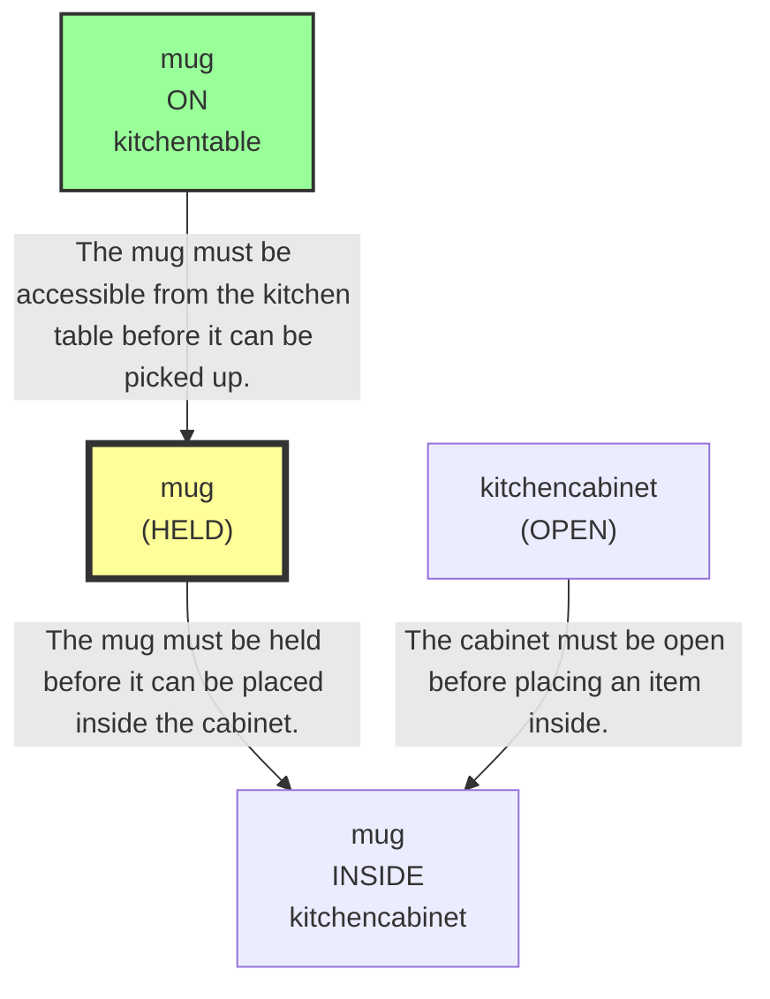
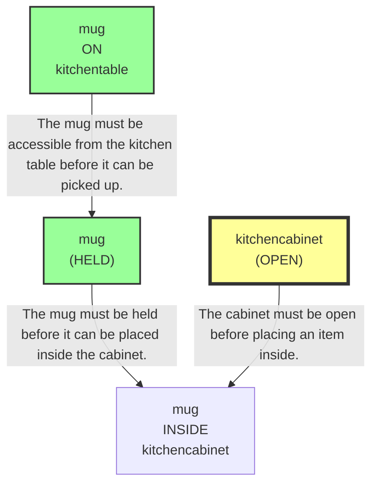
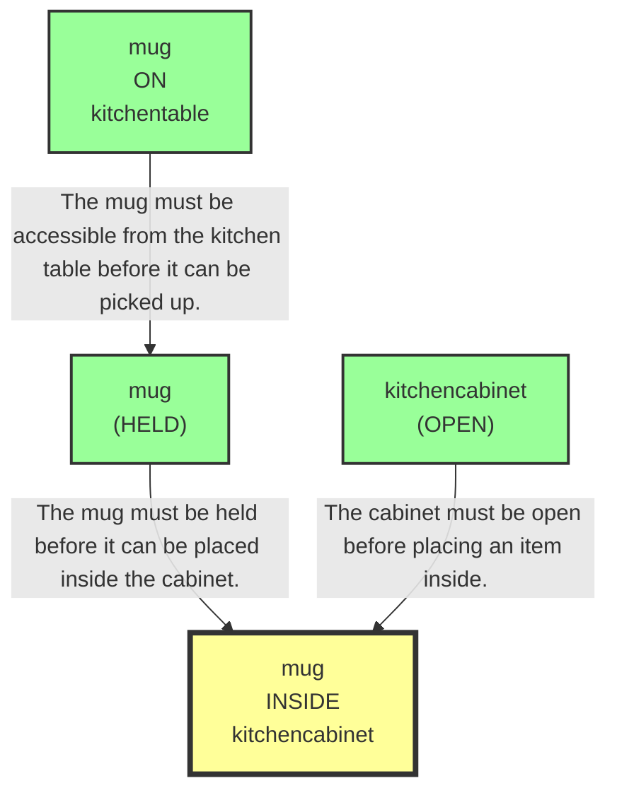

# 🚀 VirtualHome Agent Episode Log


### [GoalReasoner (Module A - Intent)] Output
```json
{
  "is_instruction_obviously_vague": true,
  "clarification_question": "Which specific destination should the drinkware be placed in?",
  "target_object": "drinkware",
  "location_hint": "kitchen table",
  "reasoning_chain": [
    {
      "question": "Why does the user want this object?",
      "answer": "To relocate drinkware from the kitchen table."
    },
    {
      "question": "Why is that important?",
      "answer": "To return it to its intended storage or use location."
    },
    {
      "question": "What fundamental need does this fulfill?",
      "answer": "To organize household items and clear the table."
    },
    {
      "question": "Are there any deeper psychological or physical motivations?",
      "answer": "Yes: keeping the space tidy and ensuring the item is stored in the correct place for future use."
    }
  ],
  "deep_intent": "The user wants to organize household items by returning them to their proper storage location and clearing the table.",
  "acceptable_alternatives_properties": [
    {
      "priority": 1,
      "description": "Other similar tabletop drink containers, such as cups, mugs, or glasses"
    },
    {
      "priority": 2,
      "description": "Other drinking vessels or reusable beverage containers found in the kitchen"
    },
    {
      "priority": 3,
      "description": "Other small kitchen items that can be returned to their usual storage location"
    },
    {
      "priority": 4,
      "description": "Household items that help restore order to the kitchen area"
    }
  ]
}
```

### [RoboStateMultiTaskController] Output
```json
{
  "action": "[ask] Which specific destination should the drinkware be placed in?",
  "active_task_id": "task_1",
  "task_context": {
    "active_task_id": "task_1",
    "pending_task_ids": [],
    "satisfied_task_ids": []
  },
  "source": "goal_reasoner_clarification"
}
```
## Step 0
- **Action**: `[ask] Which specific destination should the drinkware be placed in?`
- **Action Success**: `True`
- **Action Message**: Inside a kitchen cabinet.
- **Active Task**: `task_1`
- **Decision Source**: `goal_reasoner_clarification`
- **Task Progress**: T5_G2_11_B2=pending
- **SDG Status**:
No SDG active.
- **Observed Items (159)**: floor(12), floor(13), floor(14), floor(15), floor(16), floor(17), floor(18), floor(19), floor(20), ceiling(21), ceiling(22), ceiling(23), ceiling(24), ceiling(25), ceiling(26)...


### [GoalReasoner (Module A - Intent)] Output
```json
{
  "is_instruction_obviously_vague": false,
  "clarification_question": null,
  "target_object": "drinkware",
  "location_hint": "kitchen table",
  "reasoning_chain": [
    {
      "question": "Why does the user want this object?",
      "answer": "To have the drinkware moved from the kitchen table into storage."
    },
    {
      "question": "Why is that important?",
      "answer": "To clear the table and place the item in a more appropriate storage location."
    },
    {
      "question": "What fundamental need does this fulfill?",
      "answer": "The user wants household organization and tidiness."
    },
    {
      "question": "Are there any deeper psychological or physical motivations?",
      "answer": "Likely to reduce clutter and keep the kitchen area orderly."
    }
  ],
  "deep_intent": "The user wants to organize household items and reduce clutter.",
  "acceptable_alternatives_properties": [
    {
      "priority": 1,
      "description": "Other drinkware items found on the kitchen table that can be stored in the cabinet"
    },
    {
      "priority": 2,
      "description": "Similar kitchen table items used for serving or drinking, such as cups, glasses, or mugs"
    },
    {
      "priority": 3,
      "description": "Other small kitchen items that can be neatly stored in a cabinet"
    },
    {
      "priority": 4,
      "description": "Other household objects from the table that can be put away to reduce clutter"
    }
  ]
}
```

### [PerceptionFilter] Output
```json
{
  "reasoning": "The goal is to move the mug from the kitchen table into the kitchen cabinet. So the minimum needed objects are the target drinkware item (mug), its source location (kitchentable), its destination storage (kitchencabinet), and the cabinet must be open per the SDG. No extra tools are required beyond these items.",
  "selected_classes": [
    "kitchencabinet",
    "mug",
    "kitchentable",
    "character"
  ],
  "raw_class_count": 66
}
```

### [LLMExecutor] Output
```json
{
  "reasoning": "The target mug is already accessible because the character is close to the kitchen table and the mugs are on it. To progress toward placing a mug inside the kitchen cabinet, the first required step is to pick up one mug. I will bind the SDG object 'mug' to mug(118), which matches the required class and is on the kitchen table.",
  "satisfied_nodes": [
    "N1"
  ],
  "current_node_focus": "N2",
  "mapped_variables": {},
  "action": "[grab] <mug> (118)"
}
```

### [RoboStateMultiTaskController] Output
```json
{
  "action": "[walk] <mug> (118)",
  "active_task_id": "task_1",
  "task_context": {
    "active_task_id": "task_1",
    "pending_task_ids": [],
    "satisfied_task_ids": []
  },
  "source": "llm_executor_repaired"
}
```
## Step 1
- **Action**: `[walk] <mug> (118)`
- **Action Success**: `True`
- **Action Message**: {'0': {'message': 'Success'}}
- **Active Task**: `task_1`
- **Decision Source**: `llm_executor_repaired`
- **Task Progress**: T5_G2_11_B2=pending
- **SDG Status**:

- **Observed Items (17)**: kitchentable(72), kitchencabinet(73) [CLOSED], kitchencabinet(74) [CLOSED], kitchencabinet(75) [CLOSED], kitchencabinet(76) [CLOSED], kitchencabinet(77) [CLOSED], kitchencabinet(78) [CLOSED], kitchencabinet(79) [CLOSED], kitchencabinet(80) [CLOSED], mug(118), mug(119), mug(155), character(1), kitchen(11), bathroom(172)...


### [PerceptionFilter] Output
```json
{
  "reasoning": "Reused cached class selection.",
  "selected_classes": [
    "kitchencabinet",
    "mug",
    "kitchentable",
    "character"
  ],
  "raw_class_count": 66
}
```

### [LLMExecutor] Output
```json
{
  "reasoning": "The target mug is already accessible: mug(118) is on the kitchen table and close to the character. The SDG requires the mug to be held before placing it into the cabinet. Since we already walked to the mug in the previous step, the next atomic action is to grab it. The cabinet is still closed, but that will be handled after the mug is held.",
  "satisfied_nodes": [
    "N1"
  ],
  "current_node_focus": "N2",
  "mapped_variables": {
    "?Container": "kitchencabinet(73)"
  },
  "action": "[grab] <mug> (118)"
}
```

### [RoboStateMultiTaskController] Output
```json
{
  "action": "[grab] <mug> (118)",
  "active_task_id": "task_1",
  "task_context": {
    "active_task_id": "task_1",
    "pending_task_ids": [],
    "satisfied_task_ids": []
  },
  "source": "llm_executor"
}
```
## Step 2
- **Action**: `[grab] <mug> (118)`
- **Action Success**: `True`
- **Action Message**: {'0': {'message': 'Success'}}
- **Active Task**: `task_1`
- **Decision Source**: `llm_executor`
- **Task Progress**: T5_G2_11_B2=pending
- **SDG Status**:

- **Observed Items (17)**: kitchentable(72), kitchencabinet(73) [CLOSED], kitchencabinet(74) [CLOSED], kitchencabinet(75) [CLOSED], kitchencabinet(76) [CLOSED], kitchencabinet(77) [CLOSED], kitchencabinet(78) [CLOSED], kitchencabinet(79) [CLOSED], kitchencabinet(80) [CLOSED], mug(118), mug(119), mug(155), character(1), kitchen(11), bathroom(172)...


### [PerceptionFilter] Output
```json
{
  "reasoning": "Reused cached class selection.",
  "selected_classes": [
    "kitchencabinet",
    "mug",
    "kitchentable",
    "character"
  ],
  "raw_class_count": 66
}
```

### [LLMExecutor] Output
```json
{
  "reasoning": "The mug to be stored is already held (N2 is satisfied via HOLDS_RH on mug(118)). The cabinet required by the SDG is currently closed, so the next prerequisite is to open a kitchen cabinet before putting the mug inside. I will open one of the observed kitchen cabinets; any cabinet instance should satisfy the cabinet requirement, and no walk is needed before opening because the graph shows the character is already close to the kitchen area and cabinet interactions are permitted only when near, which current proximity likely supports. Current focus is to satisfy N4.",
  "satisfied_nodes": [
    "N1",
    "N2"
  ],
  "current_node_focus": "N4",
  "mapped_variables": {
    "?Container": "kitchencabinet(73)"
  },
  "action": "[open] <kitchencabinet> (73)"
}
```

### [RoboStateMultiTaskController] Output
```json
{
  "action": "[walk] <kitchencabinet> (73)",
  "active_task_id": "task_1",
  "task_context": {
    "active_task_id": "task_1",
    "pending_task_ids": [],
    "satisfied_task_ids": []
  },
  "source": "llm_executor_repaired"
}
```
## Step 3
- **Action**: `[walk] <kitchencabinet> (73)`
- **Action Success**: `True`
- **Action Message**: {'0': {'message': 'Success'}}
- **Active Task**: `task_1`
- **Decision Source**: `llm_executor_repaired`
- **Task Progress**: T5_G2_11_B2=pending
- **SDG Status**:

- **Observed Items (17)**: kitchentable(72), kitchencabinet(73) [CLOSED], kitchencabinet(74) [CLOSED], kitchencabinet(75) [CLOSED], kitchencabinet(76) [CLOSED], kitchencabinet(77) [CLOSED], kitchencabinet(78) [CLOSED], kitchencabinet(79) [CLOSED], kitchencabinet(80) [CLOSED], mug(118), mug(119), mug(155), character(1), kitchen(11), bathroom(172)...


### [PerceptionFilter] Output
```json
{
  "reasoning": "Reused cached class selection.",
  "selected_classes": [
    "kitchencabinet",
    "mug",
    "kitchentable",
    "character"
  ],
  "raw_class_count": 66
}
```

### [LLMExecutor] Output
```json
{
  "reasoning": "The mug is already held in the right hand, and we are already close to kitchencabinet(73). The cabinet is currently CLOSED, so the next required step to satisfy the cabinet-open prerequisite for putting the mug inside is to open it.",
  "satisfied_nodes": [
    "N1",
    "N2"
  ],
  "current_node_focus": "N4",
  "mapped_variables": {
    "?Container": "kitchencabinet(73)"
  },
  "action": "[open] <kitchencabinet> (73)"
}
```

### [RoboStateMultiTaskController] Output
```json
{
  "action": "[open] <kitchencabinet> (73)",
  "active_task_id": "task_1",
  "task_context": {
    "active_task_id": "task_1",
    "pending_task_ids": [],
    "satisfied_task_ids": []
  },
  "source": "llm_executor"
}
```
## Step 4
- **Action**: `[open] <kitchencabinet> (73)`
- **Action Success**: `True`
- **Action Message**: {'0': {'message': 'Success'}}
- **Active Task**: `task_1`
- **Decision Source**: `llm_executor`
- **Task Progress**: T5_G2_11_B2=pending
- **SDG Status**:

- **Observed Items (17)**: kitchentable(72), kitchencabinet(73) [CLOSED], kitchencabinet(74) [CLOSED], kitchencabinet(75) [CLOSED], kitchencabinet(76) [CLOSED], kitchencabinet(77) [CLOSED], kitchencabinet(78) [CLOSED], kitchencabinet(79) [CLOSED], kitchencabinet(80) [CLOSED], mug(118), mug(119), mug(155), character(1), kitchen(11), bathroom(172)...


### [PerceptionFilter] Output
```json
{
  "reasoning": "Reused cached class selection.",
  "selected_classes": [
    "kitchencabinet",
    "mug",
    "kitchentable",
    "character"
  ],
  "raw_class_count": 66
}
```

### [LLMExecutor] Output
```json
{
  "reasoning": "The mug is already held (N2 satisfied via HOLDS_RH on mug(118)), and the target cabinet kitchencabinet(73) is open (N4 satisfied). The next required SDG step is to place the held mug inside the open cabinet, so I should act directly with a putin into the cabinet.",
  "satisfied_nodes": [
    "N1",
    "N2",
    "N4"
  ],
  "current_node_focus": "N3",
  "mapped_variables": {
    "?Container": "kitchencabinet(73)"
  },
  "action": "[putin] <mug> (118) <kitchencabinet> (73)"
}
```

### [RoboStateMultiTaskController] Output
```json
{
  "action": "[putin] <mug> (118) <kitchencabinet> (73)",
  "active_task_id": "task_1",
  "task_context": {
    "active_task_id": "task_1",
    "pending_task_ids": [],
    "satisfied_task_ids": []
  },
  "source": "llm_executor"
}
```
## Step 5
- **Action**: `[putin] <mug> (118) <kitchencabinet> (73)`
- **Action Success**: `True`
- **Action Message**: {'0': {'message': 'Success'}}
- **Active Task**: `task_1`
- **Decision Source**: `llm_executor`
- **Task Progress**: T5_G2_11_B2=done
- **SDG Status**:

- **Observed Items (17)**: kitchentable(72), kitchencabinet(73) [OPEN], kitchencabinet(74) [CLOSED], kitchencabinet(75) [CLOSED], kitchencabinet(76) [CLOSED], kitchencabinet(77) [CLOSED], kitchencabinet(78) [CLOSED], kitchencabinet(79) [CLOSED], kitchencabinet(80) [CLOSED], mug(118), mug(119), mug(155), character(1), kitchen(11), bathroom(172)...

