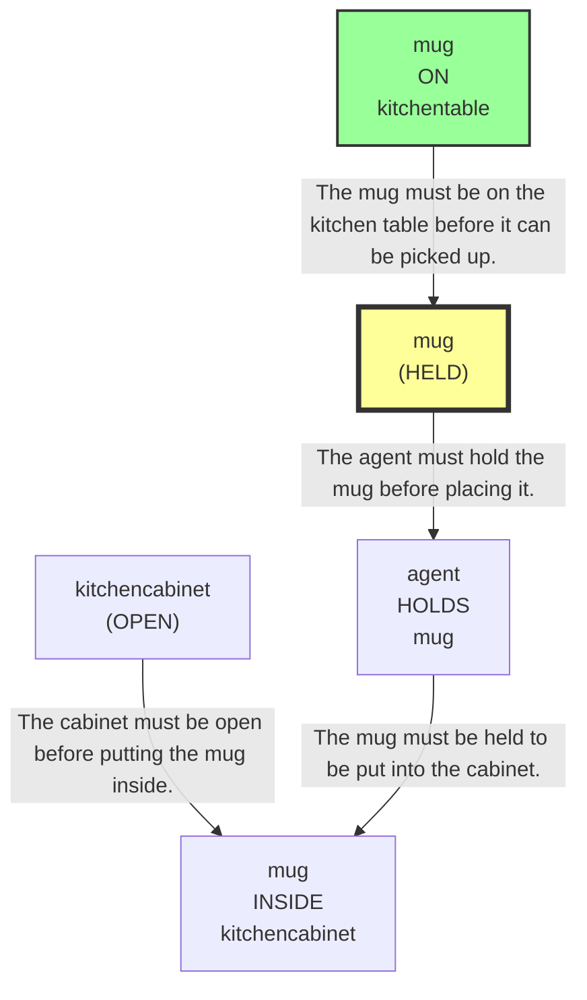
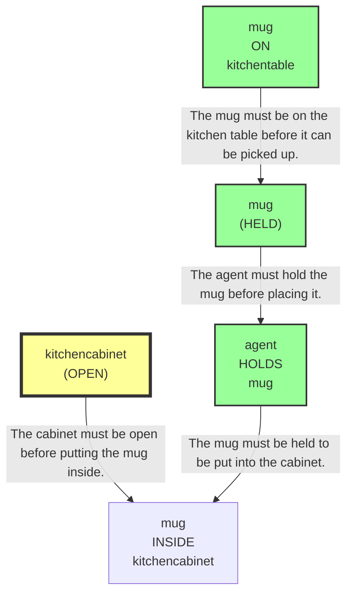
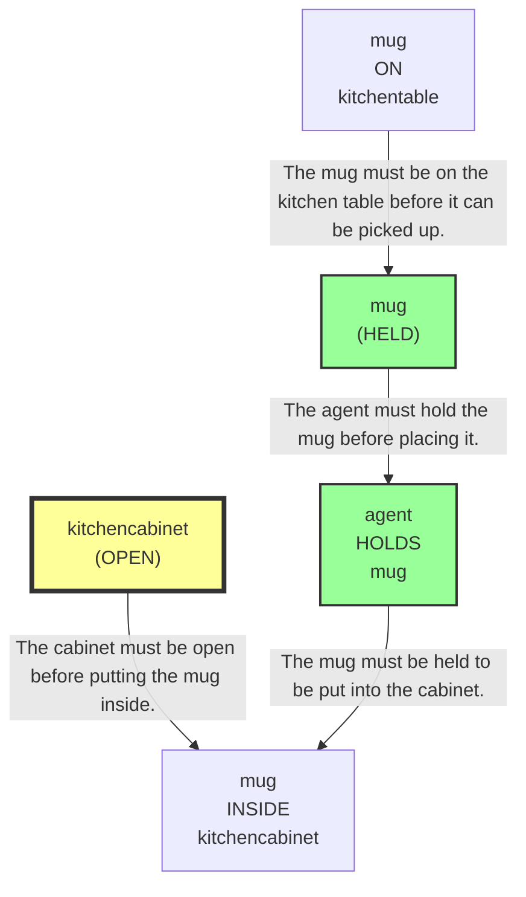
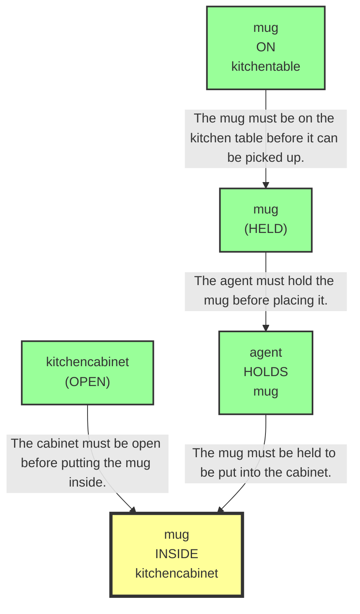
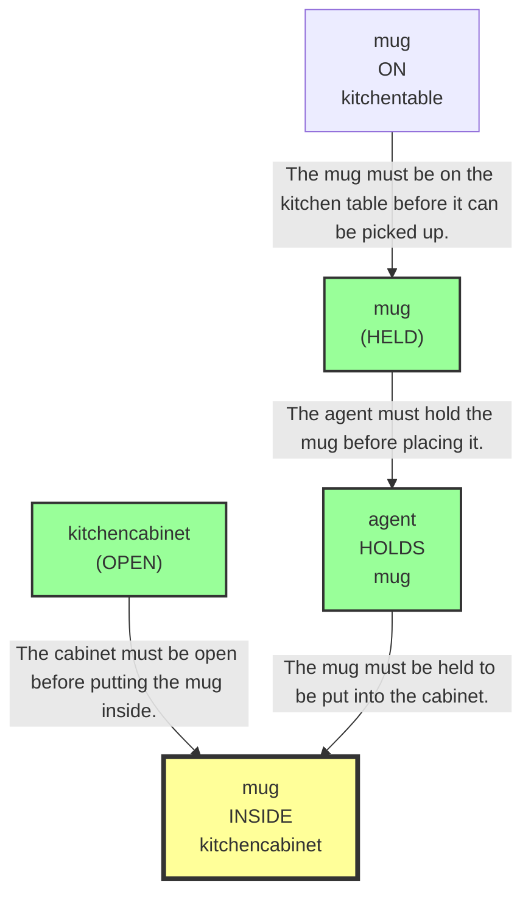

# 🚀 VirtualHome Agent Episode Log


### [GoalReasoner (Module A - Intent)] Output
```json
{
  "is_instruction_obviously_vague": true,
  "clarification_question": "Which specific drinkware item should I put away?",
  "target_object": "drinkware",
  "location_hint": "kitchen table",
  "reasoning_chain": [
    {
      "question": "Why does the user want this object?",
      "answer": "To have the drinkware moved off the kitchen table."
    },
    {
      "question": "Why is that important?",
      "answer": "To restore order or clear the table."
    },
    {
      "question": "What fundamental need does this fulfill?",
      "answer": "It helps organize the space and remove clutter from the table."
    },
    {
      "question": "Are there any deeper psychological or physical motivations?",
      "answer": "The user likely wants a tidier, more usable kitchen table environment."
    }
  ],
  "deep_intent": "The user wants to organize and clear clutter from the kitchen table.",
  "acceptable_alternatives_properties": [
    {
      "priority": 1,
      "description": "Other nearby tableware or drinking vessels that are similarly out of place and belong elsewhere in the kitchen"
    },
    {
      "priority": 2,
      "description": "Other small dining or beverage-related items on the kitchen table that can be returned to their usual storage area"
    },
    {
      "priority": 3,
      "description": "Any loose kitchen tabletop items that are contributing to clutter and can be tidied away"
    },
    {
      "priority": 4,
      "description": "Non-breakable household items that can be safely relocated to make the kitchen table clear"
    }
  ]
}
```

### [RoboStateMultiTaskController] Output
```json
{
  "action": "[ask] Which specific drinkware item should I put away?",
  "active_task_id": "task_1",
  "task_context": {
    "active_task_id": "task_1",
    "pending_task_ids": [],
    "satisfied_task_ids": []
  },
  "source": "goal_reasoner_clarification"
}
```
## Step 0
- **Action**: `[ask] Which specific drinkware item should I put away?`
- **Action Success**: `True`
- **Action Message**: The mug.
- **Active Task**: `task_1`
- **Decision Source**: `goal_reasoner_clarification`
- **Task Progress**: T5_G2_11_B3=pending
- **SDG Status**:
No SDG active.
- **Observed Items (159)**: floor(12), floor(13), floor(14), floor(15), floor(16), floor(17), floor(18), floor(19), floor(20), ceiling(21), ceiling(22), ceiling(23), ceiling(24), ceiling(25), ceiling(26)...


### [GoalReasoner (Module A - Intent)] Output
```json
{
  "is_instruction_obviously_vague": true,
  "clarification_question": "Where should the mug be placed?",
  "target_object": "mug",
  "location_hint": "kitchen table",
  "reasoning_chain": [
    {
      "question": "Why does the user want this object?",
      "answer": "To move the mug away from the kitchen table and into a designated place."
    },
    {
      "question": "Why is that important?",
      "answer": "Because the mug should be stored in its intended destination rather than left out on the table."
    },
    {
      "question": "What fundamental need does this fulfill?",
      "answer": "The user wants to organize or tidy the item by putting it in a specific physical location."
    },
    {
      "question": "Are there any deeper psychological or physical motivations?",
      "answer": "The likely motivation is maintaining order and keeping the environment clear, but the exact destination is unspecified."
    }
  ],
  "deep_intent": "The user wants to organize an item by placing it in its proper storage location.",
  "acceptable_alternatives_properties": [
    {
      "priority": 1,
      "description": "A nearby designated container or storage spot intended for drinkware, such as a shelf, cabinet, or dish rack, if that is the identified destination"
    },
    {
      "priority": 2,
      "description": "Other drinkware storage locations that serve the same organizing function, such as a cupboard or kitchen shelf"
    },
    {
      "priority": 3,
      "description": "Other household storage spots that keep small kitchen items neatly put away"
    },
    {
      "priority": 4,
      "description": "Any tidy, designated indoor place that reduces clutter and keeps the mug out of the way"
    }
  ]
}
```

### [RoboStateMultiTaskController] Output
```json
{
  "action": "[ask] Where should the mug be placed?",
  "active_task_id": "task_1",
  "task_context": {
    "active_task_id": "task_1",
    "pending_task_ids": [],
    "satisfied_task_ids": []
  },
  "source": "goal_reasoner_clarification"
}
```
## Step 1
- **Action**: `[ask] Where should the mug be placed?`
- **Action Success**: `True`
- **Action Message**: Inside a kitchen cabinet.
- **Active Task**: `task_1`
- **Decision Source**: `goal_reasoner_clarification`
- **Task Progress**: T5_G2_11_B3=pending
- **SDG Status**:
No SDG active.
- **Observed Items (159)**: floor(12), floor(13), floor(14), floor(15), floor(16), floor(17), floor(18), floor(19), floor(20), ceiling(21), ceiling(22), ceiling(23), ceiling(24), ceiling(25), ceiling(26)...


### [GoalReasoner (Module A - Intent)] Output
```json
{
  "is_instruction_obviously_vague": false,
  "clarification_question": null,
  "target_object": "mug",
  "location_hint": "kitchen table",
  "reasoning_chain": [
    {
      "question": "Why does the user want this object?",
      "answer": "To remove the mug from the kitchen table and place it in storage."
    },
    {
      "question": "Why is that important?",
      "answer": "Likely to organize the kitchen and clear the table surface."
    },
    {
      "question": "What fundamental need does this fulfill?",
      "answer": "The need to tidy and store a household item in an indoor space."
    },
    {
      "question": "Are there any deeper psychological or physical motivations?",
      "answer": "It may support a cleaner, less cluttered environment and make the table area more usable."
    }
  ],
  "deep_intent": "The user wants to organize and store a household item by moving it from a surface into storage.",
  "acceptable_alternatives_properties": [
    {
      "priority": 1,
      "description": "Other drinking vessels or small kitchen items that can be stored in a kitchen cabinet, such as cups or small bowls"
    },
    {
      "priority": 2,
      "description": "Similar household tableware items that belong in cabinets, such as plates, saucers, or tumblers"
    },
    {
      "priority": 3,
      "description": "Other small kitchen items that can be put away in enclosed storage, such as utensils or containers"
    },
    {
      "priority": 4,
      "description": "Any small indoor household object that needs to be cleared from the table and stored in an appropriate cabinet or shelf"
    }
  ]
}
```

### [PerceptionFilter] Output
```json
{
  "reasoning": "The goal requires the target mug, the kitchen table it is on, and the kitchen cabinet it should be stored in. The SDG also requires the cabinet to be open and the mug to be held during transfer. No extra tools are needed for this action.",
  "selected_classes": [
    "character",
    "kitchencabinet",
    "mug",
    "plate",
    "door",
    "kitchentable"
  ],
  "raw_class_count": 66
}
```

### [LLMExecutor] Output
```json
{
  "reasoning": "The mug is already on the kitchen table, satisfying N1. To move it into the cabinet, I must first hold it. The character is already close to the table and the mug, so the next atomic step is to grab one of the valid mug instances; mug(118) is a valid rebind because it is on the kitchen table and matches the target object.",
  "satisfied_nodes": [
    "N1"
  ],
  "current_node_focus": "N2",
  "mapped_variables": {
    "?Container": "kitchencabinet(73)",
    "?TargetObject": "mug(118)"
  },
  "action": "[grab] <mug> (118)"
}
```

### [RoboStateMultiTaskController] Output
```json
{
  "action": "[walk] <mug> (118)",
  "active_task_id": "task_1",
  "task_context": {
    "active_task_id": "task_1",
    "pending_task_ids": [],
    "satisfied_task_ids": []
  },
  "source": "llm_executor_repaired"
}
```
## Step 2
- **Action**: `[walk] <mug> (118)`
- **Action Success**: `True`
- **Action Message**: {'0': {'message': 'Success'}}
- **Active Task**: `task_1`
- **Decision Source**: `llm_executor_repaired`
- **Task Progress**: T5_G2_11_B3=pending
- **SDG Status**:

- **Observed Items (23)**: door(40) [OPEN], kitchentable(72), kitchencabinet(73) [CLOSED], kitchencabinet(74) [CLOSED], kitchencabinet(75) [CLOSED], kitchencabinet(76) [CLOSED], kitchencabinet(77) [CLOSED], kitchencabinet(78) [CLOSED], kitchencabinet(79) [CLOSED], kitchencabinet(80) [CLOSED], plate(125), plate(126), plate(127), plate(128), plate(143)...


### [PerceptionFilter] Output
```json
{
  "reasoning": "Reused cached class selection.",
  "selected_classes": [
    "character",
    "kitchencabinet",
    "mug",
    "plate",
    "door",
    "kitchentable"
  ],
  "raw_class_count": 66
}
```

### [LLMExecutor] Output
```json
{
  "reasoning": "The mug is already on the kitchen table and the agent is close to it, so the next required step toward placing it in the cabinet is to pick it up. The cabinet is still closed, but opening it comes after holding the mug only if needed by the sequence; current focus is satisfying the held state N2 and N5 first.",
  "satisfied_nodes": [
    "N1"
  ],
  "current_node_focus": "N2",
  "mapped_variables": {},
  "action": "[grab] <mug> (118)"
}
```

### [RoboStateMultiTaskController] Output
```json
{
  "action": "[grab] <mug> (118)",
  "active_task_id": "task_1",
  "task_context": {
    "active_task_id": "task_1",
    "pending_task_ids": [],
    "satisfied_task_ids": []
  },
  "source": "llm_executor"
}
```
## Step 3
- **Action**: `[grab] <mug> (118)`
- **Action Success**: `True`
- **Action Message**: {'0': {'message': 'Success'}}
- **Active Task**: `task_1`
- **Decision Source**: `llm_executor`
- **Task Progress**: T5_G2_11_B3=pending
- **SDG Status**:

- **Observed Items (23)**: door(40) [OPEN], kitchentable(72), kitchencabinet(73) [CLOSED], kitchencabinet(74) [CLOSED], kitchencabinet(75) [CLOSED], kitchencabinet(76) [CLOSED], kitchencabinet(77) [CLOSED], kitchencabinet(78) [CLOSED], kitchencabinet(79) [CLOSED], kitchencabinet(80) [CLOSED], plate(125), plate(126), plate(127), plate(128), plate(143)...


### [PerceptionFilter] Output
```json
{
  "reasoning": "Reused cached class selection.",
  "selected_classes": [
    "character",
    "kitchencabinet",
    "mug",
    "plate",
    "door",
    "kitchentable"
  ],
  "raw_class_count": 66
}
```

### [LLMExecutor] Output
```json
{
  "reasoning": "The mug is already being held in the right hand (HOLDS_RH mug(118)), satisfying the pick-up prerequisite. The next unmet SDG requirement is that the mug be placed inside an open kitchen cabinet. Among the visible cabinets, kitchencabinet(73) is a valid storage container and is currently closed, so I should first move close to it before opening it. Since only one atomic action is allowed, the best next step is to walk to the cabinet selected for storage.",
  "satisfied_nodes": [
    "N1",
    "N2",
    "N5"
  ],
  "current_node_focus": "N4",
  "mapped_variables": {
    "?Container": "kitchencabinet(73)"
  },
  "action": "[walk] <kitchencabinet> (73)"
}
```

### [RoboStateMultiTaskController] Output
```json
{
  "action": "[walk] <kitchencabinet> (73)",
  "active_task_id": "task_1",
  "task_context": {
    "active_task_id": "task_1",
    "pending_task_ids": [],
    "satisfied_task_ids": []
  },
  "source": "llm_executor"
}
```
## Step 4
- **Action**: `[walk] <kitchencabinet> (73)`
- **Action Success**: `True`
- **Action Message**: {'0': {'message': 'Success'}}
- **Active Task**: `task_1`
- **Decision Source**: `llm_executor`
- **Task Progress**: T5_G2_11_B3=pending
- **SDG Status**:

- **Observed Items (23)**: door(40) [OPEN], kitchentable(72), kitchencabinet(73) [CLOSED], kitchencabinet(74) [CLOSED], kitchencabinet(75) [CLOSED], kitchencabinet(76) [CLOSED], kitchencabinet(77) [CLOSED], kitchencabinet(78) [CLOSED], kitchencabinet(79) [CLOSED], kitchencabinet(80) [CLOSED], plate(125), plate(126), plate(127), plate(128), plate(143)...


### [PerceptionFilter] Output
```json
{
  "reasoning": "Reused cached class selection.",
  "selected_classes": [
    "character",
    "kitchencabinet",
    "mug",
    "plate",
    "door",
    "kitchentable"
  ],
  "raw_class_count": 66
}
```

### [LLMExecutor] Output
```json
{
  "reasoning": "The mug is already in hand (HOLDS_RH mug(118)) and I am already close to a closed kitchen cabinet. The next required SDG node is to open the cabinet before placing the mug inside. Cabinet 73 is a valid kitchen cabinet and is currently closed, so opening it directly progresses toward the goal.",
  "satisfied_nodes": [
    "N2",
    "N5"
  ],
  "current_node_focus": "N4",
  "mapped_variables": {
    "?Container": "kitchencabinet (73)"
  },
  "action": "[open] <kitchencabinet> (73)"
}
```

### [RoboStateMultiTaskController] Output
```json
{
  "action": "[open] <kitchencabinet> (73)",
  "active_task_id": "task_1",
  "task_context": {
    "active_task_id": "task_1",
    "pending_task_ids": [],
    "satisfied_task_ids": []
  },
  "source": "llm_executor"
}
```
## Step 5
- **Action**: `[open] <kitchencabinet> (73)`
- **Action Success**: `True`
- **Action Message**: {'0': {'message': 'Success'}}
- **Active Task**: `task_1`
- **Decision Source**: `llm_executor`
- **Task Progress**: T5_G2_11_B3=pending
- **SDG Status**:

- **Observed Items (23)**: door(40) [OPEN], kitchentable(72), kitchencabinet(73) [CLOSED], kitchencabinet(74) [CLOSED], kitchencabinet(75) [CLOSED], kitchencabinet(76) [CLOSED], kitchencabinet(77) [CLOSED], kitchencabinet(78) [CLOSED], kitchencabinet(79) [CLOSED], kitchencabinet(80) [CLOSED], plate(125), plate(126), plate(127), plate(128), plate(143)...


### [PerceptionFilter] Output
```json
{
  "reasoning": "Reused cached class selection.",
  "selected_classes": [
    "character",
    "kitchencabinet",
    "mug",
    "plate",
    "door",
    "kitchentable"
  ],
  "raw_class_count": 66
}
```

### [LLMExecutor] Output
```json
{
  "reasoning": "The mug to store is currently held in the right hand (mug(118)), and the target kitchen cabinet is already open (kitchencabinet(73)). The next required step toward placing the mug inside storage is to walk to the open cabinet before performing the putin action, since proximity to the destination is mandatory.",
  "satisfied_nodes": [
    "N1",
    "N2",
    "N4",
    "N5"
  ],
  "current_node_focus": "N3",
  "mapped_variables": {
    "?Container": "kitchencabinet(73)"
  },
  "action": "[walk] <kitchencabinet> (73)"
}
```

### [RoboStateMultiTaskController] Output
```json
{
  "action": "[walk] <kitchencabinet> (73)",
  "active_task_id": "task_1",
  "task_context": {
    "active_task_id": "task_1",
    "pending_task_ids": [],
    "satisfied_task_ids": []
  },
  "source": "llm_executor"
}
```
## Step 6
- **Action**: `[walk] <kitchencabinet> (73)`
- **Action Success**: `True`
- **Action Message**: {'0': {'message': 'Success'}}
- **Active Task**: `task_1`
- **Decision Source**: `llm_executor`
- **Task Progress**: T5_G2_11_B3=pending
- **SDG Status**:

- **Observed Items (23)**: door(40) [OPEN], kitchentable(72), kitchencabinet(73) [OPEN], kitchencabinet(74) [CLOSED], kitchencabinet(75) [CLOSED], kitchencabinet(76) [CLOSED], kitchencabinet(77) [CLOSED], kitchencabinet(78) [CLOSED], kitchencabinet(79) [CLOSED], kitchencabinet(80) [CLOSED], plate(125), plate(126), plate(127), plate(128), plate(143)...


### [PerceptionFilter] Output
```json
{
  "reasoning": "Reused cached class selection.",
  "selected_classes": [
    "character",
    "kitchencabinet",
    "mug",
    "plate",
    "door",
    "kitchentable"
  ],
  "raw_class_count": 66
}
```

### [LLMExecutor] Output
```json
{
  "reasoning": "The mug is already being held in the right hand, and the target kitchen cabinet 73 is open. The next required SDG step is to place the held mug inside that cabinet. Since putting into a container requires being near it and I have already walked to the cabinet, the correct next atomic action is to put the mug into the open cabinet.",
  "satisfied_nodes": [
    "N2",
    "N4",
    "N5"
  ],
  "current_node_focus": "N3",
  "mapped_variables": {
    "?Container": "kitchencabinet(73)"
  },
  "action": "[putin] <mug> (118) <kitchencabinet> (73)"
}
```

### [RoboStateMultiTaskController] Output
```json
{
  "action": "[putin] <mug> (118) <kitchencabinet> (73)",
  "active_task_id": "task_1",
  "task_context": {
    "active_task_id": "task_1",
    "pending_task_ids": [],
    "satisfied_task_ids": []
  },
  "source": "llm_executor"
}
```
## Step 7
- **Action**: `[putin] <mug> (118) <kitchencabinet> (73)`
- **Action Success**: `True`
- **Action Message**: {'0': {'message': 'Success'}}
- **Active Task**: `task_1`
- **Decision Source**: `llm_executor`
- **Task Progress**: T5_G2_11_B3=done
- **SDG Status**:

- **Observed Items (23)**: door(40) [OPEN], kitchentable(72), kitchencabinet(73) [OPEN], kitchencabinet(74) [CLOSED], kitchencabinet(75) [CLOSED], kitchencabinet(76) [CLOSED], kitchencabinet(77) [CLOSED], kitchencabinet(78) [CLOSED], kitchencabinet(79) [CLOSED], kitchencabinet(80) [CLOSED], plate(125), plate(126), plate(127), plate(128), plate(143)...

