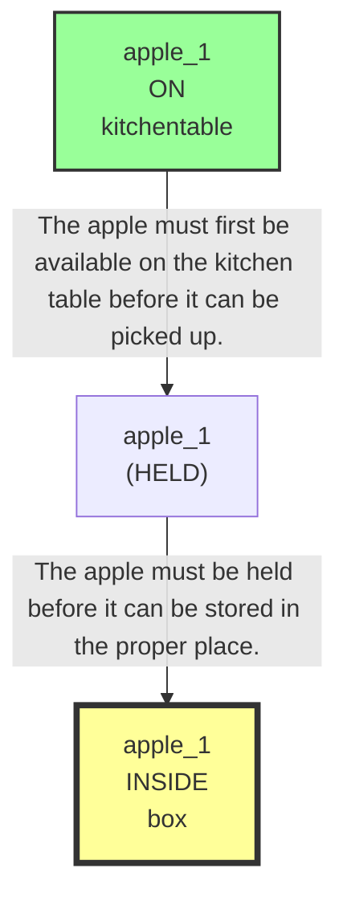
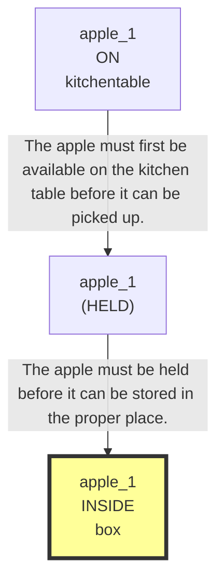
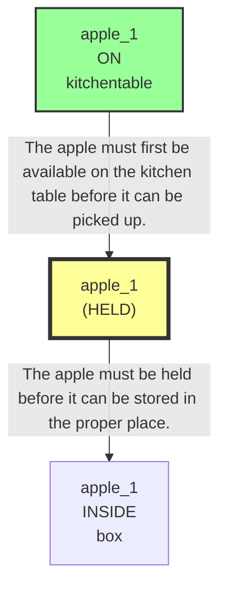
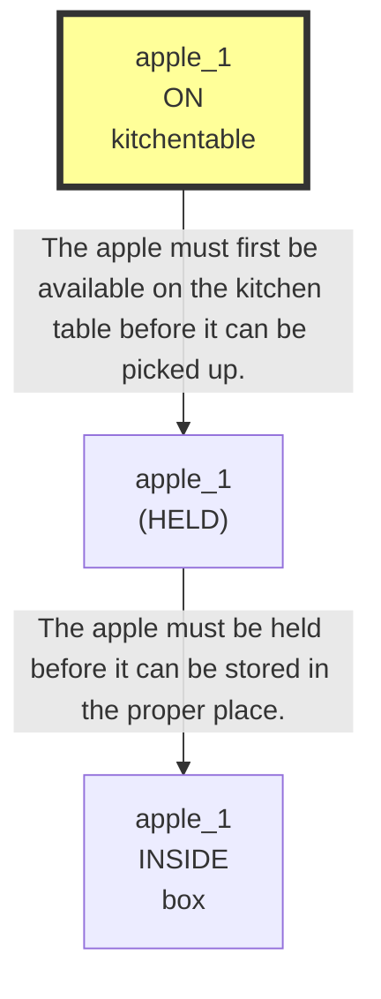
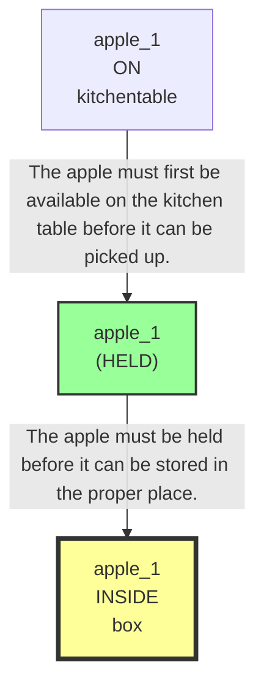
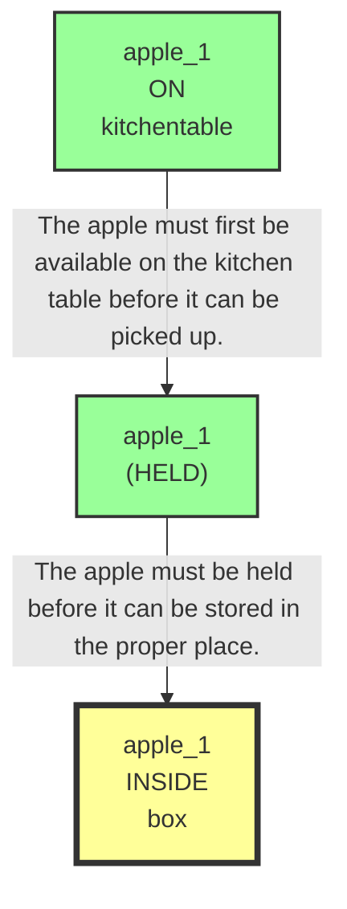

# 🚀 VirtualHome Agent Episode Log


### [GoalReasoner (Module A - Intent)] Output
```json
{
  "is_instruction_obviously_vague": true,
  "clarification_question": "What exact place should the apples be stored in?",
  "target_object": "apples",
  "location_hint": "kitchen table",
  "reasoning_chain": [
    {
      "question": "Why does the user want this object?",
      "answer": "To relocate the apples from the kitchen table to storage."
    },
    {
      "question": "Why is that important?",
      "answer": "To have them put away rather than left on the table."
    },
    {
      "question": "What fundamental need does this fulfill?",
      "answer": "It fulfills the need to organize and store food items in a designated place."
    },
    {
      "question": "Are there any deeper psychological or physical motivations?",
      "answer": "The motivation is likely to tidy the area and keep the apples in their intended storage location."
    }
  ],
  "deep_intent": "The user wants to organize and store food items in their designated place.",
  "acceptable_alternatives_properties": [
    {
      "priority": 1,
      "description": "Other similar fruit items that can be stored in the same type of food storage place"
    },
    {
      "priority": 2,
      "description": "Other fresh produce items that belong in a comparable storage area"
    },
    {
      "priority": 3,
      "description": "Other household food items that are typically kept in a storage container, bowl, or pantry-like location"
    },
    {
      "priority": 4,
      "description": "Non-perishable snack or food items that can be put away in a household storage spot"
    }
  ]
}
```

### [PerceptionFilter] Output
```json
{
  "reasoning": "The goal is to move apples from the kitchen table into their storage place. The SDG requires the apple, the kitchen table as the source location, and a box as the destination storage container. No extra tools are needed beyond these required objects.",
  "selected_classes": [
    "kitchentable",
    "box",
    "apple",
    "character"
  ],
  "raw_class_count": 66
}
```

### [LLMExecutor] Output
```json
{
  "reasoning": "The task is ambiguous about the exact storage location, but clarification is forbidden, so I must choose the most plausible storage container in the current scene. The box(146) is the only explicit storage receptacle available and is currently closed. The apple is on the kitchen table and close to the character, but I cannot put it into the box until I am near the box and open it. The SDG focus is progressing toward holding the apple before storing it, and the next prerequisite action is to move to the box so I can open it next.",
  "satisfied_nodes": [
    "N1"
  ],
  "current_node_focus": "N3",
  "mapped_variables": {
    "?Container": "box(146)"
  },
  "action": "[walk] <box> (146)"
}
```

### [RoboStateMultiTaskController] Output
```json
{
  "action": "[walk] <box> (146)",
  "active_task_id": "task_1",
  "task_context": {
    "active_task_id": "task_1",
    "pending_task_ids": [],
    "satisfied_task_ids": []
  },
  "source": "llm_executor"
}
```
## Step 0
- **Action**: `[walk] <box> (146)`
- **Action Success**: `True`
- **Action Message**: {'0': {'message': 'Success'}}
- **Active Task**: `task_1`
- **Decision Source**: `llm_executor`
- **Task Progress**: T5_G2_12_B0=pending
- **SDG Status**:

- **Observed Items (9)**: kitchentable(72), box(146) [CLOSED], apple(47), apple(48), character(1), kitchen(11), bathroom(172), bedroom(211), livingroom(268)


### [PerceptionFilter] Output
```json
{
  "reasoning": "Reused cached class selection.",
  "selected_classes": [
    "kitchentable",
    "box",
    "apple",
    "character"
  ],
  "raw_class_count": 66
}
```

### [LLMExecutor] Output
```json
{
  "reasoning": "The SDG requires apple_1 to end up INSIDE the box, and the box is currently CLOSED. We are already close to the box from the previous step, so the next necessary atomic action is to open it before any grab/put action. The graph shows two apples on the kitchen table; per historical binding, I should continue with a valid current apple instance matching the task intent, but no grab can happen until the storage container is open.",
  "satisfied_nodes": [],
  "current_node_focus": "N3",
  "mapped_variables": {
    "?Container": "box(146)"
  },
  "action": "[open] <box> (146)"
}
```

### [RoboStateMultiTaskController] Output
```json
{
  "action": "[open] <box> (146)",
  "active_task_id": "task_1",
  "task_context": {
    "active_task_id": "task_1",
    "pending_task_ids": [],
    "satisfied_task_ids": []
  },
  "source": "llm_executor"
}
```
## Step 1
- **Action**: `[open] <box> (146)`
- **Action Success**: `False`
- **Action Message**: {'0': {'message': 'ScriptExcutor 0: EXECUTION_GENERAL: Script is impossible to execute\n\n'}}
- **Active Task**: `task_1`
- **Decision Source**: `llm_executor`
- **Task Progress**: T5_G2_12_B0=pending
- **SDG Status**:

- **Observed Items (9)**: kitchentable(72), box(146) [CLOSED], apple(47), apple(48), character(1), kitchen(11), bathroom(172), bedroom(211), livingroom(268)


### [PerceptionFilter] Output
```json
{
  "reasoning": "Reused cached class selection.",
  "selected_classes": [
    "kitchentable",
    "box",
    "apple",
    "character"
  ],
  "raw_class_count": 66
}
```

### [LLMExecutor] Output
```json
{
  "reasoning": "The goal is to store the apple from the kitchen table into the box. The previous open attempt failed because the box is closed, so the next required step is to open the container while already near it. In the current graph, box(146) is closed and the character is close to it, so I can legally open it now. The specific apple target is still ambiguous between apple(47) and apple(48), but both are on the kitchen table and equivalent for the task; I will continue by preparing the destination first since storage is blocked until the box is open.",
  "satisfied_nodes": [
    "N1"
  ],
  "current_node_focus": "N3",
  "mapped_variables": {
    "?Container": "box(146)"
  },
  "action": "[open] <box> (146)"
}
```

### [RoboStateMultiTaskController] Output
```json
{
  "action": "[open] <box> (146)",
  "active_task_id": "task_1",
  "task_context": {
    "active_task_id": "task_1",
    "pending_task_ids": [],
    "satisfied_task_ids": []
  },
  "source": "llm_executor"
}
```
## Step 2
- **Action**: `[open] <box> (146)`
- **Action Success**: `False`
- **Action Message**: {'0': {'message': 'ScriptExcutor 0: EXECUTION_GENERAL: Script is impossible to execute\n\n'}}
- **Active Task**: `task_1`
- **Decision Source**: `llm_executor`
- **Task Progress**: T5_G2_12_B0=pending
- **SDG Status**:

- **Observed Items (9)**: kitchentable(72), box(146) [CLOSED], apple(47), apple(48), character(1), kitchen(11), bathroom(172), bedroom(211), livingroom(268)


### [RoboStateMultiTaskController] Output
```json
{
  "action": "[walk] <bathroom> (172)",
  "active_task_id": null,
  "task_context": {
    "active_task_id": null,
    "pending_task_ids": [
      "task_1"
    ],
    "satisfied_task_ids": []
  },
  "source": "loop_recovery_room_revisit"
}
```
## Step 3
- **Action**: `[walk] <bathroom> (172)`
- **Action Success**: `True`
- **Action Message**: {'0': {'message': 'Success'}}
- **Decision Source**: `loop_recovery_room_revisit`
- **Task Progress**: T5_G2_12_B0=pending
- **SDG Status**:
No SDG active.
- **Observed Items (159)**: floor(12), floor(13), floor(14), floor(15), floor(16), floor(17), floor(18), floor(19), floor(20), ceiling(21), ceiling(22), ceiling(23), ceiling(24), ceiling(25), ceiling(26)...


### [PerceptionFilter] Output
```json
{
  "reasoning": "The goal is to move the apples from the kitchen table into their storage place. The SDG explicitly requires the apple, the kitchen table where it starts, and a box as the destination container. No extra tools are needed beyond the storage receptacle.",
  "selected_classes": [
    "kitchentable",
    "box",
    "apple",
    "character"
  ],
  "raw_class_count": 79
}
```

### [LLMExecutor] Output
```json
{
  "reasoning": "The goal is to store the apples, and the SDG specifies apple_1 on the kitchen table then held then inside the box. The previous box interaction failed because I was already at the box and it was closed; however, I do not yet hold the apple. In the current graph, apple(47) and apple(48) are both on the kitchen table, and the box is a valid closed container. I should rebind apple_1 to one of the apples on the table; choosing apple(47) as the first target. Since I am currently in the bathroom, the next required step is to walk to the apple on the kitchen table before grabbing it.",
  "satisfied_nodes": [
    "N1"
  ],
  "current_node_focus": "N2",
  "mapped_variables": {
    "?Container": "box(146)",
    "?Apple": "apple(47)"
  },
  "action": "[walk] <apple> (47)"
}
```

### [RoboStateMultiTaskController] Output
```json
{
  "action": "[walk] <apple> (47)",
  "active_task_id": "task_1",
  "task_context": {
    "active_task_id": "task_1",
    "pending_task_ids": [],
    "satisfied_task_ids": []
  },
  "source": "llm_executor"
}
```
## Step 4
- **Action**: `[walk] <apple> (47)`
- **Action Success**: `True`
- **Action Message**: {'0': {'message': 'Success'}}
- **Active Task**: `task_1`
- **Decision Source**: `llm_executor`
- **Task Progress**: T5_G2_12_B0=pending
- **SDG Status**:

- **Observed Items (9)**: kitchentable(72), box(146) [CLOSED], apple(47), apple(48), character(1), kitchen(11), bathroom(172), bedroom(211), livingroom(268)


### [PerceptionFilter] Output
```json
{
  "reasoning": "Reused cached class selection.",
  "selected_classes": [
    "kitchentable",
    "box",
    "apple",
    "character"
  ],
  "raw_class_count": 79
}
```

### [LLMExecutor] Output
```json
{
  "reasoning": "The task is ambiguous, but clarification is forbidden. The SDG’s final sink node is N3: apple_1 inside the box. In the current graph, the exact historical apple_1 ID is not present; the best match by class and location is apple(47), which is on the kitchen table and close to the character. To progress toward holding it, the next atomic step is to grab the apple now that we are already near it. The box is currently closed, but that only matters after the apple is held.",
  "satisfied_nodes": [
    "N1"
  ],
  "current_node_focus": "N2",
  "mapped_variables": {
    "?Container": "box(146)",
    "?TargetApple": "apple(47)"
  },
  "action": "[grab] <apple> (47)"
}
```

### [RoboStateMultiTaskController] Output
```json
{
  "action": "[grab] <apple> (47)",
  "active_task_id": "task_1",
  "task_context": {
    "active_task_id": "task_1",
    "pending_task_ids": [],
    "satisfied_task_ids": []
  },
  "source": "llm_executor"
}
```
## Step 5
- **Action**: `[grab] <apple> (47)`
- **Action Success**: `True`
- **Action Message**: {'0': {'message': 'Success'}}
- **Active Task**: `task_1`
- **Decision Source**: `llm_executor`
- **Task Progress**: T5_G2_12_B0=pending
- **SDG Status**:

- **Observed Items (9)**: kitchentable(72), box(146) [CLOSED], apple(47), apple(48), character(1), kitchen(11), bathroom(172), bedroom(211), livingroom(268)


### [PerceptionFilter] Output
```json
{
  "reasoning": "Reused cached class selection.",
  "selected_classes": [
    "kitchentable",
    "box",
    "apple",
    "character"
  ],
  "raw_class_count": 79
}
```

### [LLMExecutor] Output
```json
{
  "reasoning": "The active apple target from the SDG is apple_1 on the kitchen table, and the current graph shows apple(48) ON kitchentable(72). I already hold apple(47), but that is a different apple and not the one required by the SDG. To satisfy N1 and progress toward holding the correct apple, I must move to the apple on the table before attempting to grab it. The last walk was to a bathroom, not to the kitchen table, so walking now is valid.",
  "satisfied_nodes": [],
  "current_node_focus": "N1",
  "mapped_variables": {},
  "action": "[walk] <apple> (48)"
}
```

### [RoboStateMultiTaskController] Output
```json
{
  "action": "[walk] <apple> (48)",
  "active_task_id": "task_1",
  "task_context": {
    "active_task_id": "task_1",
    "pending_task_ids": [],
    "satisfied_task_ids": []
  },
  "source": "llm_executor"
}
```
## Step 6
- **Action**: `[walk] <apple> (48)`
- **Action Success**: `True`
- **Action Message**: {'0': {'message': 'Success'}}
- **Active Task**: `task_1`
- **Decision Source**: `llm_executor`
- **Task Progress**: T5_G2_12_B0=pending
- **SDG Status**:

- **Observed Items (9)**: kitchentable(72), box(146) [CLOSED], apple(47), apple(48), character(1), kitchen(11), bathroom(172), bedroom(211), livingroom(268)


### [PerceptionFilter] Output
```json
{
  "reasoning": "Reused cached class selection.",
  "selected_classes": [
    "kitchentable",
    "box",
    "apple",
    "character"
  ],
  "raw_class_count": 79
}
```

### [LLMExecutor] Output
```json
{
  "reasoning": "The active goal is to store the apple from the kitchen table inside the box. The current graph shows apple(48) is the apple on the kitchen table and is close to the character, while the box(146) is closed. We already tried opening box(146) unsuccessfully, so to avoid repeating the same failed action, the next useful step is to verify whether apple(48) is now the held apple or whether we need to continue from the current close proximity. Since the character currently holds apple(47), the immediate missing prerequisite for storing apple(48) is not yet resolved; however, the SDG target object is apple_1 from the kitchen table, which best matches apple(48). The next atomic step should be to grab apple(48) because it is on the table and close, and the box storage can only happen after it is held.",
  "satisfied_nodes": [
    "N1"
  ],
  "current_node_focus": "N2",
  "mapped_variables": {
    "?Container": "box(146)"
  },
  "action": "[grab] <apple> (48)"
}
```

### [RoboStateMultiTaskController] Output
```json
{
  "action": "[grab] <apple> (48)",
  "active_task_id": "task_1",
  "task_context": {
    "active_task_id": "task_1",
    "pending_task_ids": [],
    "satisfied_task_ids": []
  },
  "source": "llm_executor"
}
```
## Step 7
- **Action**: `[grab] <apple> (48)`
- **Action Success**: `True`
- **Action Message**: {'0': {'message': 'Success'}}
- **Active Task**: `task_1`
- **Decision Source**: `llm_executor`
- **Task Progress**: T5_G2_12_B0=pending
- **SDG Status**:

- **Observed Items (9)**: kitchentable(72), box(146) [CLOSED], apple(47), apple(48), character(1), kitchen(11), bathroom(172), bedroom(211), livingroom(268)


### [PerceptionFilter] Output
```json
{
  "reasoning": "Reused cached class selection.",
  "selected_classes": [
    "kitchentable",
    "box",
    "apple",
    "character"
  ],
  "raw_class_count": 79
}
```

### [LLMExecutor] Output
```json
{
  "reasoning": "The active SDG requires apple_1 to be held and then stored inside the box. The current graph shows I already hold two apples: apple(47) and apple(48), and the box(146) is a closed, openable container in the kitchen. Since I am already at the kitchen table area and the box is the intended storage target, the next needed action is to open the box before any put-in action can occur. The prior open attempt failed, but no alternative container exists in the graph, so I should retry the open now rather than ask. This action is aimed at satisfying the storage prerequisite for the final INSIDE box node.",
  "satisfied_nodes": [
    "N2"
  ],
  "current_node_focus": "N3",
  "mapped_variables": {
    "?Container": "box(146)"
  },
  "action": "[open] <box> (146)"
}
```

### [RoboStateMultiTaskController] Output
```json
{
  "action": "[walk] <box> (146)",
  "active_task_id": "task_1",
  "task_context": {
    "active_task_id": "task_1",
    "pending_task_ids": [],
    "satisfied_task_ids": []
  },
  "source": "llm_executor_repaired"
}
```
## Step 8
- **Action**: `[walk] <box> (146)`
- **Action Success**: `True`
- **Action Message**: {'0': {'message': 'Success'}}
- **Active Task**: `task_1`
- **Decision Source**: `llm_executor_repaired`
- **Task Progress**: T5_G2_12_B0=pending
- **SDG Status**:

- **Observed Items (9)**: kitchentable(72), box(146) [CLOSED], apple(47), apple(48), character(1), kitchen(11), bathroom(172), bedroom(211), livingroom(268)


### [PerceptionFilter] Output
```json
{
  "reasoning": "Reused cached class selection.",
  "selected_classes": [
    "kitchentable",
    "box",
    "apple",
    "character"
  ],
  "raw_class_count": 79
}
```

### [LLMExecutor] Output
```json
{
  "reasoning": "The active goal is to store the apples in the box. The SDG requires apple_1 to be held before being inside the box. Current graph shows I already hold two apples: apple(47) and apple(48), and I am already close to box(146). The box is CLOSED, so I must open it before putting an apple inside. Since I already walked to the box in the previous step, the next needed atomic action is to open the box.",
  "satisfied_nodes": [],
  "current_node_focus": "N3",
  "mapped_variables": {
    "?Container": "box(146)"
  },
  "action": "[open] <box> (146)"
}
```

### [RoboStateMultiTaskController] Output
```json
{
  "action": "[open] <box> (146)",
  "active_task_id": "task_1",
  "task_context": {
    "active_task_id": "task_1",
    "pending_task_ids": [],
    "satisfied_task_ids": []
  },
  "source": "llm_executor"
}
```
## Step 9
- **Action**: `[open] <box> (146)`
- **Action Success**: `False`
- **Action Message**: {'0': {'message': 'ScriptExcutor 0: EXECUTION_GENERAL: Script is impossible to execute\n\n'}}
- **Active Task**: `task_1`
- **Decision Source**: `llm_executor`
- **Task Progress**: T5_G2_12_B0=pending
- **SDG Status**:

- **Observed Items (9)**: kitchentable(72), box(146) [CLOSED], apple(47), apple(48), character(1), kitchen(11), bathroom(172), bedroom(211), livingroom(268)


### [PerceptionFilter] Output
```json
{
  "reasoning": "Reused cached class selection.",
  "selected_classes": [
    "kitchentable",
    "box",
    "apple",
    "character"
  ],
  "raw_class_count": 79
}
```

### [LLMExecutor] Output
```json
{
  "reasoning": "The task is to store the apples in the indicated storage object. The SDG requires the apple to be held before being inside the box. Currently I already hold both apples, and the box is closed, so the next progress-making step is to open the box to enable storing the apples inside it. The previous open attempts failed, but the box is still the intended container and no alternative storage is shown in the graph.",
  "satisfied_nodes": [
    "N1",
    "N2"
  ],
  "current_node_focus": "N3",
  "mapped_variables": {
    "?Container": "box(146)"
  },
  "action": "[open] <box> (146)"
}
```

### [RoboStateMultiTaskController] Output
```json
{
  "action": "[open] <box> (146)",
  "active_task_id": "task_1",
  "task_context": {
    "active_task_id": "task_1",
    "pending_task_ids": [],
    "satisfied_task_ids": []
  },
  "source": "llm_executor"
}
```
## Step 10
- **Action**: `[open] <box> (146)`
- **Action Success**: `False`
- **Action Message**: {'0': {'message': 'ScriptExcutor 0: EXECUTION_GENERAL: Script is impossible to execute\n\n'}}
- **Active Task**: `task_1`
- **Decision Source**: `llm_executor`
- **Task Progress**: T5_G2_12_B0=pending
- **SDG Status**:

- **Observed Items (9)**: kitchentable(72), box(146) [CLOSED], apple(47), apple(48), character(1), kitchen(11), bathroom(172), bedroom(211), livingroom(268)


### [RoboStateMultiTaskController] Output
```json
{
  "action": "[walk] <bedroom> (211)",
  "active_task_id": null,
  "task_context": {
    "active_task_id": null,
    "pending_task_ids": [
      "task_1"
    ],
    "satisfied_task_ids": []
  },
  "source": "loop_recovery_room_revisit"
}
```
## Step 11
- **Action**: `[walk] <bedroom> (211)`
- **Action Success**: `True`
- **Action Message**: {'0': {'message': 'Success'}}
- **Decision Source**: `loop_recovery_room_revisit`
- **Task Progress**: T5_G2_12_B0=pending
- **SDG Status**:
No SDG active.
- **Observed Items (197)**: floor(12), floor(13), floor(14), floor(15), floor(16), floor(17), floor(18), floor(19), floor(20), ceiling(21), ceiling(22), ceiling(23), ceiling(24), ceiling(25), ceiling(26)...


### [PerceptionFilter] Output
```json
{
  "reasoning": "The goal is to store the apples, and the SDG says the apple is on the kitchen table, must be held, then placed inside a box. So only the target fruit, the source location, and the storage receptacle are needed.",
  "selected_classes": [
    "kitchentable",
    "box",
    "apple",
    "character"
  ],
  "raw_class_count": 86
}
```

### [LLMExecutor] Output
```json
{
  "reasoning": "The apples in the current state are already being held (apple(47) in right hand and apple(48) in left hand), so N1 and N2 are satisfied. The storage target must be rebound from the stale box(146) to the available closed container box(243) in the bedroom, since the historical box in the kitchen is no longer a valid usable target and the task is to store the apples somewhere contained. To proceed toward N3, the next required step is to move near the destination container before putting the held apples inside. I will walk to box(243) now.",
  "satisfied_nodes": [
    "N1",
    "N2"
  ],
  "current_node_focus": "N3",
  "mapped_variables": {
    "?Container": "box(243)"
  },
  "action": "[walk] <box> (243)"
}
```

### [RoboStateMultiTaskController] Output
```json
{
  "action": "[walk] <box> (243)",
  "active_task_id": "task_1",
  "task_context": {
    "active_task_id": "task_1",
    "pending_task_ids": [],
    "satisfied_task_ids": []
  },
  "source": "llm_executor"
}
```
## Step 12
- **Action**: `[walk] <box> (243)`
- **Action Success**: `True`
- **Action Message**: {'0': {'message': 'Success'}}
- **Active Task**: `task_1`
- **Decision Source**: `llm_executor`
- **Task Progress**: T5_G2_12_B0=pending
- **SDG Status**:

- **Observed Items (21)**: kitchentable(72), box(146) [CLOSED], apple(47), apple(48), character(1), kitchen(11), bathroom(172), bedroom(211), livingroom(268), apple(231), apple(232), apple(233), apple(234), apple(235), apple(236)...


### [PerceptionFilter] Output
```json
{
  "reasoning": "Reused cached class selection.",
  "selected_classes": [
    "kitchentable",
    "box",
    "apple",
    "character"
  ],
  "raw_class_count": 86
}
```

### [LLMExecutor] Output
```json
{
  "reasoning": "The active goal is to store the apples in a box. We already have two apples held, and the closest matching storage container in the current graph is box(243), which is closed and close to the character. Since we must explicitly walk to the destination container before putin, the next step is to move near box(243).",
  "satisfied_nodes": [
    "N1"
  ],
  "current_node_focus": "N2",
  "mapped_variables": {
    "?Container": "box(243)"
  },
  "action": "[walk] <box> (243)"
}
```

### [RoboStateMultiTaskController] Output
```json
{
  "action": "[walk] <box> (243)",
  "active_task_id": "task_1",
  "task_context": {
    "active_task_id": "task_1",
    "pending_task_ids": [],
    "satisfied_task_ids": []
  },
  "source": "llm_executor"
}
```
## Step 13
- **Action**: `[walk] <box> (243)`
- **Action Success**: `True`
- **Action Message**: {'0': {'message': 'Success'}}
- **Active Task**: `task_1`
- **Decision Source**: `llm_executor`
- **Task Progress**: T5_G2_12_B0=pending
- **SDG Status**:

- **Observed Items (21)**: kitchentable(72), box(146) [CLOSED], apple(47), apple(48), character(1), kitchen(11), bathroom(172), bedroom(211), livingroom(268), apple(231), apple(232), apple(233), apple(234), apple(235), apple(236)...


### [PerceptionFilter] Output
```json
{
  "reasoning": "Reused cached class selection.",
  "selected_classes": [
    "kitchentable",
    "box",
    "apple",
    "character"
  ],
  "raw_class_count": 86
}
```

### [LLMExecutor] Output
```json
{
  "reasoning": "The active goal is to store the apples in a box. We already have two apples in hand (apple 47 and apple 48). The currently relevant storage candidate in the graph is box(243), which is closed and near the character. Since the box must be opened before putting items inside, and we are already close to it, the next required step is to open box(243).",
  "satisfied_nodes": [
    "N1",
    "N2"
  ],
  "current_node_focus": "N3",
  "mapped_variables": {
    "?Container": "box(243)"
  },
  "action": "[open] <box> (243)"
}
```

### [RoboStateMultiTaskController] Output
```json
{
  "action": "[open] <box> (243)",
  "active_task_id": "task_1",
  "task_context": {
    "active_task_id": "task_1",
    "pending_task_ids": [],
    "satisfied_task_ids": []
  },
  "source": "llm_executor"
}
```
## Step 14
- **Action**: `[open] <box> (243)`
- **Action Success**: `False`
- **Action Message**: {'0': {'message': 'ScriptExcutor 0: EXECUTION_GENERAL: Script is impossible to execute\n\n'}}
- **Active Task**: `task_1`
- **Decision Source**: `llm_executor`
- **Task Progress**: T5_G2_12_B0=pending
- **SDG Status**:

- **Observed Items (21)**: kitchentable(72), box(146) [CLOSED], apple(47), apple(48), character(1), kitchen(11), bathroom(172), bedroom(211), livingroom(268), apple(231), apple(232), apple(233), apple(234), apple(235), apple(236)...

