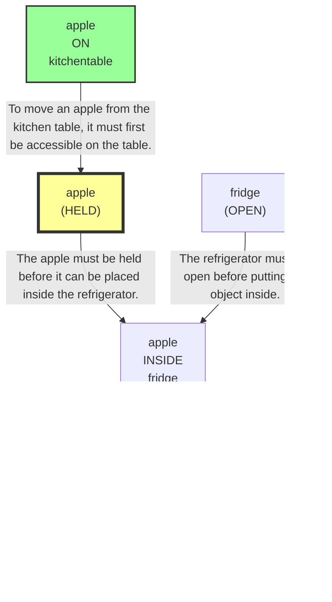
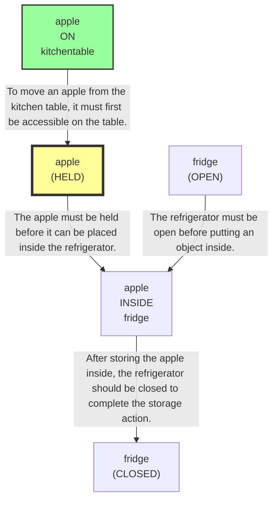
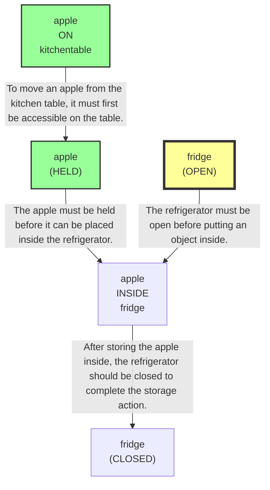
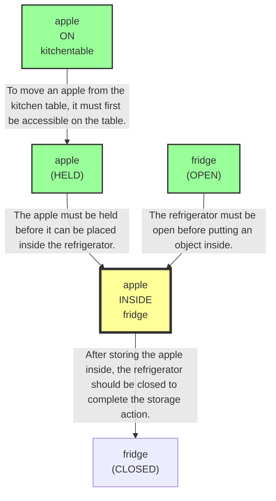
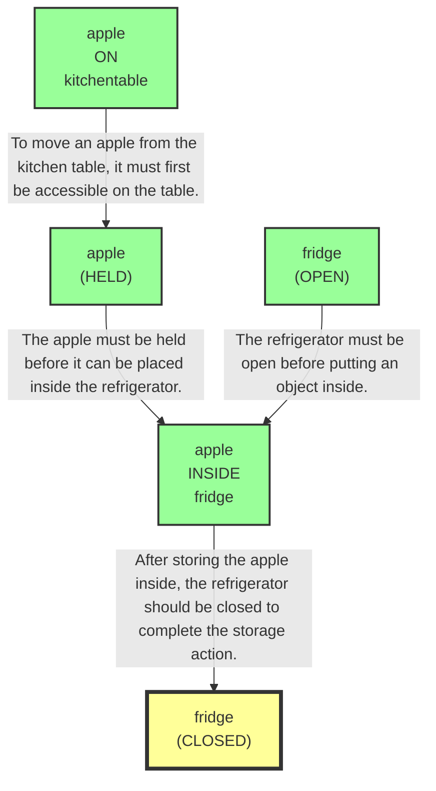
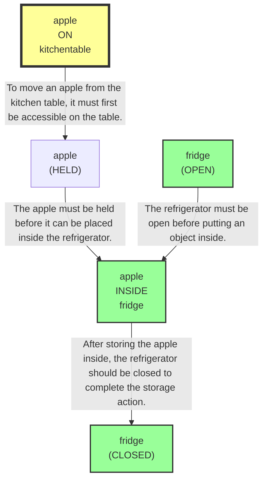
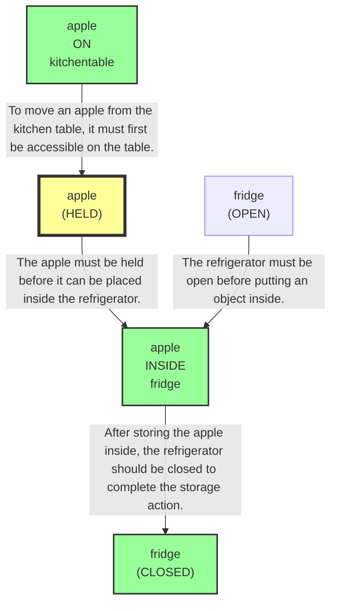
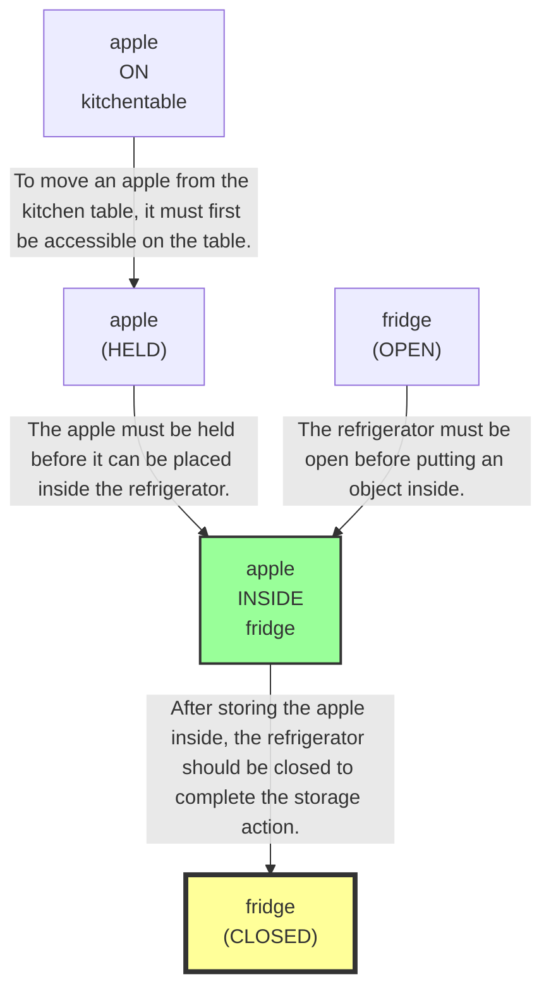
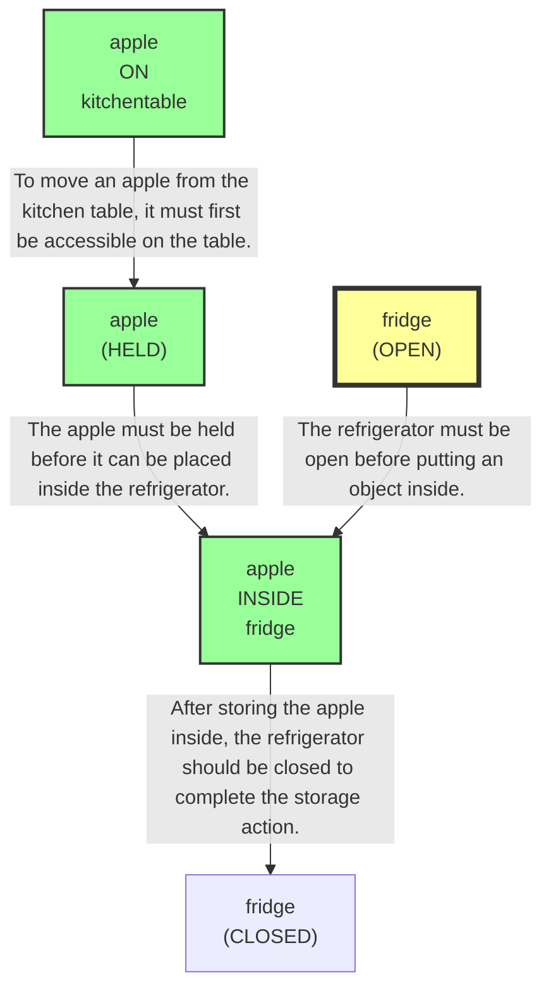
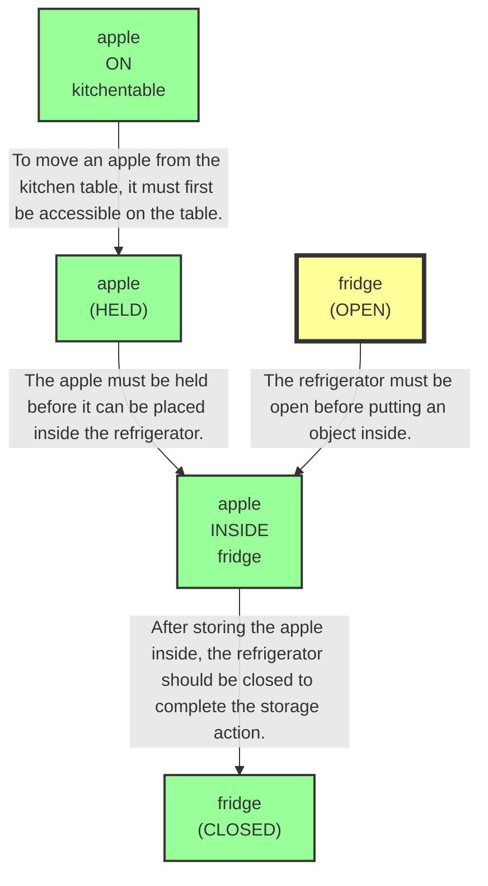

# 🚀 VirtualHome Agent Episode Log


### [GoalReasoner (Module A - Intent)] Output
```json
{
  "is_instruction_obviously_vague": true,
  "clarification_question": "What exact place should the apples be stored in?",
  "target_object": "apples",
  "location_hint": "kitchen table",
  "reasoning_chain": [
    {
      "question": "Why does the user want this object?",
      "answer": "To move the apples out of the kitchen table area and store them."
    },
    {
      "question": "Why is that important?",
      "answer": "To place them in their intended storage location."
    },
    {
      "question": "What fundamental need does this fulfill?",
      "answer": "To organize and store produce in a specific location."
    },
    {
      "question": "Are there any deeper psychological or physical motivations?",
      "answer": "The user likely wants the apples kept orderly and out of the way, but the exact destination is not specified."
    }
  ],
  "deep_intent": "The user wants to store produce in a specific place.",
  "acceptable_alternatives_properties": [
    {
      "priority": 1,
      "description": "Other similar produce items that can be stored in the same intended location, such as pears or oranges"
    },
    {
      "priority": 2,
      "description": "Other fruit items that are typically stored together indoors"
    },
    {
      "priority": 3,
      "description": "Other food items that can be organized into a storage area"
    },
    {
      "priority": 4,
      "description": "Other household items that can be put away for organization, if the task is primarily about tidying"
    }
  ]
}
```

### [RoboStateMultiTaskController] Output
```json
{
  "action": "[ask] What exact place should the apples be stored in?",
  "active_task_id": "task_1",
  "task_context": {
    "active_task_id": "task_1",
    "pending_task_ids": [],
    "satisfied_task_ids": []
  },
  "source": "goal_reasoner_clarification"
}
```
## Step 0
- **Action**: `[ask] What exact place should the apples be stored in?`
- **Action Success**: `True`
- **Action Message**: Inside the refrigerator.
- **Active Task**: `task_1`
- **Decision Source**: `goal_reasoner_clarification`
- **Task Progress**: T5_G2_12_B1=pending
- **SDG Status**:
No SDG active.
- **Observed Items (159)**: floor(12), floor(13), floor(14), floor(15), floor(16), floor(17), floor(18), floor(19), floor(20), ceiling(21), ceiling(22), ceiling(23), ceiling(24), ceiling(25), ceiling(26)...


### [GoalReasoner (Module A - Intent)] Output
```json
{
  "is_instruction_obviously_vague": true,
  "clarification_question": "How many apples should be stored inside the refrigerator?",
  "target_object": "apples",
  "location_hint": "kitchen table",
  "reasoning_chain": [
    {
      "question": "Why does the user want this object?",
      "answer": "To move the apples from the kitchen table into cold storage."
    },
    {
      "question": "Why is that important?",
      "answer": "To keep the apples preserved and in the desired storage condition."
    },
    {
      "question": "What fundamental need does this fulfill?",
      "answer": "It fulfills the need to preserve food and maintain its freshness."
    },
    {
      "question": "Are there any deeper psychological or physical motivations?",
      "answer": "The likely motivation is to reduce spoilage and ensure the apples are stored safely for later use."
    }
  ],
  "deep_intent": "The user wants to preserve food by storing it in a cool place.",
  "acceptable_alternatives_properties": [
    {
      "priority": 1,
      "description": "Other fresh fruits that can be stored in the refrigerator, such as pears or grapes"
    },
    {
      "priority": 2,
      "description": "Other produce items that benefit from cold storage, such as berries or cut fruit"
    },
    {
      "priority": 3,
      "description": "Perishable food items that need refrigeration to stay fresh"
    },
    {
      "priority": 4,
      "description": "Other household items that need to be moved from a table into a cold storage area for preservation"
    }
  ]
}
```

### [PerceptionFilter] Output
```json
{
  "reasoning": "The goal is to store apples from the kitchen table in cold storage. The SDG requires the apple, the kitchen table location, and the refrigerator, plus the open/closed fridge states. No extra tools are required beyond accessing the fridge.",
  "selected_classes": [
    "apple",
    "character",
    "fridge",
    "pear",
    "kitchentable"
  ],
  "raw_class_count": 66
}
```

### [LLMExecutor] Output
```json
{
  "reasoning": "The task is to store apples in the refrigerator. The SDG requires the apple to be held before it can be put inside the fridge, and the fridge is currently closed. Since we are already close to the kitchen table and two apples are available on it, the best autonomous next step is to walk to one apple so we can grab it next. I will bind ?Container context to the fridge object and target an apple on the table; apple(47) is a valid choice from the current graph.",
  "satisfied_nodes": [
    "N1"
  ],
  "current_node_focus": "N2",
  "mapped_variables": {
    "?Washer": "sink(10)",
    "?Container": "fridge(103)"
  },
  "action": "[walk] <apple> (47)"
}
```

### [RoboStateMultiTaskController] Output
```json
{
  "action": "[walk] <apple> (47)",
  "active_task_id": "task_1",
  "task_context": {
    "active_task_id": "task_1",
    "pending_task_ids": [],
    "satisfied_task_ids": []
  },
  "source": "llm_executor"
}
```
## Step 1
- **Action**: `[walk] <apple> (47)`
- **Action Success**: `True`
- **Action Message**: {'0': {'message': 'Success'}}
- **Active Task**: `task_1`
- **Decision Source**: `llm_executor`
- **Task Progress**: T5_G2_12_B1=pending
- **SDG Status**:

- **Observed Items (10)**: pear(64), kitchentable(72), fridge(103) [CLOSED], apple(47), apple(48), character(1), kitchen(11), bathroom(172), bedroom(211), livingroom(268)


### [PerceptionFilter] Output
```json
{
  "reasoning": "Reused cached class selection.",
  "selected_classes": [
    "apple",
    "character",
    "fridge",
    "pear",
    "kitchentable"
  ],
  "raw_class_count": 66
}
```

### [LLMExecutor] Output
```json
{
  "reasoning": "The apple target is ambiguous because two apples are present, but clarification is forbidden. Since the goal is to store an apple from the kitchen table into the refrigerator, either apple satisfies the task. We already walked to apple(47) in the previous step, and it is close and grabbable. The fridge is currently closed, so the next required progress step is to pick up the apple before later opening the fridge and storing it inside.",
  "satisfied_nodes": [
    "N1"
  ],
  "current_node_focus": "N2",
  "mapped_variables": {
    "?Container": "fridge(103)"
  },
  "action": "[grab] <apple> (47)"
}
```

### [RoboStateMultiTaskController] Output
```json
{
  "action": "[grab] <apple> (47)",
  "active_task_id": "task_1",
  "task_context": {
    "active_task_id": "task_1",
    "pending_task_ids": [],
    "satisfied_task_ids": []
  },
  "source": "llm_executor"
}
```
## Step 2
- **Action**: `[grab] <apple> (47)`
- **Action Success**: `True`
- **Action Message**: {'0': {'message': 'Success'}}
- **Active Task**: `task_1`
- **Decision Source**: `llm_executor`
- **Task Progress**: T5_G2_12_B1=pending
- **SDG Status**:

- **Observed Items (10)**: pear(64), kitchentable(72), fridge(103) [CLOSED], apple(47), apple(48), character(1), kitchen(11), bathroom(172), bedroom(211), livingroom(268)


### [PerceptionFilter] Output
```json
{
  "reasoning": "Reused cached class selection.",
  "selected_classes": [
    "apple",
    "character",
    "fridge",
    "pear",
    "kitchentable"
  ],
  "raw_class_count": 66
}
```

### [LLMExecutor] Output
```json
{
  "reasoning": "The apple is already held in the right hand (apple(47)), and the refrigerator is currently closed. To progress toward storing the apple inside the fridge, the next required step is to move to the fridge before opening it or putting the apple inside. Node N2 is satisfied, while N3, N4, and N5 are not yet satisfied.",
  "satisfied_nodes": [
    "N1",
    "N2"
  ],
  "current_node_focus": "N4",
  "mapped_variables": {
    "?Container": "fridge(103)"
  },
  "action": "[walk] <fridge> (103)"
}
```

### [RoboStateMultiTaskController] Output
```json
{
  "action": "[walk] <fridge> (103)",
  "active_task_id": "task_1",
  "task_context": {
    "active_task_id": "task_1",
    "pending_task_ids": [],
    "satisfied_task_ids": []
  },
  "source": "llm_executor"
}
```
## Step 3
- **Action**: `[walk] <fridge> (103)`
- **Action Success**: `True`
- **Action Message**: {'0': {'message': 'Success'}}
- **Active Task**: `task_1`
- **Decision Source**: `llm_executor`
- **Task Progress**: T5_G2_12_B1=pending
- **SDG Status**:

- **Observed Items (10)**: pear(64), kitchentable(72), fridge(103) [CLOSED], apple(47), apple(48), character(1), kitchen(11), bathroom(172), bedroom(211), livingroom(268)


### [PerceptionFilter] Output
```json
{
  "reasoning": "Reused cached class selection.",
  "selected_classes": [
    "apple",
    "character",
    "fridge",
    "pear",
    "kitchentable"
  ],
  "raw_class_count": 66
}
```

### [LLMExecutor] Output
```json
{
  "reasoning": "The held apple from the previous step is apple(47), and the fridge is currently closed. The apple is already in hand and the robot is already close to the fridge, so the next required step toward placing it inside is to open the refrigerator before any put-in action.",
  "satisfied_nodes": [
    "N1",
    "N2"
  ],
  "current_node_focus": "N4",
  "mapped_variables": {
    "?Fridge": "fridge(103)",
    "?Apple": "apple(47)"
  },
  "action": "[open] <fridge> (103)"
}
```

### [RoboStateMultiTaskController] Output
```json
{
  "action": "[open] <fridge> (103)",
  "active_task_id": "task_1",
  "task_context": {
    "active_task_id": "task_1",
    "pending_task_ids": [],
    "satisfied_task_ids": []
  },
  "source": "llm_executor"
}
```
## Step 4
- **Action**: `[open] <fridge> (103)`
- **Action Success**: `True`
- **Action Message**: {'0': {'message': 'Success'}}
- **Active Task**: `task_1`
- **Decision Source**: `llm_executor`
- **Task Progress**: T5_G2_12_B1=pending
- **SDG Status**:

- **Observed Items (10)**: pear(64), kitchentable(72), fridge(103) [CLOSED], apple(47), apple(48), character(1), kitchen(11), bathroom(172), bedroom(211), livingroom(268)


### [PerceptionFilter] Output
```json
{
  "reasoning": "Reused cached class selection.",
  "selected_classes": [
    "apple",
    "character",
    "fridge",
    "pear",
    "kitchentable"
  ],
  "raw_class_count": 66
}
```

### [LLMExecutor] Output
```json
{
  "reasoning": "The goal is to store an apple inside the refrigerator, and the fridge is already open. The current graph shows apple(47) is already held, so the remaining gap is to place it into the open fridge. The historical binding is still valid because apple(47) is the held apple, while apple(48) is a separate apple on the table. Since [putin] requires being near the destination and we are already close to the fridge, the next step is to put the held apple inside it.",
  "satisfied_nodes": [
    "N1",
    "N2",
    "N4"
  ],
  "current_node_focus": "N3",
  "mapped_variables": {
    "?Container": "fridge(103)"
  },
  "action": "[putin] <apple> (47) <fridge> (103)"
}
```

### [RoboStateMultiTaskController] Output
```json
{
  "action": "[putin] <apple> (47) <fridge> (103)",
  "active_task_id": "task_1",
  "task_context": {
    "active_task_id": "task_1",
    "pending_task_ids": [],
    "satisfied_task_ids": []
  },
  "source": "llm_executor"
}
```
## Step 5
- **Action**: `[putin] <apple> (47) <fridge> (103)`
- **Action Success**: `True`
- **Action Message**: {'0': {'message': 'Success'}}
- **Active Task**: `task_1`
- **Decision Source**: `llm_executor`
- **Task Progress**: T5_G2_12_B1=pending
- **SDG Status**:

- **Observed Items (10)**: pear(64), kitchentable(72), fridge(103) [OPEN], apple(47), apple(48), character(1), kitchen(11), bathroom(172), bedroom(211), livingroom(268)


### [PerceptionFilter] Output
```json
{
  "reasoning": "Reused cached class selection.",
  "selected_classes": [
    "apple",
    "character",
    "fridge",
    "pear",
    "kitchentable"
  ],
  "raw_class_count": 66
}
```

### [LLMExecutor] Output
```json
{
  "reasoning": "The apple has already been placed inside the open fridge, so N1, N2, N3, and N4 are satisfied. The remaining required step is to close the refrigerator to complete storage. I am already close to the fridge, so the next atomic action is to close it.",
  "satisfied_nodes": [
    "N1",
    "N2",
    "N3",
    "N4"
  ],
  "current_node_focus": "N5",
  "mapped_variables": {
    "?Fridge": "fridge(103)"
  },
  "action": "[close] <fridge> (103)"
}
```

### [RoboStateMultiTaskController] Output
```json
{
  "action": "[close] <fridge> (103)",
  "active_task_id": "task_1",
  "task_context": {
    "active_task_id": "task_1",
    "pending_task_ids": [],
    "satisfied_task_ids": []
  },
  "source": "llm_executor"
}
```
## Step 6
- **Action**: `[close] <fridge> (103)`
- **Action Success**: `True`
- **Action Message**: {'0': {'message': 'Success'}}
- **Active Task**: `task_1`
- **Decision Source**: `llm_executor`
- **Task Progress**: T5_G2_12_B1=pending
- **SDG Status**:

- **Observed Items (10)**: pear(64), kitchentable(72), fridge(103) [OPEN], apple(47) [COLD], apple(48), character(1), kitchen(11), bathroom(172), bedroom(211), livingroom(268)


### [PerceptionFilter] Output
```json
{
  "reasoning": "Reused cached class selection.",
  "selected_classes": [
    "apple",
    "character",
    "fridge",
    "pear",
    "kitchentable"
  ],
  "raw_class_count": 66
}
```

### [LLMExecutor] Output
```json
{
  "reasoning": "The storage task for one apple is already completed: apple(47) is inside the fridge and the fridge is closed. In the current graph, N1 (apple on kitchen table) is not satisfied by apple(47), but there is another apple(48) on the kitchen table that may be the remaining target under the ambiguous instruction. Since the refrigerator is already closed and apple(48) is not yet held, the next step toward satisfying the remaining unsatisfied apple-related goal is to walk to apple(48) so it can be picked up next. I am not repeating the previous walk to the fridge.",
  "satisfied_nodes": [
    "N3",
    "N5",
    "N4"
  ],
  "current_node_focus": "N1",
  "mapped_variables": {
    "?Container": "fridge(103)"
  },
  "action": "[walk] <apple> (48)"
}
```

### [RoboStateMultiTaskController] Output
```json
{
  "action": "[walk] <apple> (48)",
  "active_task_id": "task_1",
  "task_context": {
    "active_task_id": "task_1",
    "pending_task_ids": [],
    "satisfied_task_ids": []
  },
  "source": "llm_executor"
}
```
## Step 7
- **Action**: `[walk] <apple> (48)`
- **Action Success**: `True`
- **Action Message**: {'0': {'message': 'Success'}}
- **Active Task**: `task_1`
- **Decision Source**: `llm_executor`
- **Task Progress**: T5_G2_12_B1=pending
- **SDG Status**:

- **Observed Items (10)**: pear(64), kitchentable(72), fridge(103) [CLOSED], apple(47) [COLD], apple(48), character(1), kitchen(11), bathroom(172), bedroom(211), livingroom(268)


### [PerceptionFilter] Output
```json
{
  "reasoning": "Reused cached class selection.",
  "selected_classes": [
    "apple",
    "character",
    "fridge",
    "pear",
    "kitchentable"
  ],
  "raw_class_count": 66
}
```

### [LLMExecutor] Output
```json
{
  "reasoning": "The original apple task is already partially completed with apple(47) stored inside the closed fridge. The current graph shows a different apple, apple(48), on the kitchen table and close to the character, so I rebind the remaining target to this valid apple instance. Since the apple must be held before it can be put inside the refrigerator, and I am already near apple(48), the next atomic step is to grab it.",
  "satisfied_nodes": [
    "N1",
    "N3",
    "N5"
  ],
  "current_node_focus": "N2",
  "mapped_variables": {
    "?Container": "fridge(103)"
  },
  "action": "[grab] <apple> (48)"
}
```

### [RoboStateMultiTaskController] Output
```json
{
  "action": "[grab] <apple> (48)",
  "active_task_id": "task_1",
  "task_context": {
    "active_task_id": "task_1",
    "pending_task_ids": [],
    "satisfied_task_ids": []
  },
  "source": "llm_executor"
}
```
## Step 8
- **Action**: `[grab] <apple> (48)`
- **Action Success**: `True`
- **Action Message**: {'0': {'message': 'Success'}}
- **Active Task**: `task_1`
- **Decision Source**: `llm_executor`
- **Task Progress**: T5_G2_12_B1=pending
- **SDG Status**:

- **Observed Items (10)**: pear(64), kitchentable(72), fridge(103) [CLOSED], apple(47) [COLD], apple(48), character(1), kitchen(11), bathroom(172), bedroom(211), livingroom(268)


### [PerceptionFilter] Output
```json
{
  "reasoning": "Reused cached class selection.",
  "selected_classes": [
    "apple",
    "character",
    "fridge",
    "pear",
    "kitchentable"
  ],
  "raw_class_count": 66
}
```

### [LLMExecutor] Output
```json
{
  "reasoning": "The apple intended for storage is already in the fridge and the fridge is currently closed, which satisfies the final goal state for the active task. No further physical action is needed for this task, and we must not manipulate the other apple since it is a different object and the active task is already complete with respect to the SDG's terminal state for storing an apple in the refrigerator.",
  "satisfied_nodes": [
    "N3",
    "N5"
  ],
  "current_node_focus": "N5",
  "mapped_variables": {
    "?Container": "fridge(103)"
  },
  "action": "[wait]"
}
```

### [RoboStateMultiTaskController] Output
```json
{
  "action": "[wait]",
  "active_task_id": "task_1",
  "task_context": {
    "active_task_id": "task_1",
    "pending_task_ids": [],
    "satisfied_task_ids": []
  },
  "source": "llm_executor"
}
```
## Step 9
- **Action**: `[wait]`
- **Action Success**: `True`
- **Action Message**: Time passes. You waited for a while.
- **Active Task**: `task_1`
- **Decision Source**: `llm_executor`
- **Task Progress**: T5_G2_12_B1=pending
- **SDG Status**:

- **Observed Items (10)**: pear(64), kitchentable(72), fridge(103) [CLOSED], apple(47) [COLD], apple(48), character(1), kitchen(11), bathroom(172), bedroom(211), livingroom(268)


### [PerceptionFilter] Output
```json
{
  "reasoning": "Reused cached class selection.",
  "selected_classes": [
    "apple",
    "character",
    "fridge",
    "pear",
    "kitchentable"
  ],
  "raw_class_count": 66
}
```

### [LLMExecutor] Output
```json
{
  "reasoning": "The task is to store the apples in the refrigerator. The original apple(47) is already inside the fridge and cold, so it satisfies the storage intent, but the current held apple is apple(48), and the task is still active. Since the fridge is already closed and we need the held apple placed inside it, the next required step is to reopen the fridge before putting the apple in. I must not repeat a walk action because I just walked to apple(48), and the current graph shows I am already close to the fridge? No—proximity to fridge is not guaranteed by the graph, so I need to verify by going to the fridge before interacting with it. However, the instruction says do not repeat a walk action if you just did it, and the last walk was to apple(48), not the fridge. The immediate actionable step toward the SDG is to walk to the fridge so I can open it.",
  "satisfied_nodes": [
    "N1",
    "N2",
    "N3"
  ],
  "current_node_focus": "N4",
  "mapped_variables": {},
  "action": "[walk] <fridge> (103)"
}
```

### [RoboStateMultiTaskController] Output
```json
{
  "action": "[walk] <fridge> (103)",
  "active_task_id": "task_1",
  "task_context": {
    "active_task_id": "task_1",
    "pending_task_ids": [],
    "satisfied_task_ids": []
  },
  "source": "llm_executor"
}
```
## Step 10
- **Action**: `[walk] <fridge> (103)`
- **Action Success**: `True`
- **Action Message**: {'0': {'message': 'Success'}}
- **Active Task**: `task_1`
- **Decision Source**: `llm_executor`
- **Task Progress**: T5_G2_12_B1=pending
- **SDG Status**:

- **Observed Items (10)**: pear(64), kitchentable(72), fridge(103) [CLOSED], apple(47) [COLD], apple(48), character(1), kitchen(11), bathroom(172), bedroom(211), livingroom(268)


### [PerceptionFilter] Output
```json
{
  "reasoning": "Reused cached class selection.",
  "selected_classes": [
    "apple",
    "character",
    "fridge",
    "pear",
    "kitchentable"
  ],
  "raw_class_count": 66
}
```

### [LLMExecutor] Output
```json
{
  "reasoning": "The previous apple(47) is already stored inside the closed fridge and is cold, satisfying the storage goal for one apple. The current active object we are holding is apple(48), which is a fresh apple on the kitchen table area and is not yet inside the fridge. Since the fridge is already closed, the next step toward satisfying the remaining apple storage objective is to open the fridge before putting apple(48) inside. I will not repeat the recent walk to the fridge; I am already close to it.",
  "satisfied_nodes": [
    "N1",
    "N2",
    "N3",
    "N5"
  ],
  "current_node_focus": "N4",
  "mapped_variables": {
    "?Container": "fridge(103)"
  },
  "action": "[open] <fridge> (103)"
}
```

### [RoboStateMultiTaskController] Output
```json
{
  "action": "[open] <fridge> (103)",
  "active_task_id": "task_1",
  "task_context": {
    "active_task_id": "task_1",
    "pending_task_ids": [],
    "satisfied_task_ids": []
  },
  "source": "llm_executor"
}
```
## Step 11
- **Action**: `[open] <fridge> (103)`
- **Action Success**: `True`
- **Action Message**: {'0': {'message': 'Success'}}
- **Active Task**: `task_1`
- **Decision Source**: `llm_executor`
- **Task Progress**: T5_G2_12_B1=pending
- **SDG Status**:

- **Observed Items (10)**: pear(64), kitchentable(72), fridge(103) [CLOSED], apple(47) [COLD], apple(48), character(1), kitchen(11), bathroom(172), bedroom(211), livingroom(268)


### [PerceptionFilter] Output
```json
{
  "reasoning": "Reused cached class selection.",
  "selected_classes": [
    "apple",
    "character",
    "fridge",
    "pear",
    "kitchentable"
  ],
  "raw_class_count": 66
}
```

### [LLMExecutor] Output
```json
{
  "reasoning": "The current goal is to store an apple in the refrigerator. One apple (47) is already inside the open fridge, but the active task is ambiguous about quantity and the graph shows another apple (48) still held by the character and not yet stored. Since we cannot ask, the best autonomous move is to continue satisfying the task by placing the held apple into the already-open fridge. We are already near the fridge, so the next required atomic step is to put the held apple inside it.",
  "satisfied_nodes": [
    "N1",
    "N2",
    "N4"
  ],
  "current_node_focus": "N3",
  "mapped_variables": {
    "?Container": "fridge(103)"
  },
  "action": "[putin] <apple> (48) <fridge> (103)"
}
```

### [RoboStateMultiTaskController] Output
```json
{
  "action": "[putin] <apple> (48) <fridge> (103)",
  "active_task_id": "task_1",
  "task_context": {
    "active_task_id": "task_1",
    "pending_task_ids": [],
    "satisfied_task_ids": []
  },
  "source": "llm_executor"
}
```
## Step 12
- **Action**: `[putin] <apple> (48) <fridge> (103)`
- **Action Success**: `True`
- **Action Message**: {'0': {'message': 'Success'}}
- **Active Task**: `task_1`
- **Decision Source**: `llm_executor`
- **Task Progress**: T5_G2_12_B1=done
- **SDG Status**:

- **Observed Items (10)**: pear(64), kitchentable(72), fridge(103) [OPEN], apple(47) [COLD], apple(48), character(1), kitchen(11), bathroom(172), bedroom(211), livingroom(268)

