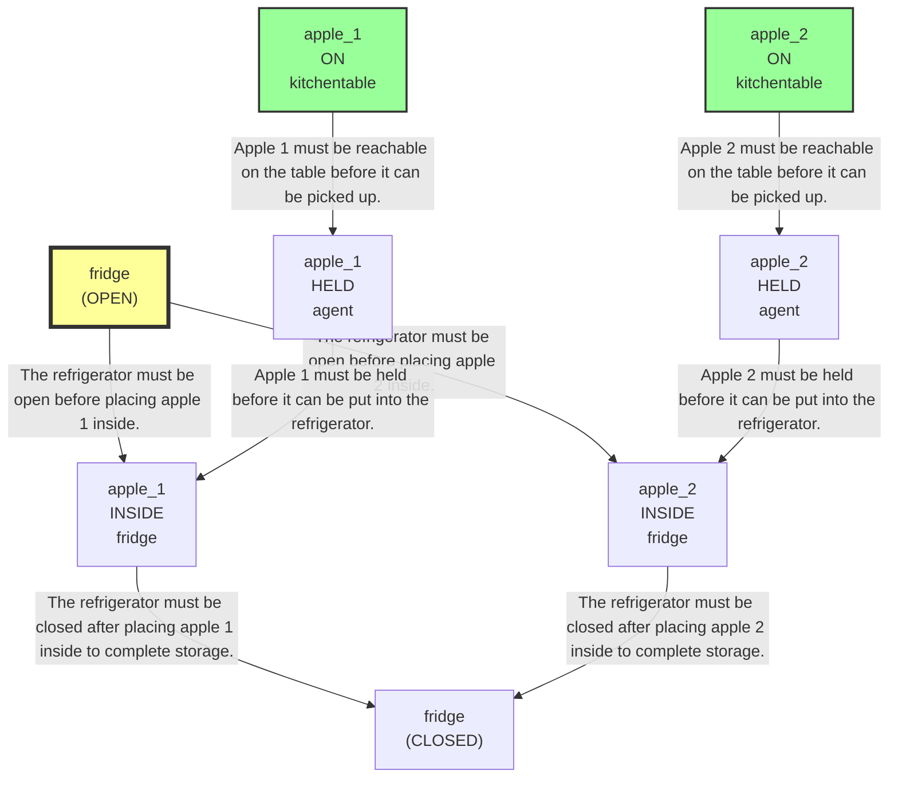
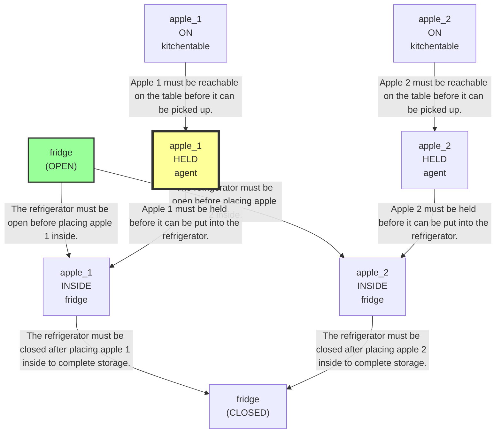
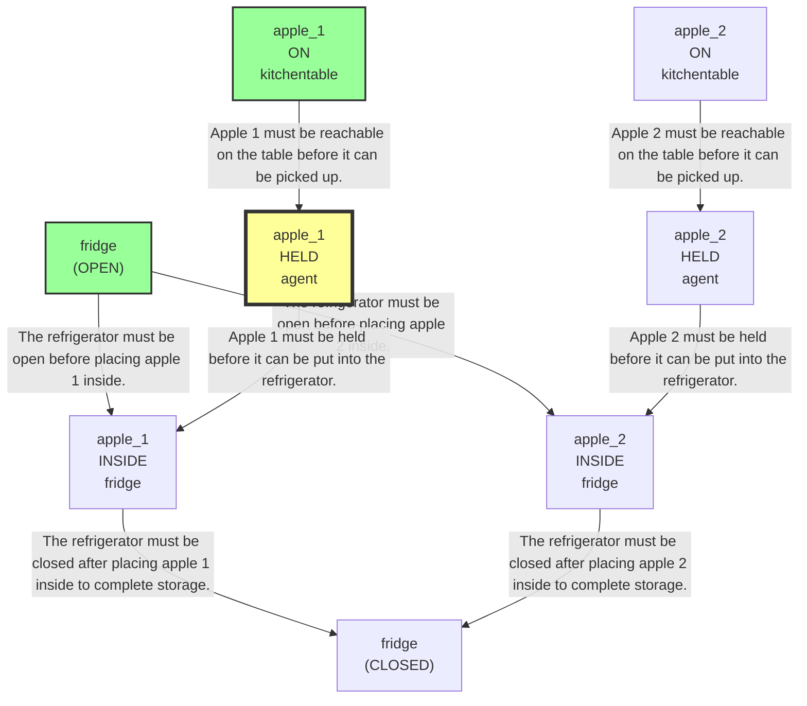
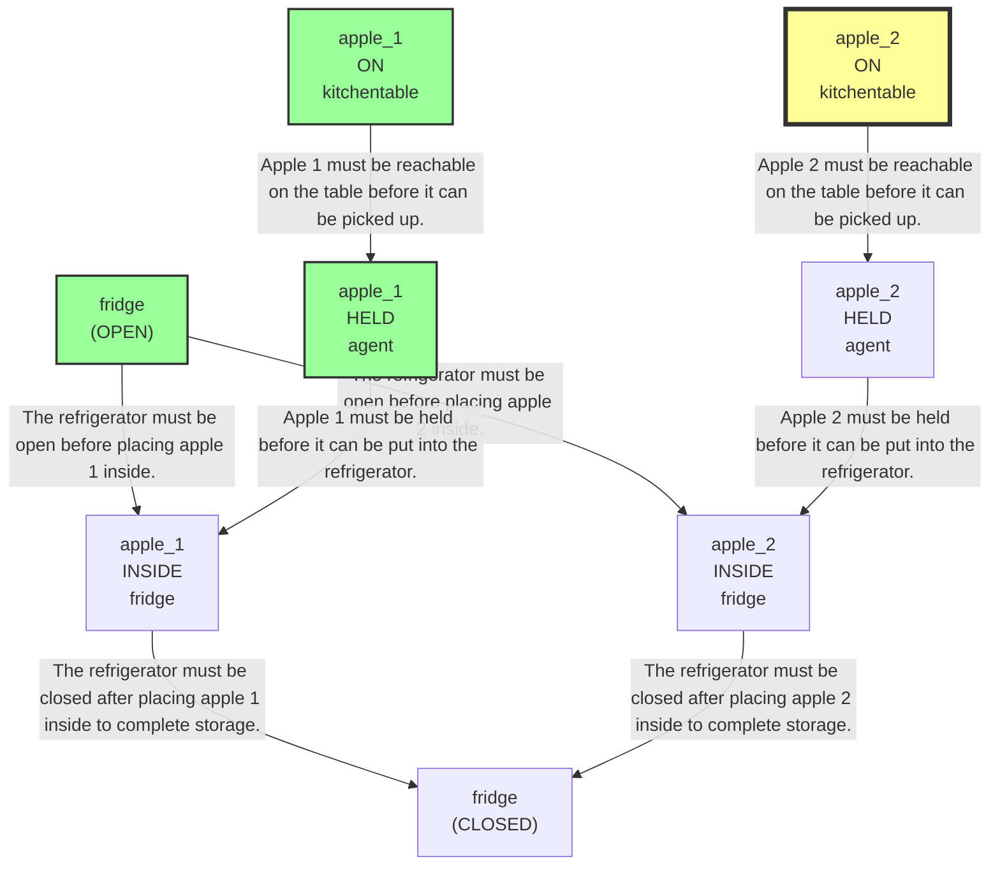
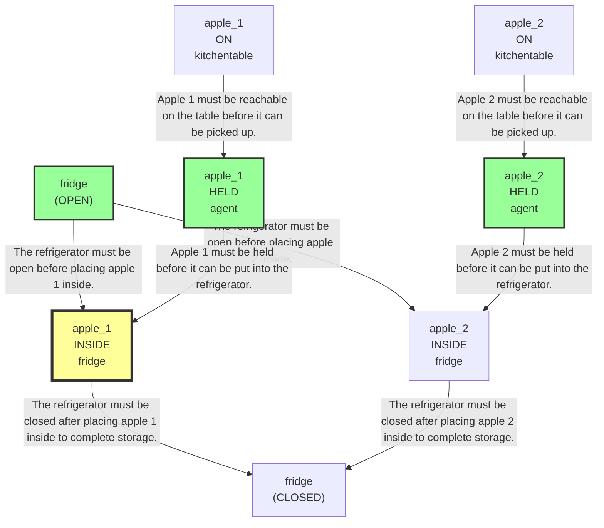
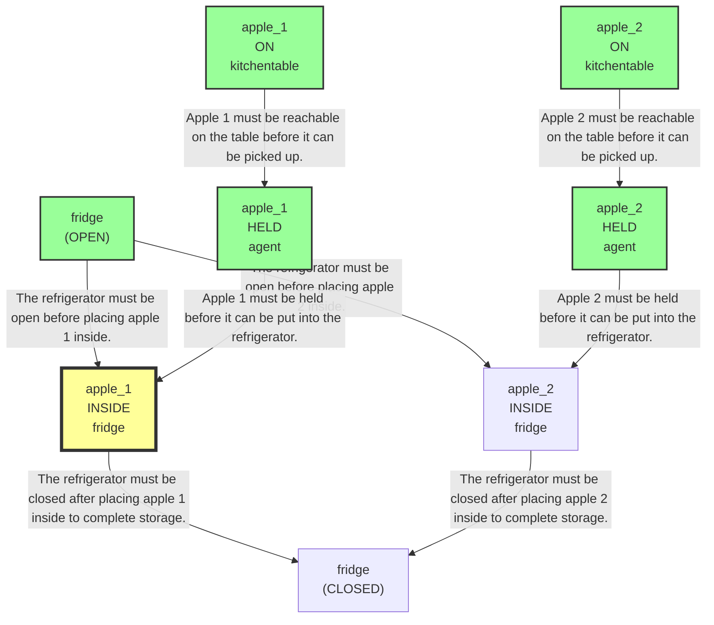
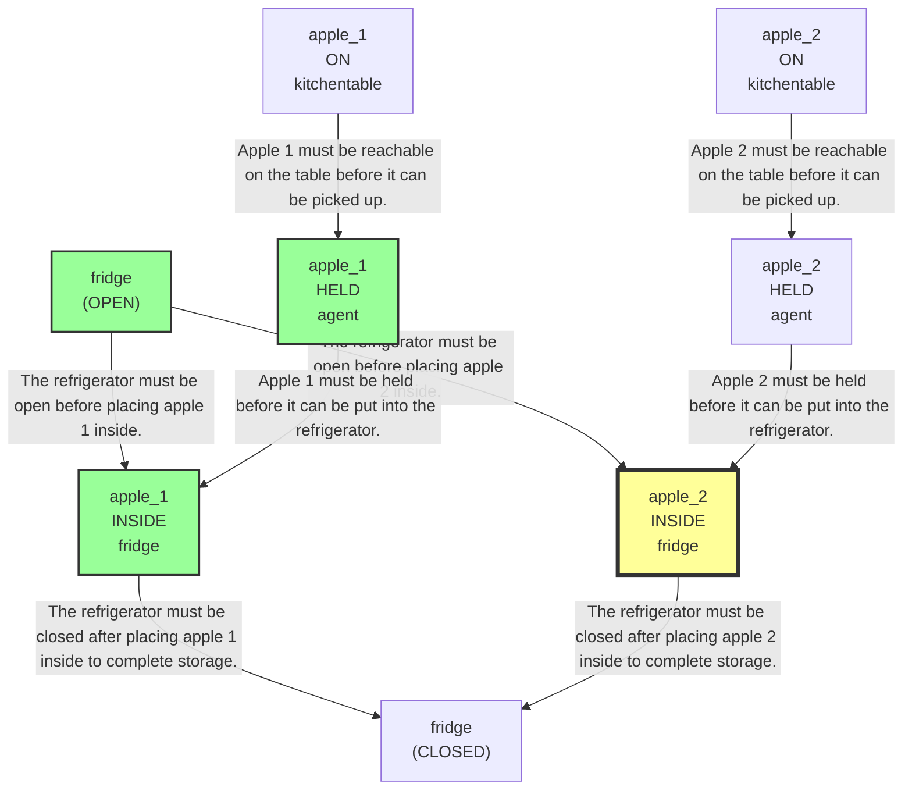
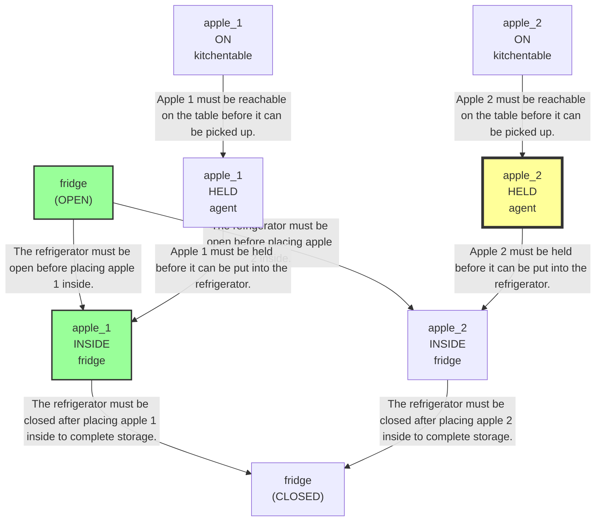
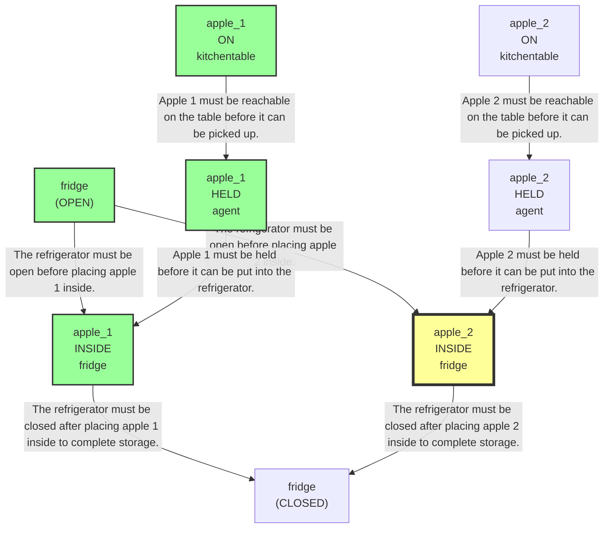

# 🚀 VirtualHome Agent Episode Log


### [GoalReasoner (Module A - Intent)] Output
```json
{
  "is_instruction_obviously_vague": true,
  "clarification_question": "What is the proper place for the apples?",
  "target_object": "apples",
  "location_hint": "kitchen table",
  "reasoning_chain": [
    {
      "question": "Why does the user want this object?",
      "answer": "To move the apples from the kitchen table."
    },
    {
      "question": "Why is that important?",
      "answer": "To store them in a designated destination."
    },
    {
      "question": "What fundamental need does this fulfill?",
      "answer": "It fulfills the need to organize or put away items in the correct storage location."
    },
    {
      "question": "Are there any deeper psychological or physical motivations?",
      "answer": "The user likely wants the space cleared and the apples kept in a proper storage place, but the exact destination is not specified."
    }
  ],
  "deep_intent": "The user wants to put food items away in the correct storage location.",
  "acceptable_alternatives_properties": [
    {
      "priority": 1,
      "description": "Other similar food items that belong with the apples in the same storage area."
    },
    {
      "priority": 2,
      "description": "Other fruits that can be stored alongside apples in household food storage."
    },
    {
      "priority": 3,
      "description": "Other perishable produce items that are typically kept in indoor kitchen storage."
    },
    {
      "priority": 4,
      "description": "Other household items that need to be put away in a clearly defined storage location."
    }
  ]
}
```

### [RoboStateMultiTaskController] Output
```json
{
  "action": "[ask] What is the proper place for the apples?",
  "active_task_id": "task_1",
  "task_context": {
    "active_task_id": "task_1",
    "pending_task_ids": [],
    "satisfied_task_ids": []
  },
  "source": "goal_reasoner_clarification"
}
```
## Step 0
- **Action**: `[ask] What is the proper place for the apples?`
- **Action Success**: `True`
- **Action Message**: Inside the refrigerator.
- **Active Task**: `task_1`
- **Decision Source**: `goal_reasoner_clarification`
- **Task Progress**: T5_G2_12_B2=pending
- **SDG Status**:
No SDG active.
- **Observed Items (159)**: floor(12), floor(13), floor(14), floor(15), floor(16), floor(17), floor(18), floor(19), floor(20), ceiling(21), ceiling(22), ceiling(23), ceiling(24), ceiling(25), ceiling(26)...


### [GoalReasoner (Module A - Intent)] Output
```json
{
  "is_instruction_obviously_vague": true,
  "clarification_question": "How many apples should be stored inside the refrigerator?",
  "target_object": "apple",
  "location_hint": "kitchen table",
  "reasoning_chain": [
    {
      "question": "Why does the user want this object?",
      "answer": "To move apples from the kitchen table into cold storage."
    },
    {
      "question": "Why is that important?",
      "answer": "To keep the apples stored in the refrigerator rather than left on the table."
    },
    {
      "question": "What fundamental need does this fulfill?",
      "answer": "Preserving food and managing household item placement."
    },
    {
      "question": "Are there any deeper psychological or physical motivations?",
      "answer": "Likely food preservation and organization."
    }
  ],
  "deep_intent": "The user wants to preserve food by storing produce in a refrigerator.",
  "acceptable_alternatives_properties": [
    {
      "priority": 1,
      "description": "Other whole fruits or similar produce that can be refrigerated, such as pears, grapes, or oranges."
    },
    {
      "priority": 2,
      "description": "Other perishable fresh foods that belong in cold storage, such as berries or cut fruit."
    },
    {
      "priority": 3,
      "description": "Any refrigerated food items that benefit from being kept cool, such as vegetables or dairy products."
    },
    {
      "priority": 4,
      "description": "Non-food items that need cool storage for preservation, if no produce is available, though this is a weaker substitute."
    }
  ]
}
```

### [RoboStateMultiTaskController] Output
```json
{
  "action": "[ask] How many apples should be stored inside the refrigerator?",
  "active_task_id": "task_1",
  "task_context": {
    "active_task_id": "task_1",
    "pending_task_ids": [],
    "satisfied_task_ids": []
  },
  "source": "goal_reasoner_clarification"
}
```
## Step 1
- **Action**: `[ask] How many apples should be stored inside the refrigerator?`
- **Action Success**: `True`
- **Action Message**: Both apples.
- **Active Task**: `task_1`
- **Decision Source**: `goal_reasoner_clarification`
- **Task Progress**: T5_G2_12_B2=pending
- **SDG Status**:
No SDG active.
- **Observed Items (159)**: floor(12), floor(13), floor(14), floor(15), floor(16), floor(17), floor(18), floor(19), floor(20), ceiling(21), ceiling(22), ceiling(23), ceiling(24), ceiling(25), ceiling(26)...


### [GoalReasoner (Module A - Intent)] Output
```json
{
  "is_instruction_obviously_vague": false,
  "clarification_question": null,
  "target_object": "apples",
  "location_hint": "kitchen table",
  "reasoning_chain": [
    {
      "question": "Why does the user want this object?",
      "answer": "To have the apples moved from the kitchen table into cold storage."
    },
    {
      "question": "Why is that important?",
      "answer": "To keep the apples from remaining out on the table and to preserve them in a refrigerator."
    },
    {
      "question": "What fundamental need does this fulfill?",
      "answer": "The need to store perishable food items safely."
    },
    {
      "question": "Are there any deeper psychological or physical motivations?",
      "answer": "The primary motivation is likely food preservation and maintaining freshness."
    }
  ],
  "deep_intent": "The user wants to preserve perishable food safely by moving it into cold storage.",
  "acceptable_alternatives_properties": [
    {
      "priority": 1,
      "description": "Other fresh fruits that can be stored in a refrigerator, such as pears or berries"
    },
    {
      "priority": 2,
      "description": "Other perishable food items that benefit from refrigeration, such as cut fruit or vegetables"
    },
    {
      "priority": 3,
      "description": "Other household food items needing cool storage, such as dairy products or leftovers"
    },
    {
      "priority": 4,
      "description": "Any safe cool storage location or container that keeps perishable food chilled"
    }
  ]
}
```

### [PerceptionFilter] Output
```json
{
  "reasoning": "The goal is to move the apples from the kitchen table into cold storage. The SDG explicitly requires the apples, the kitchen table they are on, and the fridge as the storage location, including the fridge being open/closed. No other tools are required.",
  "selected_classes": [
    "apple",
    "character",
    "fridge",
    "pear",
    "kitchentable"
  ],
  "raw_class_count": 66
}
```

### [LLMExecutor] Output
```json
{
  "reasoning": "The task is to store both apples in the refrigerator. In the current graph, the apples are on the kitchen table and the fridge is present but closed. Since the next required prerequisite is to open the fridge before any putting-in can happen, and I must not repeat a walk action if I just did it, the best next step is to interact with the fridge directly by opening it. This moves the SDG toward satisfying N3, which unlocks N6/N7.",
  "satisfied_nodes": [
    "N1",
    "N2"
  ],
  "current_node_focus": "N3",
  "mapped_variables": {
    "?Container": "fridge(103)"
  },
  "action": "[open] <fridge> (103)"
}
```

### [RoboStateMultiTaskController] Output
```json
{
  "action": "[walk] <fridge> (103)",
  "active_task_id": "task_1",
  "task_context": {
    "active_task_id": "task_1",
    "pending_task_ids": [],
    "satisfied_task_ids": []
  },
  "source": "llm_executor_repaired"
}
```
## Step 2
- **Action**: `[walk] <fridge> (103)`
- **Action Success**: `True`
- **Action Message**: {'0': {'message': 'Success'}}
- **Active Task**: `task_1`
- **Decision Source**: `llm_executor_repaired`
- **Task Progress**: T5_G2_12_B2=pending
- **SDG Status**:

- **Observed Items (10)**: pear(64), kitchentable(72), fridge(103) [CLOSED], apple(47), apple(48), character(1), kitchen(11), bathroom(172), bedroom(211), livingroom(268)


### [PerceptionFilter] Output
```json
{
  "reasoning": "Reused cached class selection.",
  "selected_classes": [
    "apple",
    "character",
    "fridge",
    "pear",
    "kitchentable"
  ],
  "raw_class_count": 66
}
```

### [LLMExecutor] Output
```json
{
  "reasoning": "We are at the fridge and it is currently CLOSED, which blocks access to its contents. The apples on the kitchen table are the target items, and the historical IDs apple_1/apple_2 are stale; the current graph shows two matching apples, apple(47) and apple(48), both on the kitchen table and grabbable. To progress toward storing them in the fridge, the next required step is to open the fridge before any grabbing/placing actions.",
  "satisfied_nodes": [
    "N1",
    "N2"
  ],
  "current_node_focus": "N3",
  "mapped_variables": {
    "?Container": "fridge(103)"
  },
  "action": "[open] <fridge> (103)"
}
```

### [RoboStateMultiTaskController] Output
```json
{
  "action": "[open] <fridge> (103)",
  "active_task_id": "task_1",
  "task_context": {
    "active_task_id": "task_1",
    "pending_task_ids": [],
    "satisfied_task_ids": []
  },
  "source": "llm_executor"
}
```
## Step 3
- **Action**: `[open] <fridge> (103)`
- **Action Success**: `True`
- **Action Message**: {'0': {'message': 'Success'}}
- **Active Task**: `task_1`
- **Decision Source**: `llm_executor`
- **Task Progress**: T5_G2_12_B2=pending
- **SDG Status**:

- **Observed Items (10)**: pear(64), kitchentable(72), fridge(103) [CLOSED], apple(47), apple(48), character(1), kitchen(11), bathroom(172), bedroom(211), livingroom(268)


### [PerceptionFilter] Output
```json
{
  "reasoning": "Reused cached class selection.",
  "selected_classes": [
    "apple",
    "character",
    "fridge",
    "pear",
    "kitchentable"
  ],
  "raw_class_count": 66
}
```

### [LLMExecutor] Output
```json
{
  "reasoning": "The fridge is already open and I am close to it. The current graph shows two apples on the kitchen table, matching the task. To progress toward the final goal, I should first pick up one apple that is reachable from the table. I will bind the first available apple instance to apple_1 and grab it now.",
  "satisfied_nodes": [
    "N3"
  ],
  "current_node_focus": "N4",
  "mapped_variables": {
    "?Container": "fridge(103)"
  },
  "action": "[grab] <apple> (47)"
}
```

### [RoboStateMultiTaskController] Output
```json
{
  "action": "[walk] <apple> (47)",
  "active_task_id": "task_1",
  "task_context": {
    "active_task_id": "task_1",
    "pending_task_ids": [],
    "satisfied_task_ids": []
  },
  "source": "llm_executor_repaired"
}
```
## Step 4
- **Action**: `[walk] <apple> (47)`
- **Action Success**: `True`
- **Action Message**: {'0': {'message': 'Success'}}
- **Active Task**: `task_1`
- **Decision Source**: `llm_executor_repaired`
- **Task Progress**: T5_G2_12_B2=pending
- **SDG Status**:

- **Observed Items (10)**: pear(64), kitchentable(72), fridge(103) [OPEN], apple(47), apple(48), character(1), kitchen(11), bathroom(172), bedroom(211), livingroom(268)


### [PerceptionFilter] Output
```json
{
  "reasoning": "Reused cached class selection.",
  "selected_classes": [
    "apple",
    "character",
    "fridge",
    "pear",
    "kitchentable"
  ],
  "raw_class_count": 66
}
```

### [LLMExecutor] Output
```json
{
  "reasoning": "Apple 47 is the current reachable apple on the kitchen table and we already walked close to it. The fridge is open, so the next required step is to pick up apple 47 before moving it into the refrigerator. Apple 48 remains the second apple to handle afterward.",
  "satisfied_nodes": [
    "N1",
    "N3"
  ],
  "current_node_focus": "N4",
  "mapped_variables": {
    "?Cooler": "fridge(103)"
  },
  "action": "[grab] <apple> (47)"
}
```

### [RoboStateMultiTaskController] Output
```json
{
  "action": "[grab] <apple> (47)",
  "active_task_id": "task_1",
  "task_context": {
    "active_task_id": "task_1",
    "pending_task_ids": [],
    "satisfied_task_ids": []
  },
  "source": "llm_executor"
}
```
## Step 5
- **Action**: `[grab] <apple> (47)`
- **Action Success**: `True`
- **Action Message**: {'0': {'message': 'Success'}}
- **Active Task**: `task_1`
- **Decision Source**: `llm_executor`
- **Task Progress**: T5_G2_12_B2=pending
- **SDG Status**:

- **Observed Items (10)**: pear(64), kitchentable(72), fridge(103) [OPEN], apple(47), apple(48), character(1), kitchen(11), bathroom(172), bedroom(211), livingroom(268)


### [PerceptionFilter] Output
```json
{
  "reasoning": "Reused cached class selection.",
  "selected_classes": [
    "apple",
    "character",
    "fridge",
    "pear",
    "kitchentable"
  ],
  "raw_class_count": 66
}
```

### [LLMExecutor] Output
```json
{
  "reasoning": "Apple 1 has already been grabbed and the fridge is open. The next unsatisfied prerequisite toward storing both apples is to pick up apple 2, which is currently on the kitchen table and close to the agent. Historical apple_1 was the held apple, and apple(48) is the remaining apple on the table, so I rebind the second target to apple(48).",
  "satisfied_nodes": [
    "N1",
    "N3",
    "N4"
  ],
  "current_node_focus": "N2",
  "mapped_variables": {
    "?Container": "fridge(103)"
  },
  "action": "[grab] <apple> (48)"
}
```

### [RoboStateMultiTaskController] Output
```json
{
  "action": "[grab] <apple> (48)",
  "active_task_id": "task_1",
  "task_context": {
    "active_task_id": "task_1",
    "pending_task_ids": [],
    "satisfied_task_ids": []
  },
  "source": "llm_executor"
}
```
## Step 6
- **Action**: `[grab] <apple> (48)`
- **Action Success**: `True`
- **Action Message**: {'0': {'message': 'Success'}}
- **Active Task**: `task_1`
- **Decision Source**: `llm_executor`
- **Task Progress**: T5_G2_12_B2=pending
- **SDG Status**:

- **Observed Items (10)**: pear(64), kitchentable(72), fridge(103) [OPEN], apple(47), apple(48), character(1), kitchen(11), bathroom(172), bedroom(211), livingroom(268)


### [PerceptionFilter] Output
```json
{
  "reasoning": "Reused cached class selection.",
  "selected_classes": [
    "apple",
    "character",
    "fridge",
    "pear",
    "kitchentable"
  ],
  "raw_class_count": 66
}
```

### [LLMExecutor] Output
```json
{
  "reasoning": "Both apples are already held, and the refrigerator is already open. The next required step toward placing them into cold storage is to move to the refrigerator so a subsequent putin action can be executed. I am rebinding the goal fridge to the currently observed fridge(103).",
  "satisfied_nodes": [
    "N3",
    "N4",
    "N5"
  ],
  "current_node_focus": "N6",
  "mapped_variables": {
    "?Cooler": "fridge(103)"
  },
  "action": "[walk] <fridge> (103)"
}
```

### [RoboStateMultiTaskController] Output
```json
{
  "action": "[walk] <fridge> (103)",
  "active_task_id": "task_1",
  "task_context": {
    "active_task_id": "task_1",
    "pending_task_ids": [],
    "satisfied_task_ids": []
  },
  "source": "llm_executor"
}
```
## Step 7
- **Action**: `[walk] <fridge> (103)`
- **Action Success**: `True`
- **Action Message**: {'0': {'message': 'Success'}}
- **Active Task**: `task_1`
- **Decision Source**: `llm_executor`
- **Task Progress**: T5_G2_12_B2=pending
- **SDG Status**:

- **Observed Items (10)**: pear(64), kitchentable(72), fridge(103) [OPEN], apple(47), apple(48), character(1), kitchen(11), bathroom(172), bedroom(211), livingroom(268)


### [PerceptionFilter] Output
```json
{
  "reasoning": "Reused cached class selection.",
  "selected_classes": [
    "apple",
    "character",
    "fridge",
    "pear",
    "kitchentable"
  ],
  "raw_class_count": 66
}
```

### [LLMExecutor] Output
```json
{
  "reasoning": "We have already walked to the refrigerator and it is open. The agent is currently holding both apples (apple_47 and apple_48), which matches the SDG prerequisites for placing them into the fridge. The next unmet goal is to store the apples inside the open fridge; after that, the fridge can be closed. Since only one atomic action is allowed and we must not repeat the recent walk, the best next step is to put one held apple into the fridge, starting with apple_47.",
  "satisfied_nodes": [
    "N1",
    "N2",
    "N3",
    "N4",
    "N5"
  ],
  "current_node_focus": "N6",
  "mapped_variables": {
    "?Container": "fridge(103)"
  },
  "action": "[putin] <apple> (47) <fridge> (103)"
}
```

### [RoboStateMultiTaskController] Output
```json
{
  "action": "[putin] <apple> (47) <fridge> (103)",
  "active_task_id": "task_1",
  "task_context": {
    "active_task_id": "task_1",
    "pending_task_ids": [],
    "satisfied_task_ids": []
  },
  "source": "llm_executor"
}
```
## Step 8
- **Action**: `[putin] <apple> (47) <fridge> (103)`
- **Action Success**: `True`
- **Action Message**: {'0': {'message': 'Success'}}
- **Active Task**: `task_1`
- **Decision Source**: `llm_executor`
- **Task Progress**: T5_G2_12_B2=pending
- **SDG Status**:

- **Observed Items (10)**: pear(64), kitchentable(72), fridge(103) [OPEN], apple(47), apple(48), character(1), kitchen(11), bathroom(172), bedroom(211), livingroom(268)


### [PerceptionFilter] Output
```json
{
  "reasoning": "Reused cached class selection.",
  "selected_classes": [
    "apple",
    "character",
    "fridge",
    "pear",
    "kitchentable"
  ],
  "raw_class_count": 66
}
```

### [LLMExecutor] Output
```json
{
  "reasoning": "Apple 1 has already been placed inside the open fridge, satisfying N6. The remaining unsatisfied storage goal is to place apple 2 into the refrigerator. The current graph shows apple(48) is close to the agent and currently held in the left hand, so the next needed prerequisite for N7 is to be near the fridge and then put it inside. Since the user goal is cold storage and the fridge is already open, the most direct next step is to move to the fridge before depositing apple 2.",
  "satisfied_nodes": [
    "N3",
    "N4",
    "N6"
  ],
  "current_node_focus": "N7",
  "mapped_variables": {
    "?Container": "fridge(103)"
  },
  "action": "[walk] <fridge> (103)"
}
```

### [RoboStateMultiTaskController] Output
```json
{
  "action": "[walk] <fridge> (103)",
  "active_task_id": "task_1",
  "task_context": {
    "active_task_id": "task_1",
    "pending_task_ids": [],
    "satisfied_task_ids": []
  },
  "source": "llm_executor"
}
```
## Step 9
- **Action**: `[walk] <fridge> (103)`
- **Action Success**: `True`
- **Action Message**: {'0': {'message': 'Success'}}
- **Active Task**: `task_1`
- **Decision Source**: `llm_executor`
- **Task Progress**: T5_G2_12_B2=pending
- **SDG Status**:

- **Observed Items (10)**: pear(64), kitchentable(72), fridge(103) [OPEN], apple(47) [COLD], apple(48), character(1), kitchen(11), bathroom(172), bedroom(211), livingroom(268)


### [PerceptionFilter] Output
```json
{
  "reasoning": "Reused cached class selection.",
  "selected_classes": [
    "apple",
    "character",
    "fridge",
    "pear",
    "kitchentable"
  ],
  "raw_class_count": 66
}
```

### [LLMExecutor] Output
```json
{
  "reasoning": "Apple 47 is already inside the open fridge, satisfying the first apple's storage path. The remaining unsatisfied SDG branch is to store apple 48 in the fridge. Since apple 48 is currently close to the agent and not held, the next required step is to pick it up before returning to the fridge for placement.",
  "satisfied_nodes": [
    "N3",
    "N6"
  ],
  "current_node_focus": "N5",
  "mapped_variables": {
    "?Container": "fridge(103)"
  },
  "action": "[grab] <apple> (48)"
}
```

### [RoboStateMultiTaskController] Output
```json
{
  "action": "[grab] <apple> (48)",
  "active_task_id": "task_1",
  "task_context": {
    "active_task_id": "task_1",
    "pending_task_ids": [],
    "satisfied_task_ids": []
  },
  "source": "llm_executor"
}
```
## Step 10
- **Action**: `[grab] <apple> (48)`
- **Action Success**: `False`
- **Action Message**: {'0': {'message': 'ScriptExcutor 0: EXECUTION_GENERAL: Script is impossible to execute\n\n'}}
- **Active Task**: `task_1`
- **Decision Source**: `llm_executor`
- **Task Progress**: T5_G2_12_B2=pending
- **SDG Status**:

- **Observed Items (10)**: pear(64), kitchentable(72), fridge(103) [OPEN], apple(47) [COLD], apple(48), character(1), kitchen(11), bathroom(172), bedroom(211), livingroom(268)


### [PerceptionFilter] Output
```json
{
  "reasoning": "Reused cached class selection.",
  "selected_classes": [
    "apple",
    "character",
    "fridge",
    "pear",
    "kitchentable"
  ],
  "raw_class_count": 66
}
```

### [LLMExecutor] Output
```json
{
  "reasoning": "Apple 1 has already been placed inside the open fridge, and the current graph shows apple(47) is the remaining apple relevant to the task, while the historical apple(48) grab failed because that ID is stale. The character is already close to apple(48), and it is currently held in the left hand, so the next required step is to place this apple into the open fridge to satisfy the remaining HOLD/INSIDE chain before closing the fridge.",
  "satisfied_nodes": [
    "N1",
    "N3",
    "N4",
    "N6"
  ],
  "current_node_focus": "N7",
  "mapped_variables": {
    "?Container": "fridge(103)"
  },
  "action": "[putin] <apple> (48) <fridge> (103)"
}
```

### [RoboStateMultiTaskController] Output
```json
{
  "action": "[putin] <apple> (48) <fridge> (103)",
  "active_task_id": "task_1",
  "task_context": {
    "active_task_id": "task_1",
    "pending_task_ids": [],
    "satisfied_task_ids": []
  },
  "source": "llm_executor"
}
```
## Step 11
- **Action**: `[putin] <apple> (48) <fridge> (103)`
- **Action Success**: `True`
- **Action Message**: {'0': {'message': 'Success'}}
- **Active Task**: `task_1`
- **Decision Source**: `llm_executor`
- **Task Progress**: T5_G2_12_B2=done
- **SDG Status**:

- **Observed Items (10)**: pear(64), kitchentable(72), fridge(103) [OPEN], apple(47) [COLD], apple(48), character(1), kitchen(11), bathroom(172), bedroom(211), livingroom(268)

