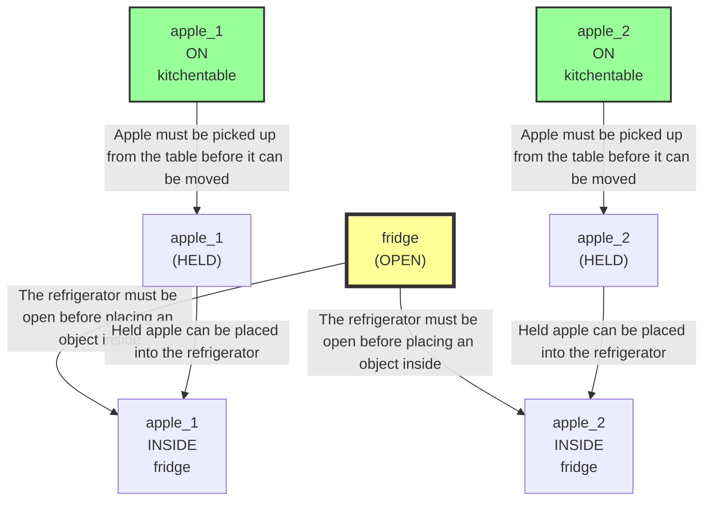
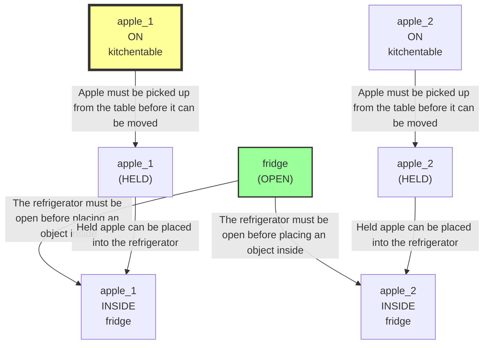
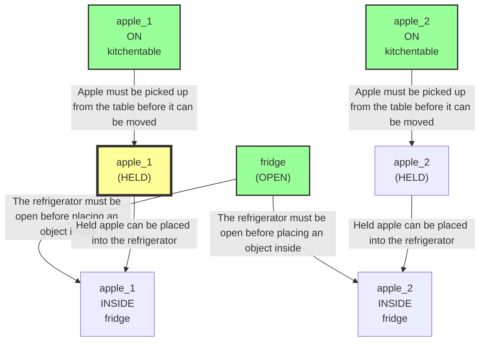
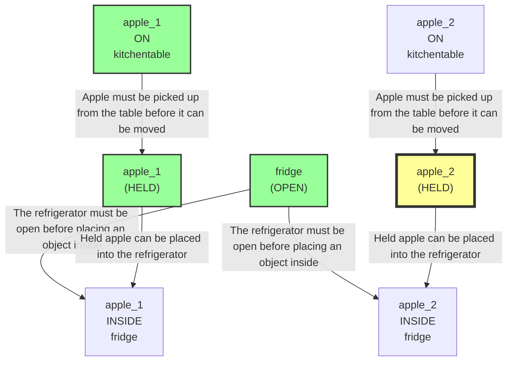
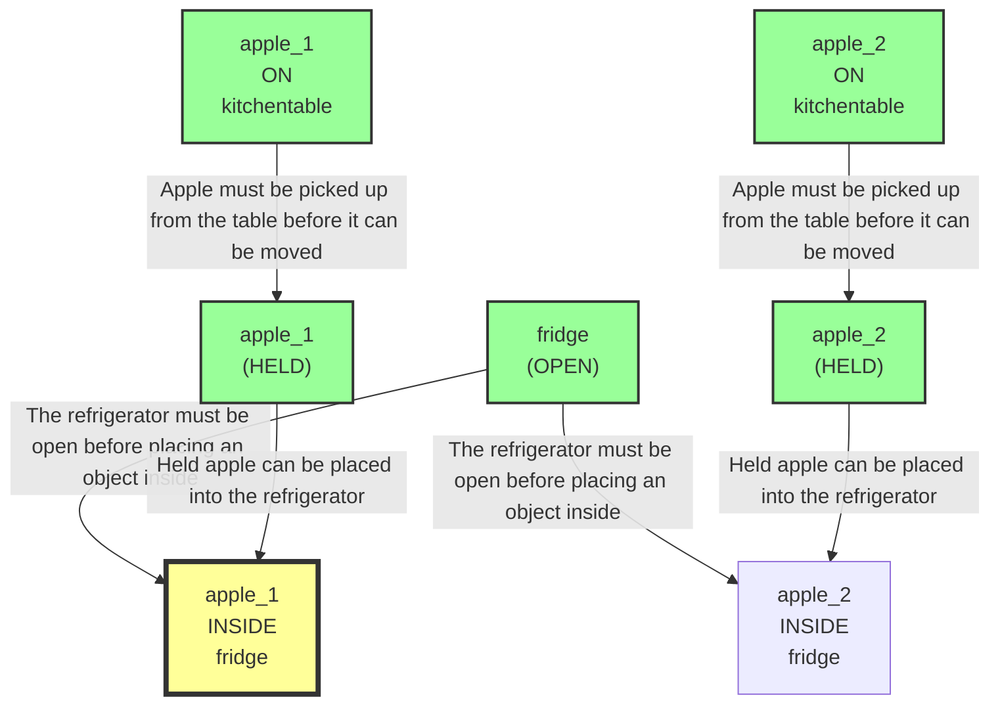
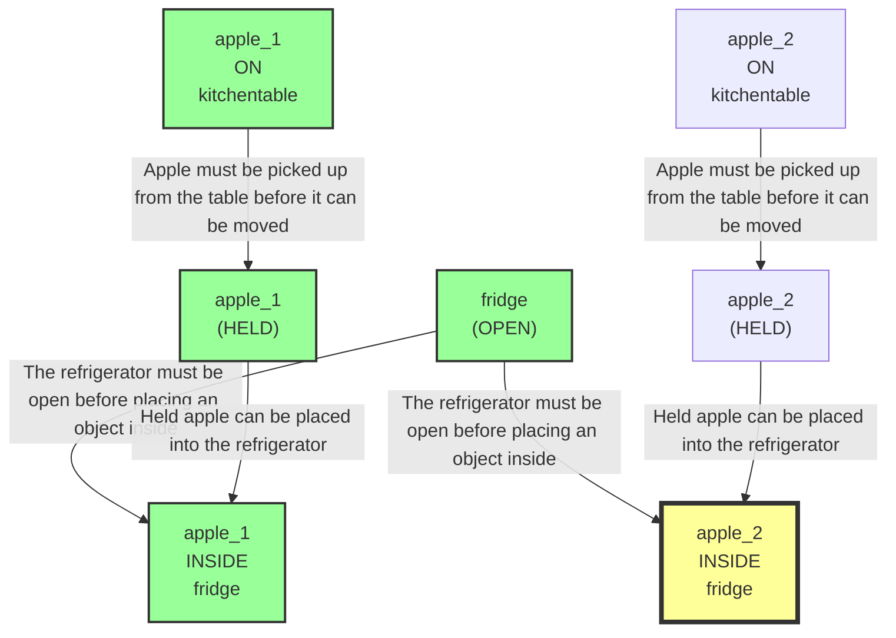

# 🚀 VirtualHome Agent Episode Log


### [GoalReasoner (Module A - Intent)] Output
```json
{
  "is_instruction_obviously_vague": true,
  "clarification_question": "Where should the apples be stored?",
  "target_object": "apples",
  "location_hint": "kitchen table",
  "reasoning_chain": [
    {
      "question": "Why does the user want this object?",
      "answer": "To have the apples moved from the kitchen table to storage."
    },
    {
      "question": "Why is that important?",
      "answer": "To clear or organize the kitchen table and keep the apples in storage."
    },
    {
      "question": "What fundamental need does this fulfill?",
      "answer": "The user wants household organization and proper storage of food items."
    },
    {
      "question": "Are there any deeper psychological or physical motivations?",
      "answer": "The user may want to reduce clutter, maintain order, or preserve the apples by placing them in an appropriate storage location."
    }
  ],
  "deep_intent": "The user wants to organize and properly store food items in the home.",
  "acceptable_alternatives_properties": [
    {
      "priority": 1,
      "description": "Other similar produce items that can be stored in the same kind of household location, such as pears or oranges"
    },
    {
      "priority": 2,
      "description": "Other whole fruits or fresh produce that belong in storage, such as bananas or tomatoes"
    },
    {
      "priority": 3,
      "description": "Other edible household items that can be put away for later, such as packaged snacks or pantry items"
    },
    {
      "priority": 4,
      "description": "Other objects that need to be organized and removed from the table, such as small kitchen items or food containers"
    }
  ]
}
```

### [RoboStateMultiTaskController] Output
```json
{
  "action": "[ask] Where should the apples be stored?",
  "active_task_id": "task_1",
  "task_context": {
    "active_task_id": "task_1",
    "pending_task_ids": [],
    "satisfied_task_ids": []
  },
  "source": "goal_reasoner_clarification"
}
```
## Step 0
- **Action**: `[ask] Where should the apples be stored?`
- **Action Success**: `True`
- **Action Message**: Inside the refrigerator.
- **Active Task**: `task_1`
- **Decision Source**: `goal_reasoner_clarification`
- **Task Progress**: T5_G2_12_B3=pending
- **SDG Status**:
No SDG active.
- **Observed Items (159)**: floor(12), floor(13), floor(14), floor(15), floor(16), floor(17), floor(18), floor(19), floor(20), ceiling(21), ceiling(22), ceiling(23), ceiling(24), ceiling(25), ceiling(26)...


### [GoalReasoner (Module A - Intent)] Output
```json
{
  "is_instruction_obviously_vague": true,
  "clarification_question": "What is the required number of apples to store in the refrigerator?",
  "target_object": "apples",
  "location_hint": "kitchen table",
  "reasoning_chain": [
    {
      "question": "Why does the user want this object?",
      "answer": "To have apples stored in a refrigerator."
    },
    {
      "question": "Why is that important?",
      "answer": "To preserve the apples by placing them in a cooler storage location."
    },
    {
      "question": "What fundamental need does this fulfill?",
      "answer": "To keep food stored safely and maintain its freshness."
    },
    {
      "question": "Are there any deeper psychological or physical motivations?",
      "answer": "The physical motivation is food preservation and readiness for later use."
    }
  ],
  "deep_intent": "To preserve food for later use",
  "acceptable_alternatives_properties": [
    {
      "priority": 1,
      "description": "Other fresh produce items that can be refrigerated, such as pears or grapes"
    },
    {
      "priority": 2,
      "description": "Other perishable foods that are typically kept cold, such as yogurt or cheese"
    },
    {
      "priority": 3,
      "description": "Any food items that benefit from refrigerated storage to maintain freshness"
    },
    {
      "priority": 4,
      "description": "Other household items that need cool storage, if the goal is general preservation rather than food-specific storage"
    }
  ]
}
```

### [RoboStateMultiTaskController] Output
```json
{
  "action": "[ask] What is the required number of apples to store in the refrigerator?",
  "active_task_id": "task_1",
  "task_context": {
    "active_task_id": "task_1",
    "pending_task_ids": [],
    "satisfied_task_ids": []
  },
  "source": "goal_reasoner_clarification"
}
```
## Step 1
- **Action**: `[ask] What is the required number of apples to store in the refrigerator?`
- **Action Success**: `True`
- **Action Message**: Both apples.
- **Active Task**: `task_1`
- **Decision Source**: `goal_reasoner_clarification`
- **Task Progress**: T5_G2_12_B3=pending
- **SDG Status**:
No SDG active.
- **Observed Items (159)**: floor(12), floor(13), floor(14), floor(15), floor(16), floor(17), floor(18), floor(19), floor(20), ceiling(21), ceiling(22), ceiling(23), ceiling(24), ceiling(25), ceiling(26)...


### [GoalReasoner (Module A - Intent)] Output
```json
{
  "is_instruction_obviously_vague": false,
  "clarification_question": null,
  "target_object": "apples",
  "location_hint": "kitchen table",
  "reasoning_chain": [
    {
      "question": "Why does the user want this object?",
      "answer": "To move the apples from the kitchen table into a storage place."
    },
    {
      "question": "Why is that important?",
      "answer": "To keep the apples in a cooler environment and off the table."
    },
    {
      "question": "What fundamental need does this fulfill?",
      "answer": "Preserving food by storing it appropriately."
    },
    {
      "question": "Are there any deeper psychological or physical motivations?",
      "answer": "The user likely wants the fruit kept fresh and organized in a refrigerated storage space."
    }
  ],
  "deep_intent": "The user wants to preserve food freshness by storing fruit in a cool place.",
  "acceptable_alternatives_properties": [
    {
      "priority": 1,
      "description": "Other fresh fruit that can be refrigerated, such as pears, grapes, or berries"
    },
    {
      "priority": 2,
      "description": "Other fresh produce items that are commonly kept chilled, such as citrus fruit or cut fruit"
    },
    {
      "priority": 3,
      "description": "Other perishable foods that benefit from cold storage, such as yogurt or cheese"
    },
    {
      "priority": 4,
      "description": "Any household item or food that needs to be kept cool to remain usable"
    }
  ]
}
```

### [PerceptionFilter] Output
```json
{
  "reasoning": "The goal is to move apples from the kitchen table into cold storage. The SDG explicitly requires the apples, the kitchen table they are on, and an open fridge to place them into. No extra tools are needed beyond these physical objects.",
  "selected_classes": [
    "apple",
    "character",
    "fridge",
    "pear",
    "kitchentable"
  ],
  "raw_class_count": 66
}
```

### [LLMExecutor] Output
```json
{
  "reasoning": "The task is to store both apples from the kitchen table into the refrigerator. The fridge is currently CLOSED, so the next required prerequisite is to open it. I should first move near the fridge before interacting with it. Apple bindings in the current graph are apple(47) and apple(48), both on the kitchen table, matching the two required apples.",
  "satisfied_nodes": [
    "N1",
    "N2"
  ],
  "current_node_focus": "N5",
  "mapped_variables": {
    "?Container": "fridge(103)"
  },
  "action": "[walk] <fridge> (103)"
}
```

### [RoboStateMultiTaskController] Output
```json
{
  "action": "[walk] <fridge> (103)",
  "active_task_id": "task_1",
  "task_context": {
    "active_task_id": "task_1",
    "pending_task_ids": [],
    "satisfied_task_ids": []
  },
  "source": "llm_executor"
}
```
## Step 2
- **Action**: `[walk] <fridge> (103)`
- **Action Success**: `True`
- **Action Message**: {'0': {'message': 'Success'}}
- **Active Task**: `task_1`
- **Decision Source**: `llm_executor`
- **Task Progress**: T5_G2_12_B3=pending
- **SDG Status**:

- **Observed Items (10)**: pear(64), kitchentable(72), fridge(103) [CLOSED], apple(47), apple(48), character(1), kitchen(11), bathroom(172), bedroom(211), livingroom(268)


### [PerceptionFilter] Output
```json
{
  "reasoning": "Reused cached class selection.",
  "selected_classes": [
    "apple",
    "character",
    "fridge",
    "pear",
    "kitchentable"
  ],
  "raw_class_count": 66
}
```

### [LLMExecutor] Output
```json
{
  "reasoning": "The task is to store both apples in the refrigerator. We are already close to the fridge, but it is currently CLOSED, and the SDG requires the fridge to be OPEN before either apple can be placed inside. The current graph shows two apples on the kitchen table, matching the goal objects. The immediate prerequisite node to satisfy is opening the fridge.",
  "satisfied_nodes": [
    "N1",
    "N2"
  ],
  "current_node_focus": "N5",
  "mapped_variables": {
    "?Fridge": "fridge(103)"
  },
  "action": "[open] <fridge> (103)"
}
```

### [RoboStateMultiTaskController] Output
```json
{
  "action": "[open] <fridge> (103)",
  "active_task_id": "task_1",
  "task_context": {
    "active_task_id": "task_1",
    "pending_task_ids": [],
    "satisfied_task_ids": []
  },
  "source": "llm_executor"
}
```
## Step 3
- **Action**: `[open] <fridge> (103)`
- **Action Success**: `True`
- **Action Message**: {'0': {'message': 'Success'}}
- **Active Task**: `task_1`
- **Decision Source**: `llm_executor`
- **Task Progress**: T5_G2_12_B3=pending
- **SDG Status**:

- **Observed Items (10)**: pear(64), kitchentable(72), fridge(103) [CLOSED], apple(47), apple(48), character(1), kitchen(11), bathroom(172), bedroom(211), livingroom(268)


### [PerceptionFilter] Output
```json
{
  "reasoning": "Reused cached class selection.",
  "selected_classes": [
    "apple",
    "character",
    "fridge",
    "pear",
    "kitchentable"
  ],
  "raw_class_count": 66
}
```

### [LLMExecutor] Output
```json
{
  "reasoning": "The fridge is already open and we are close to it. The current goal requires both apples to be stored in the fridge. The apples on the kitchen table are best matched by the two current apple instances on the table, and the next prerequisite is to pick one up before placing it inside the open fridge. Since we are already near the fridge but need to grab an apple from the table, I should first walk to an apple to satisfy the proximity rule for grabbing.",
  "satisfied_nodes": [
    "N5"
  ],
  "current_node_focus": "N1",
  "mapped_variables": {
    "?Container": "fridge(103)"
  },
  "action": "[walk] <apple> (47)"
}
```

### [RoboStateMultiTaskController] Output
```json
{
  "action": "[walk] <apple> (47)",
  "active_task_id": "task_1",
  "task_context": {
    "active_task_id": "task_1",
    "pending_task_ids": [],
    "satisfied_task_ids": []
  },
  "source": "llm_executor"
}
```
## Step 4
- **Action**: `[walk] <apple> (47)`
- **Action Success**: `True`
- **Action Message**: {'0': {'message': 'Success'}}
- **Active Task**: `task_1`
- **Decision Source**: `llm_executor`
- **Task Progress**: T5_G2_12_B3=pending
- **SDG Status**:

- **Observed Items (10)**: pear(64), kitchentable(72), fridge(103) [OPEN], apple(47), apple(48), character(1), kitchen(11), bathroom(172), bedroom(211), livingroom(268)


### [PerceptionFilter] Output
```json
{
  "reasoning": "Reused cached class selection.",
  "selected_classes": [
    "apple",
    "character",
    "fridge",
    "pear",
    "kitchentable"
  ],
  "raw_class_count": 66
}
```

### [LLMExecutor] Output
```json
{
  "reasoning": "The fridge is already open and the current graph shows two apples on the kitchen table: apple(47) and apple(48). The previous walk brought me near apple(47), so the next atomic step is to grab it. This satisfies the prerequisite to later move both apples into the fridge. I am not repeating a walk action because I already walked to an apple in the prior step.",
  "satisfied_nodes": [
    "N5",
    "N1",
    "N2"
  ],
  "current_node_focus": "N3",
  "mapped_variables": {
    "?Container": "fridge(103)",
    "?Item1": "apple(47)",
    "?Item2": "apple(48)"
  },
  "action": "[grab] <apple> (47)"
}
```

### [RoboStateMultiTaskController] Output
```json
{
  "action": "[grab] <apple> (47)",
  "active_task_id": "task_1",
  "task_context": {
    "active_task_id": "task_1",
    "pending_task_ids": [],
    "satisfied_task_ids": []
  },
  "source": "llm_executor"
}
```
## Step 5
- **Action**: `[grab] <apple> (47)`
- **Action Success**: `True`
- **Action Message**: {'0': {'message': 'Success'}}
- **Active Task**: `task_1`
- **Decision Source**: `llm_executor`
- **Task Progress**: T5_G2_12_B3=pending
- **SDG Status**:

- **Observed Items (10)**: pear(64), kitchentable(72), fridge(103) [OPEN], apple(47), apple(48), character(1), kitchen(11), bathroom(172), bedroom(211), livingroom(268)


### [PerceptionFilter] Output
```json
{
  "reasoning": "Reused cached class selection.",
  "selected_classes": [
    "apple",
    "character",
    "fridge",
    "pear",
    "kitchentable"
  ],
  "raw_class_count": 66
}
```

### [LLMExecutor] Output
```json
{
  "reasoning": "We need satisfy the apple storage task by moving both apples from the kitchen table into the open fridge. The current graph shows apple(48) on the kitchentable and close to the character, while apple(47) is already held in the right hand from the previous grab. The fridge is already open, so the next required progression is to grab the second apple before walking to the fridge, using both hands efficiently. The best binding for the remaining table apple is apple(48), which matches the SDG's second apple currently on the kitchen table.",
  "satisfied_nodes": [
    "N1",
    "N3",
    "N5"
  ],
  "current_node_focus": "N4",
  "mapped_variables": {
    "?Container": "fridge(103)"
  },
  "action": "[grab] <apple> (48)"
}
```

### [RoboStateMultiTaskController] Output
```json
{
  "action": "[grab] <apple> (48)",
  "active_task_id": "task_1",
  "task_context": {
    "active_task_id": "task_1",
    "pending_task_ids": [],
    "satisfied_task_ids": []
  },
  "source": "llm_executor"
}
```
## Step 6
- **Action**: `[grab] <apple> (48)`
- **Action Success**: `True`
- **Action Message**: {'0': {'message': 'Success'}}
- **Active Task**: `task_1`
- **Decision Source**: `llm_executor`
- **Task Progress**: T5_G2_12_B3=pending
- **SDG Status**:

- **Observed Items (10)**: pear(64), kitchentable(72), fridge(103) [OPEN], apple(47), apple(48), character(1), kitchen(11), bathroom(172), bedroom(211), livingroom(268)


### [PerceptionFilter] Output
```json
{
  "reasoning": "Reused cached class selection.",
  "selected_classes": [
    "apple",
    "character",
    "fridge",
    "pear",
    "kitchentable"
  ],
  "raw_class_count": 66
}
```

### [LLMExecutor] Output
```json
{
  "reasoning": "We already satisfied the prerequisite by opening the fridge, and both apples are currently held. The next unmet SDG node is to place one held apple into the open fridge. Since putin requires being near the destination and the fridge is already the current nearby target from the prior step, the best next atomic action is to place apple(47) inside the fridge to advance toward N6 while preserving the ability to place the second apple afterward.",
  "satisfied_nodes": [
    "N1",
    "N2",
    "N3",
    "N4",
    "N5"
  ],
  "current_node_focus": "N6",
  "mapped_variables": {
    "?Container": "fridge(103)"
  },
  "action": "[putin] <apple> (47) <fridge> (103)"
}
```

### [RoboStateMultiTaskController] Output
```json
{
  "action": "[walk] <fridge> (103)",
  "active_task_id": "task_1",
  "task_context": {
    "active_task_id": "task_1",
    "pending_task_ids": [],
    "satisfied_task_ids": []
  },
  "source": "llm_executor_repaired"
}
```
## Step 7
- **Action**: `[walk] <fridge> (103)`
- **Action Success**: `True`
- **Action Message**: {'0': {'message': 'Success'}}
- **Active Task**: `task_1`
- **Decision Source**: `llm_executor_repaired`
- **Task Progress**: T5_G2_12_B3=pending
- **SDG Status**:

- **Observed Items (10)**: pear(64), kitchentable(72), fridge(103) [OPEN], apple(47), apple(48), character(1), kitchen(11), bathroom(172), bedroom(211), livingroom(268)


### [PerceptionFilter] Output
```json
{
  "reasoning": "Reused cached class selection.",
  "selected_classes": [
    "apple",
    "character",
    "fridge",
    "pear",
    "kitchentable"
  ],
  "raw_class_count": 66
}
```

### [LLMExecutor] Output
```json
{
  "reasoning": "The two apples required by the SDG are already held: apple(47) in the right hand and apple(48) in the left hand. The fridge is already open, and we are currently close to it, so the next required progression is to place one held apple into the fridge. I will move apple(47) into the open fridge first, which should satisfy the first held-to-inside dependency and reduce the task gap toward the final storage state.",
  "satisfied_nodes": [
    "N1",
    "N2",
    "N3",
    "N4",
    "N5"
  ],
  "current_node_focus": "N6",
  "mapped_variables": {
    "?Container": "fridge(103)"
  },
  "action": "[putin] <apple> (47) <fridge> (103)"
}
```

### [RoboStateMultiTaskController] Output
```json
{
  "action": "[putin] <apple> (47) <fridge> (103)",
  "active_task_id": "task_1",
  "task_context": {
    "active_task_id": "task_1",
    "pending_task_ids": [],
    "satisfied_task_ids": []
  },
  "source": "llm_executor"
}
```
## Step 8
- **Action**: `[putin] <apple> (47) <fridge> (103)`
- **Action Success**: `True`
- **Action Message**: {'0': {'message': 'Success'}}
- **Active Task**: `task_1`
- **Decision Source**: `llm_executor`
- **Task Progress**: T5_G2_12_B3=pending
- **SDG Status**:

- **Observed Items (10)**: pear(64), kitchentable(72), fridge(103) [OPEN], apple(47), apple(48), character(1), kitchen(11), bathroom(172), bedroom(211), livingroom(268)


### [PerceptionFilter] Output
```json
{
  "reasoning": "Reused cached class selection.",
  "selected_classes": [
    "apple",
    "character",
    "fridge",
    "pear",
    "kitchentable"
  ],
  "raw_class_count": 66
}
```

### [LLMExecutor] Output
```json
{
  "reasoning": "Apple 47 is already stored in the fridge, satisfying its held/inside progression. The remaining unsatisfied target is apple 48, which is currently held in the left hand and already close to the open fridge. Since the fridge is open and we are adjacent to it, the next step is to place apple 48 inside the fridge.",
  "satisfied_nodes": [
    "N1",
    "N3",
    "N5",
    "N6"
  ],
  "current_node_focus": "N7",
  "mapped_variables": {
    "?Container": "fridge(103)"
  },
  "action": "[putin] <apple> (48) <fridge> (103)"
}
```

### [RoboStateMultiTaskController] Output
```json
{
  "action": "[putin] <apple> (48) <fridge> (103)",
  "active_task_id": "task_1",
  "task_context": {
    "active_task_id": "task_1",
    "pending_task_ids": [],
    "satisfied_task_ids": []
  },
  "source": "llm_executor"
}
```
## Step 9
- **Action**: `[putin] <apple> (48) <fridge> (103)`
- **Action Success**: `True`
- **Action Message**: {'0': {'message': 'Success'}}
- **Active Task**: `task_1`
- **Decision Source**: `llm_executor`
- **Task Progress**: T5_G2_12_B3=done
- **SDG Status**:

- **Observed Items (10)**: pear(64), kitchentable(72), fridge(103) [OPEN], apple(47) [COLD], apple(48), character(1), kitchen(11), bathroom(172), bedroom(211), livingroom(268)

