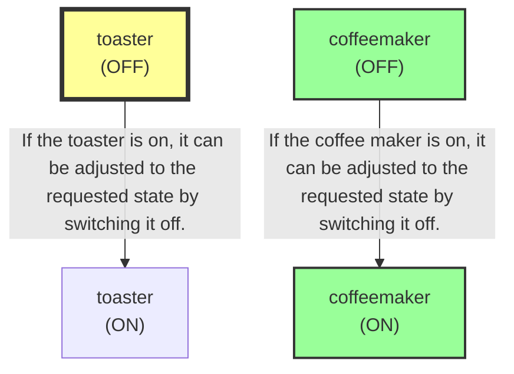
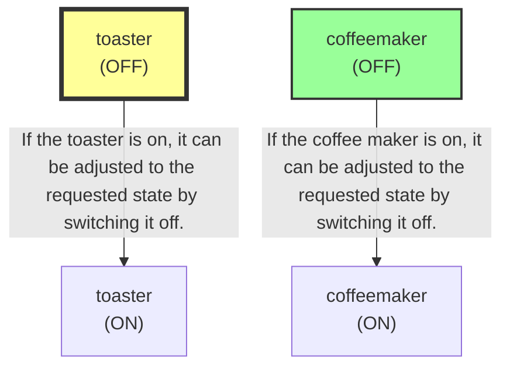

# 🚀 VirtualHome Agent Episode Log


### [GoalReasoner (Module A - Intent)] Output
```json
{
  "is_instruction_obviously_vague": true,
  "clarification_question": "Which appliance should I adjust?",
  "target_object": "appliance",
  "location_hint": null,
  "reasoning_chain": [
    {
      "question": "Why does the user want this object?",
      "answer": "To change the state of one appliance to match a requested setting."
    },
    {
      "question": "Why is that important?",
      "answer": "Because the current on-state may not be the desired operating condition."
    },
    {
      "question": "What fundamental need does this fulfill?",
      "answer": "To control a household appliance so it reaches a specific functional state."
    },
    {
      "question": "Are there any deeper psychological or physical motivations?",
      "answer": "The user likely wants a device in the correct operational state for use or readiness."
    }
  ],
  "deep_intent": "The user wants a household appliance set to a specific operating state.",
  "acceptable_alternatives_properties": [
    {
      "priority": 1,
      "description": "Other controllable household appliances that can be adjusted to a requested operational state."
    },
    {
      "priority": 2,
      "description": "Similar kitchen appliances with on/off or mode controls."
    },
    {
      "priority": 3,
      "description": "Any nearby device that can be set to a specific functional setting."
    },
    {
      "priority": 4,
      "description": "Another appliance serving the same immediate household function if the original one cannot be adjusted."
    }
  ]
}
```

### [PerceptionFilter] Output
```json
{
  "reasoning": "The goal is to adjust a household appliance, and the SDG specifically identifies two controllable appliances that could need changing state: the toaster and the coffeemaker. Per the alternative-retention rule, both must be kept as possible targets/backups, and no unrelated objects are needed.",
  "selected_classes": [
    "coffeemaker",
    "toaster",
    "character"
  ],
  "raw_class_count": 56
}
```

### [LLMExecutor] Output
```json
{
  "reasoning": "The task is ambiguous, but clarification is forbidden in this episode. The SDG gives two valid appliance targets: toaster and coffeemaker, both currently ON. I will autonomously progress the most straightforward sink node by turning off the toaster, which satisfies N3 and moves toward N1 via the SDG edge.",
  "satisfied_nodes": [
    "N2",
    "N4"
  ],
  "current_node_focus": "N3",
  "mapped_variables": {},
  "action": "[switchoff] <toaster> (158)"
}
```

### [RoboStateMultiTaskController] Output
```json
{
  "action": "[walk] <toaster> (158)",
  "active_task_id": "task_1",
  "task_context": {
    "active_task_id": "task_1",
    "pending_task_ids": [],
    "satisfied_task_ids": []
  },
  "source": "llm_executor_repaired"
}
```
## Step 0
- **Action**: `[walk] <toaster> (158)`
- **Action Success**: `True`
- **Action Message**: {'0': {'message': 'Success'}}
- **Active Task**: `task_1`
- **Decision Source**: `llm_executor_repaired`
- **Task Progress**: T5_G2_13_B0=pending
- **SDG Status**:

- **Observed Items (7)**: toaster(158) [ON], coffeemaker(161) [ON,CLOSED], character(1), livingroom(11), kitchen(111), bedroom(214), bathroom(276)


### [PerceptionFilter] Output
```json
{
  "reasoning": "Reused cached class selection.",
  "selected_classes": [
    "coffeemaker",
    "toaster",
    "character"
  ],
  "raw_class_count": 56
}
```

### [LLMExecutor] Output
```json
{
  "reasoning": "The active task is ambiguous, but clarification is forbidden now. The SDG shows two valid controllable appliances, both currently ON. The past action already moved near the toaster, and the current graph confirms the character is close to both toaster(158) and coffeemaker(161). To make autonomous progress toward a satisfied goal state, I should switch off one of the candidate appliances. The toaster is the most directly aligned with the explicit prior approach, and switching it off satisfies N3, which is the prerequisite for N1.",
  "satisfied_nodes": [
    "N3",
    "N4"
  ],
  "current_node_focus": "N3",
  "mapped_variables": {},
  "action": "[switchoff] <toaster> (158)"
}
```

### [RoboStateMultiTaskController] Output
```json
{
  "action": "[switchoff] <toaster> (158)",
  "active_task_id": "task_1",
  "task_context": {
    "active_task_id": "task_1",
    "pending_task_ids": [],
    "satisfied_task_ids": []
  },
  "source": "llm_executor"
}
```
## Step 1
- **Action**: `[switchoff] <toaster> (158)`
- **Action Success**: `True`
- **Action Message**: Faked switch operation in Python layer (bypassed Unity failure)
- **Active Task**: `task_1`
- **Decision Source**: `llm_executor`
- **Task Progress**: T5_G2_13_B0=done
- **SDG Status**:

- **Observed Items (7)**: toaster(158) [ON], coffeemaker(161) [ON,CLOSED], character(1), livingroom(11), kitchen(111), bedroom(214), bathroom(276)

