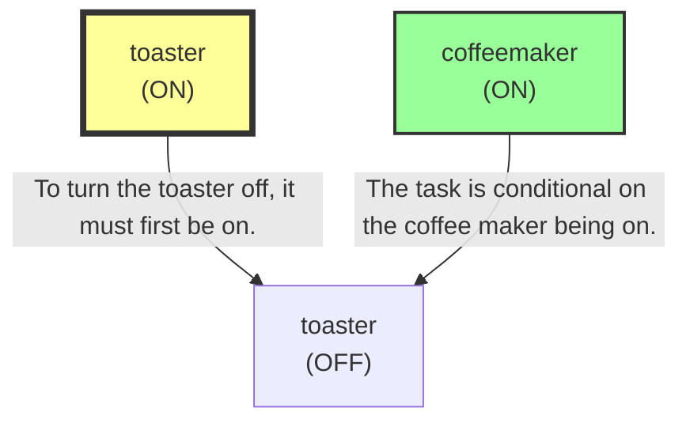
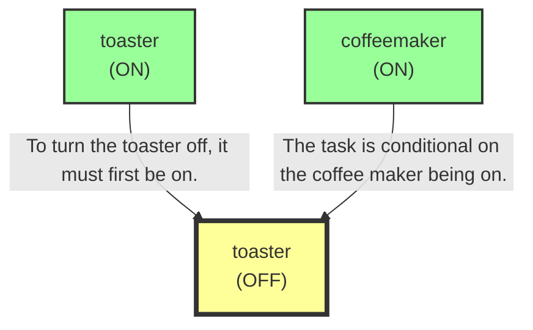

# 🚀 VirtualHome Agent Episode Log


### [GoalReasoner (Module A - Intent)] Output
```json
{
  "is_instruction_obviously_vague": true,
  "clarification_question": "Which appliance should be adjusted: the toaster or the coffee maker?",
  "target_object": null,
  "location_hint": null,
  "reasoning_chain": [
    {
      "question": "Why does the user want this object?",
      "answer": "To adjust an appliance to a requested state."
    },
    {
      "question": "Why is that important?",
      "answer": "So the appliance is in the correct operating condition."
    },
    {
      "question": "What fundamental need does this fulfill?",
      "answer": "It fulfills the need to control a household appliance to the desired state."
    },
    {
      "question": "Are there any deeper psychological or physical motivations?",
      "answer": "The underlying motivation is likely to make the appliance function as intended for a task such as preparing food or drink."
    }
  ],
  "deep_intent": "The user wants to control a household appliance to a desired operating state.",
  "acceptable_alternatives_properties": [
    {
      "priority": 1,
      "description": "Other simple household appliances that can be turned on, off, or adjusted to a clear operating state."
    },
    {
      "priority": 2,
      "description": "Similar countertop appliances used for preparing food or beverages, such as a kettle or microwave."
    },
    {
      "priority": 3,
      "description": "Any indoor appliance with a clear physical control state, such as a lamp or fan."
    },
    {
      "priority": 4,
      "description": "Other devices that can be set to a defined functional state, even if they are not used for cooking or drinks."
    }
  ]
}
```

### [RoboStateMultiTaskController] Output
```json
{
  "action": "[ask] Which appliance should be adjusted: the toaster or the coffee maker?",
  "active_task_id": "task_1",
  "task_context": {
    "active_task_id": "task_1",
    "pending_task_ids": [],
    "satisfied_task_ids": []
  },
  "source": "goal_reasoner_clarification"
}
```
## Step 0
- **Action**: `[ask] Which appliance should be adjusted: the toaster or the coffee maker?`
- **Action Success**: `True`
- **Action Message**: The toaster.
- **Active Task**: `task_1`
- **Decision Source**: `goal_reasoner_clarification`
- **Task Progress**: T5_G2_13_B2=pending
- **SDG Status**:
No SDG active.
- **Observed Items (96)**: floor(112), floor(113), floor(114), floor(115), floor(116), floor(117), wall(118), wall(119), wall(120), wall(121), wall(122), wall(123), ceiling(124), ceiling(125), ceiling(126)...


### [GoalReasoner (Module A - Intent)] Output
```json
{
  "is_instruction_obviously_vague": true,
  "clarification_question": "What exact state should the toaster be adjusted to?",
  "target_object": "toaster",
  "location_hint": null,
  "reasoning_chain": [
    {
      "question": "Why does the user want this object?",
      "answer": "To change the toaster's setting or condition to a specified state."
    },
    {
      "question": "Why is that important?",
      "answer": "So the toaster operates in the way the user intends."
    },
    {
      "question": "What fundamental need does this fulfill?",
      "answer": "The user wants control over an appliance's operating state."
    },
    {
      "question": "Are there any deeper psychological or physical motivations?",
      "answer": "The likely motivation is to achieve the desired appliance behavior, possibly as part of preparing food or coordinating appliance use."
    }
  ],
  "deep_intent": "The user wants to adjust an appliance to a desired operating state.",
  "acceptable_alternatives_properties": [
    {
      "priority": 1,
      "description": "Other small kitchen appliances whose operating settings can be adjusted, such as a microwave, kettle, or coffee maker."
    },
    {
      "priority": 2,
      "description": "Appliances with selectable power or mode settings that can produce a similar functional result."
    },
    {
      "priority": 3,
      "description": "Any household device that can be set to a specific operating level or state."
    },
    {
      "priority": 4,
      "description": "A different appliance that helps complete the same general task if the toaster cannot be adjusted as requested."
    }
  ]
}
```

### [RoboStateMultiTaskController] Output
```json
{
  "action": "[ask] What exact state should the toaster be adjusted to?",
  "active_task_id": "task_1",
  "task_context": {
    "active_task_id": "task_1",
    "pending_task_ids": [],
    "satisfied_task_ids": []
  },
  "source": "goal_reasoner_clarification"
}
```
## Step 1
- **Action**: `[ask] What exact state should the toaster be adjusted to?`
- **Action Success**: `True`
- **Action Message**: Turn it off.
- **Active Task**: `task_1`
- **Decision Source**: `goal_reasoner_clarification`
- **Task Progress**: T5_G2_13_B2=pending
- **SDG Status**:
No SDG active.
- **Observed Items (96)**: floor(112), floor(113), floor(114), floor(115), floor(116), floor(117), wall(118), wall(119), wall(120), wall(121), wall(122), wall(123), ceiling(124), ceiling(125), ceiling(126)...


### [GoalReasoner (Module A - Intent)] Output
```json
{
  "is_instruction_obviously_vague": false,
  "clarification_question": null,
  "target_object": "toaster",
  "location_hint": null,
  "reasoning_chain": [
    {
      "question": "Why does the user want this object?",
      "answer": "To control the toaster’s power state."
    },
    {
      "question": "Why is that important?",
      "answer": "To ensure the toaster is turned off when a certain condition is met."
    },
    {
      "question": "What fundamental need does this fulfill?",
      "answer": "It fulfills a need to manage appliance operation and prevent unnecessary or unsafe heating or energy use."
    },
    {
      "question": "Are there any deeper psychological or physical motivations?",
      "answer": "The user likely wants to maintain safe, intentional control over kitchen appliances and reduce waste or risk."
    }
  ],
  "deep_intent": "The user wants to control an appliance’s power state based on another appliance’s status.",
  "acceptable_alternatives_properties": [
    {
      "priority": 1,
      "description": "Other household appliances that can be switched off, such as a lamp, fan, or microwave."
    },
    {
      "priority": 2,
      "description": "Other electrically powered kitchen devices with an on/off state, such as a blender or electric kettle."
    },
    {
      "priority": 3,
      "description": "Any device or machine in the home that can be powered down to reduce energy use or stop operation."
    },
    {
      "priority": 4,
      "description": "Different controllable household electronics that can satisfy the same need for managing device state and preventing unnecessary operation."
    }
  ]
}
```

### [PerceptionFilter] Output
```json
{
  "reasoning": "The goal is to control the toaster’s power state, and the SDG explicitly depends on the coffeemaker being ON. The minimum required classes are the target appliance (toaster) and the conditional appliance (coffeemaker).",
  "selected_classes": [
    "coffeemaker",
    "microwave",
    "toaster",
    "character"
  ],
  "raw_class_count": 56
}
```

### [LLMExecutor] Output
```json
{
  "reasoning": "The SDG requires the toaster to end OFF, with prerequisite that it is currently ON. The current graph shows toaster(158) is ON and has a switch, so the correct autonomous next step is to turn it off. The toaster is in the kitchen; since switch actions require proximity, I should first move toward the toaster before attempting the switch in a later step. The coffee maker is also ON, which aligns with the conditional context, so no additional action is needed for it right now.",
  "satisfied_nodes": [
    "N3"
  ],
  "current_node_focus": "N2",
  "mapped_variables": {
    "?Toaster": "toaster(158)",
    "?CoffeeMaker": "coffeemaker(161)"
  },
  "action": "[walk] <toaster> (158)"
}
```

### [RoboStateMultiTaskController] Output
```json
{
  "action": "[walk] <toaster> (158)",
  "active_task_id": "task_1",
  "task_context": {
    "active_task_id": "task_1",
    "pending_task_ids": [],
    "satisfied_task_ids": []
  },
  "source": "llm_executor"
}
```
## Step 2
- **Action**: `[walk] <toaster> (158)`
- **Action Success**: `True`
- **Action Message**: {'0': {'message': 'Success'}}
- **Active Task**: `task_1`
- **Decision Source**: `llm_executor`
- **Task Progress**: T5_G2_13_B2=pending
- **SDG Status**:

- **Observed Items (8)**: toaster(158) [ON], coffeemaker(161) [ON,CLOSED], microwave(162) [CLOSED,OFF], character(1), livingroom(11), kitchen(111), bedroom(214), bathroom(276)


### [PerceptionFilter] Output
```json
{
  "reasoning": "Reused cached class selection.",
  "selected_classes": [
    "coffeemaker",
    "microwave",
    "toaster",
    "character"
  ],
  "raw_class_count": 56
}
```

### [LLMExecutor] Output
```json
{
  "reasoning": "The toaster is already the correct target appliance and is currently ON, while the goal SDG requires it to be OFF. We are already close to the toaster, so the next atomic step is to switch it off. This directly satisfies N1 after the toaster power state changes.",
  "satisfied_nodes": [
    "N3",
    "N2"
  ],
  "current_node_focus": "N1",
  "mapped_variables": {
    "?Washer": "kitchen(111)"
  },
  "action": "[switchoff] <toaster> (158)"
}
```

### [RoboStateMultiTaskController] Output
```json
{
  "action": "[switchoff] <toaster> (158)",
  "active_task_id": "task_1",
  "task_context": {
    "active_task_id": "task_1",
    "pending_task_ids": [],
    "satisfied_task_ids": []
  },
  "source": "llm_executor"
}
```
## Step 3
- **Action**: `[switchoff] <toaster> (158)`
- **Action Success**: `True`
- **Action Message**: Faked switch operation in Python layer (bypassed Unity failure)
- **Active Task**: `task_1`
- **Decision Source**: `llm_executor`
- **Task Progress**: T5_G2_13_B2=done
- **SDG Status**:

- **Observed Items (8)**: toaster(158) [ON], coffeemaker(161) [ON,CLOSED], microwave(162) [CLOSED,OFF], character(1), livingroom(11), kitchen(111), bedroom(214), bathroom(276)

