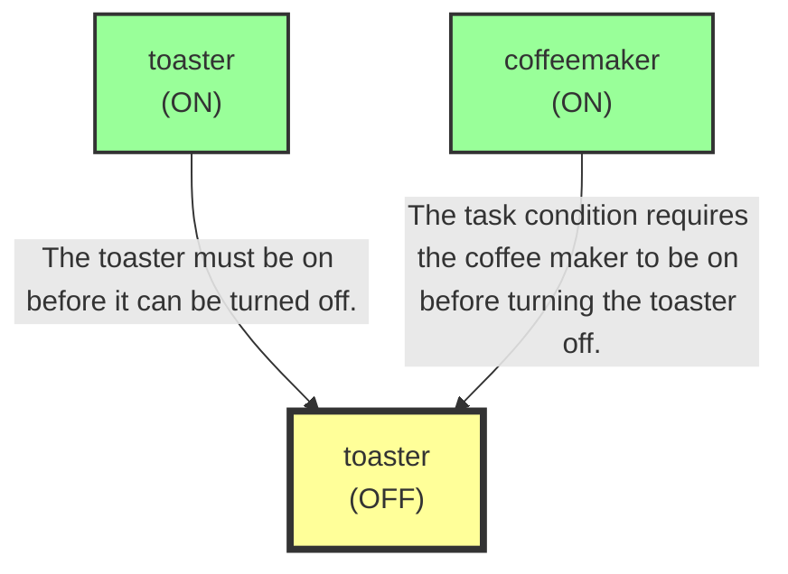

# 🚀 VirtualHome Agent Episode Log


### [GoalReasoner (Module A - Intent)] Output
```json
{
  "is_instruction_obviously_vague": true,
  "clarification_question": "Which appliance should I adjust: the toaster or the coffee maker?",
  "target_object": "appliance",
  "location_hint": null,
  "reasoning_chain": [
    {
      "question": "Why does the user want this object?",
      "answer": "To change the state of an appliance that is currently on."
    },
    {
      "question": "Why is that important?",
      "answer": "To make the appliance match the requested state."
    },
    {
      "question": "What fundamental need does this fulfill?",
      "answer": "The user wants to control a household device to achieve a desired operating condition."
    },
    {
      "question": "Are there any deeper psychological or physical motivations?",
      "answer": "The likely motivation is to manage an active kitchen appliance for use or safety, but the exact device and desired state are not specified."
    }
  ],
  "deep_intent": "The user wants to control a household appliance so it is in the desired operating state.",
  "acceptable_alternatives_properties": [
    {
      "priority": 1,
      "description": "The same type of kitchen appliance if the exact one is unavailable or unclear, such as another appliance that can be switched or adjusted."
    },
    {
      "priority": 2,
      "description": "Another small countertop appliance with a similar on/off or setting-control function."
    },
    {
      "priority": 3,
      "description": "A different household device that can be adjusted to a requested operating state."
    },
    {
      "priority": 4,
      "description": "Any indoor appliance that serves the same basic control/adjustment need."
    }
  ]
}
```

### [RoboStateMultiTaskController] Output
```json
{
  "action": "[ask] Which appliance should I adjust: the toaster or the coffee maker?",
  "active_task_id": "task_1",
  "task_context": {
    "active_task_id": "task_1",
    "pending_task_ids": [],
    "satisfied_task_ids": []
  },
  "source": "goal_reasoner_clarification"
}
```
## Step 0
- **Action**: `[ask] Which appliance should I adjust: the toaster or the coffee maker?`
- **Action Success**: `True`
- **Action Message**: The toaster.
- **Active Task**: `task_1`
- **Decision Source**: `goal_reasoner_clarification`
- **Task Progress**: T5_G2_13_B3=pending
- **SDG Status**:
No SDG active.
- **Observed Items (96)**: floor(112), floor(113), floor(114), floor(115), floor(116), floor(117), wall(118), wall(119), wall(120), wall(121), wall(122), wall(123), ceiling(124), ceiling(125), ceiling(126)...


### [GoalReasoner (Module A - Intent)] Output
```json
{
  "is_instruction_obviously_vague": true,
  "clarification_question": "What exact state should the toaster be adjusted to?",
  "target_object": "toaster",
  "location_hint": null,
  "reasoning_chain": [
    {
      "question": "Why does the user want this object?",
      "answer": "To change the toaster's state."
    },
    {
      "question": "Why is that important?",
      "answer": "So the toaster matches the requested setting."
    },
    {
      "question": "What fundamental need does this fulfill?",
      "answer": "It fulfills the need to configure a household appliance to a specific operating state."
    },
    {
      "question": "Are there any deeper psychological or physical motivations?",
      "answer": "The motivation is likely to prepare the appliance for use in the intended way or ensure it is set correctly."
    }
  ],
  "deep_intent": "The user wants to configure a household appliance to a specific state.",
  "acceptable_alternatives_properties": [
    {
      "priority": 1,
      "description": "Other household appliances that can be adjusted to a specific operating setting, such as a microwave, oven, or coffee maker."
    },
    {
      "priority": 2,
      "description": "Similar countertop kitchen appliances with controllable settings, such as a kettle or air fryer."
    },
    {
      "priority": 3,
      "description": "Any appliance or device with an adjustable state or mode."
    },
    {
      "priority": 4,
      "description": "If the goal is preparation for use, other devices that can be set up and operated to complete a task."
    }
  ]
}
```

### [RoboStateMultiTaskController] Output
```json
{
  "action": "[ask] What exact state should the toaster be adjusted to?",
  "active_task_id": "task_1",
  "task_context": {
    "active_task_id": "task_1",
    "pending_task_ids": [],
    "satisfied_task_ids": []
  },
  "source": "goal_reasoner_clarification"
}
```
## Step 1
- **Action**: `[ask] What exact state should the toaster be adjusted to?`
- **Action Success**: `True`
- **Action Message**: Turn it off.
- **Active Task**: `task_1`
- **Decision Source**: `goal_reasoner_clarification`
- **Task Progress**: T5_G2_13_B3=pending
- **SDG Status**:
No SDG active.
- **Observed Items (96)**: floor(112), floor(113), floor(114), floor(115), floor(116), floor(117), wall(118), wall(119), wall(120), wall(121), wall(122), wall(123), ceiling(124), ceiling(125), ceiling(126)...


### [GoalReasoner (Module A - Intent)] Output
```json
{
  "is_instruction_obviously_vague": false,
  "clarification_question": null,
  "target_object": "toaster",
  "location_hint": null,
  "reasoning_chain": [
    {
      "question": "Why does the user want this object?",
      "answer": "To control the toaster's power state based on the condition that both appliances are on."
    },
    {
      "question": "Why is that important?",
      "answer": "To ensure the toaster is turned off when the specified condition is met."
    },
    {
      "question": "What fundamental need does this fulfill?",
      "answer": "The user wants to manage an appliance's operating state in response to a household condition."
    },
    {
      "question": "Are there any deeper psychological or physical motivations?",
      "answer": "Likely to prevent unnecessary operation, conserve energy, or reduce safety risk."
    }
  ],
  "deep_intent": "The user wants to change an appliance's power state when a specified condition is true.",
  "acceptable_alternatives_properties": [
    {
      "priority": 1,
      "description": "Other controllable household appliances that can be switched off, such as a lamp, fan, or kettle."
    },
    {
      "priority": 2,
      "description": "Similar kitchen appliances with an on/off state, such as a microwave or blender."
    },
    {
      "priority": 3,
      "description": "Any electrically powered device that can be safely turned off to stop operation."
    },
    {
      "priority": 4,
      "description": "If the exact appliance cannot be controlled, a comparable device can be stopped or disabled to achieve the same safety or energy-saving goal."
    }
  ]
}
```

### [PerceptionFilter] Output
```json
{
  "reasoning": "The SDG requires the toaster to be turned OFF when the coffeemaker is ON, so the only necessary object classes are the target appliance and the condition appliance. No other tools or locations are required by the graph.",
  "selected_classes": [
    "coffeemaker",
    "microwave",
    "toaster",
    "character"
  ],
  "raw_class_count": 56
}
```

### [LLMExecutor] Output
```json
{
  "reasoning": "The SDG requires the toaster to be ON, the coffeemaker to be ON, and then the toaster turned OFF. The current graph already shows both toaster and coffeemaker are ON, so N1 and N2 are satisfied. The remaining focus is to turn the toaster off, and because it has a switch and is in the current room, the next atomic action is to switch it off.",
  "satisfied_nodes": [
    "N1",
    "N2"
  ],
  "current_node_focus": "N3",
  "mapped_variables": {},
  "action": "[switchoff] <toaster> (158)"
}
```

### [RoboStateMultiTaskController] Output
```json
{
  "action": "[walk] <toaster> (158)",
  "active_task_id": "task_1",
  "task_context": {
    "active_task_id": "task_1",
    "pending_task_ids": [],
    "satisfied_task_ids": []
  },
  "source": "llm_executor_repaired"
}
```
## Step 2
- **Action**: `[walk] <toaster> (158)`
- **Action Success**: `True`
- **Action Message**: {'0': {'message': 'Success'}}
- **Active Task**: `task_1`
- **Decision Source**: `llm_executor_repaired`
- **Task Progress**: T5_G2_13_B3=pending
- **SDG Status**:

- **Observed Items (8)**: toaster(158) [ON], coffeemaker(161) [ON,CLOSED], microwave(162) [CLOSED,OFF], character(1), livingroom(11), kitchen(111), bedroom(214), bathroom(276)


### [PerceptionFilter] Output
```json
{
  "reasoning": "Reused cached class selection.",
  "selected_classes": [
    "coffeemaker",
    "microwave",
    "toaster",
    "character"
  ],
  "raw_class_count": 56
}
```

### [LLMExecutor] Output
```json
{
  "reasoning": "The toaster is already ON and the coffee maker is also ON, which satisfies the precondition for the final goal node. The next required state is to turn the toaster OFF. I am already close to the toaster, so I can directly operate its switch.",
  "satisfied_nodes": [
    "N1",
    "N2"
  ],
  "current_node_focus": "N3",
  "mapped_variables": {},
  "action": "[switchoff] <toaster> (158)"
}
```

### [RoboStateMultiTaskController] Output
```json
{
  "action": "[switchoff] <toaster> (158)",
  "active_task_id": "task_1",
  "task_context": {
    "active_task_id": "task_1",
    "pending_task_ids": [],
    "satisfied_task_ids": []
  },
  "source": "llm_executor"
}
```
## Step 3
- **Action**: `[switchoff] <toaster> (158)`
- **Action Success**: `True`
- **Action Message**: Faked switch operation in Python layer (bypassed Unity failure)
- **Active Task**: `task_1`
- **Decision Source**: `llm_executor`
- **Task Progress**: T5_G2_13_B3=done
- **SDG Status**:

- **Observed Items (8)**: toaster(158) [ON], coffeemaker(161) [ON,CLOSED], microwave(162) [CLOSED,OFF], character(1), livingroom(11), kitchen(111), bedroom(214), bathroom(276)

