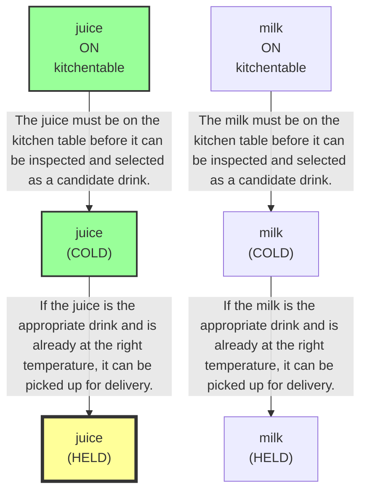

# 🚀 VirtualHome Agent Episode Log


### [GoalReasoner (Module A - Intent)] Output
```json
{
  "is_instruction_obviously_vague": true,
  "clarification_question": "Which drink should I bring?",
  "target_object": "drink",
  "location_hint": "kitchen table",
  "reasoning_chain": [
    {
      "question": "Why does the user want this object?",
      "answer": "To have a drink available."
    },
    {
      "question": "Why is that important?",
      "answer": "To satisfy a thirst or beverage need."
    },
    {
      "question": "What fundamental need does this fulfill?",
      "answer": "Hydration and refreshment."
    },
    {
      "question": "Are there any deeper psychological or physical motivations?",
      "answer": "The user may want comfort, relief from thirst, or a preferred beverage experience."
    }
  ],
  "deep_intent": "The user wants to satisfy thirst or refreshment with a suitable beverage at an appropriate temperature.",
  "acceptable_alternatives_properties": [
    {
      "priority": 1,
      "description": "Other beverages of the same general type that are already suitable to drink at the desired temperature, such as water, juice, soda, tea, or coffee."
    },
    {
      "priority": 2,
      "description": "Any ready-to-drink household beverage that matches the intended temperature and can satisfy thirst."
    },
    {
      "priority": 3,
      "description": "Other drinkable liquids that provide hydration or refreshment, if the preferred beverage is unavailable."
    },
    {
      "priority": 4,
      "description": "A different hydrating beverage with a similar temperature and drinking experience, such as another cold or warm drink."
    }
  ]
}
```

### [PerceptionFilter] Output
```json
{
  "reasoning": "The goal is to bring a suitable drink, and the SDG specifically identifies juice and milk as the candidate beverages on the kitchen table, both cold and holdable. I also keep the kitchen table because it is the required location for the drinks, and the waterglass as a possible drinking vessel backup if needed.",
  "selected_classes": [
    "character",
    "waterglass",
    "juice",
    "kitchentable",
    "milk"
  ],
  "raw_class_count": 50
}
```

### [LLMExecutor] Output
```json
{
  "reasoning": "The task is ambiguous, but clarification is forbidden, so I must choose autonomously. The SDG’s drink candidates are juice and milk. Juice(173) is already COLD and on the kitchen table, satisfying the prerequisite chain to be picked up; milk(176) is HOT and closed, so it is a worse fit. The next progress-making step toward delivering the selected cold drink is to grab the cold juice. I am already close to juice(173).",
  "satisfied_nodes": [
    "N1",
    "N3"
  ],
  "current_node_focus": "N4",
  "mapped_variables": {},
  "action": "[grab] <juice> (173)"
}
```

### [RoboStateMultiTaskController] Output
```json
{
  "action": "[grab] <juice> (173)",
  "active_task_id": "task_1",
  "task_context": {
    "active_task_id": "task_1",
    "pending_task_ids": [],
    "satisfied_task_ids": []
  },
  "source": "llm_executor"
}
```
## Step 0
- **Action**: `[grab] <juice> (173)`
- **Action Success**: `True`
- **Action Message**: {'0': {'message': 'Success'}}
- **Active Task**: `task_1`
- **Decision Source**: `llm_executor`
- **Task Progress**: T5_G2_14_B0=done
- **SDG Status**:

- **Observed Items (20)**: waterglass(64), waterglass(71), waterglass(72), waterglass(79), waterglass(80), waterglass(87), waterglass(88), waterglass(100), kitchentable(131), kitchentable(135), juice(173) [COLD], juice(174), milk(177) [CLOSED], milk(176) [HOT,CLOSED], character(1)...

