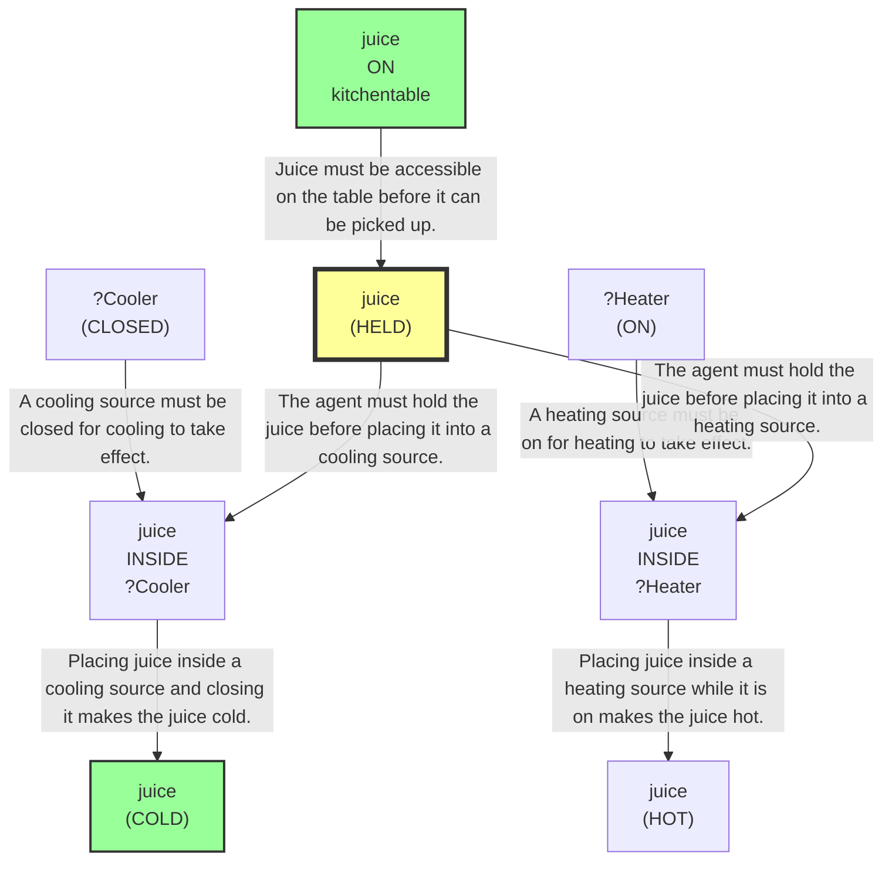

# 🚀 VirtualHome Agent Episode Log


### [GoalReasoner (Module A - Intent)] Output
```json
{
  "is_instruction_obviously_vague": true,
  "clarification_question": "Which drink should I bring?",
  "target_object": "drink",
  "location_hint": "kitchen table",
  "reasoning_chain": [
    {
      "question": "Why does the user want this object?",
      "answer": "To have a drink available."
    },
    {
      "question": "Why is that important?",
      "answer": "To satisfy thirst or enjoy a beverage."
    },
    {
      "question": "What fundamental need does this fulfill?",
      "answer": "Relieving thirst / hydration."
    },
    {
      "question": "Are there any deeper psychological or physical motivations?",
      "answer": "The user likely wants a suitable beverage that matches their preference and temperature."
    }
  ],
  "deep_intent": "The user wants to obtain a suitable beverage to drink.",
  "acceptable_alternatives_properties": [
    {
      "priority": 1,
      "description": "Other beverages that match the intended type and temperature, such as water, juice, milk, tea, or coffee depending on context."
    },
    {
      "priority": 2,
      "description": "Other drinkable items from the same general beverage category, such as bottled drinks, canned drinks, or prepared hot/cold beverages."
    },
    {
      "priority": 3,
      "description": "Any common household beverage that can satisfy thirst, such as flavored drinks or plain water."
    },
    {
      "priority": 4,
      "description": "A different thirst-relieving option in a pinch, such as chilled water instead of a requested cold drink or warm water instead of a requested hot drink."
    }
  ]
}
```

### [RoboStateMultiTaskController] Output
```json
{
  "action": "[ask] Which drink should I bring?",
  "active_task_id": "task_1",
  "task_context": {
    "active_task_id": "task_1",
    "pending_task_ids": [],
    "satisfied_task_ids": []
  },
  "source": "goal_reasoner_clarification"
}
```
## Step 0
- **Action**: `[ask] Which drink should I bring?`
- **Action Success**: `True`
- **Action Message**: The juice.
- **Active Task**: `task_1`
- **Decision Source**: `goal_reasoner_clarification`
- **Task Progress**: T5_G2_14_B1=pending
- **SDG Status**:
No SDG active.
- **Observed Items (159)**: wall(12), wall(13), wall(14), wall(15), wall(16), wall(17), wall(18), wall(19), wall(20), wall(21), floor(22), floor(23), floor(24), floor(25), floor(26)...


### [GoalReasoner (Module A - Intent)] Output
```json
{
  "is_instruction_obviously_vague": true,
  "clarification_question": "What temperature should the juice be?",
  "target_object": "juice",
  "location_hint": "kitchen table",
  "reasoning_chain": [
    {
      "question": "Why does the user want this object?",
      "answer": "To have juice available to them."
    },
    {
      "question": "Why is that important?",
      "answer": "They want to drink it."
    },
    {
      "question": "What fundamental need does this fulfill?",
      "answer": "It fulfills thirst relief and refreshment."
    },
    {
      "question": "Are there any deeper psychological or physical motivations?",
      "answer": "The user may want hydration and a preferred drinking experience, including a specific temperature."
    }
  ],
  "deep_intent": "The user wants to relieve thirst and refresh themselves with a drink at a preferred temperature.",
  "acceptable_alternatives_properties": [
    {
      "priority": 1,
      "description": "Other ready-to-drink cold or warm beverages that match the requested temperature."
    },
    {
      "priority": 2,
      "description": "Similar fruit-based drinks or flavored beverages."
    },
    {
      "priority": 3,
      "description": "Packaged drinks or liquids that provide hydration and refreshment."
    },
    {
      "priority": 4,
      "description": "Water or other household beverages that can satisfy thirst even if they are not juice."
    }
  ]
}
```

### [PerceptionFilter] Output
```json
{
  "reasoning": "The goal is to get juice at a preferred temperature. The SDG requires the target object (juice), its location on the kitchen table, and possible cooling/heating appliances. Because alternatives must be retained, I keep all plausible cooler/heater options visible: fridge, microwave, and stove. Since the goal mentions drinking/thirst relief and alternatives include similar beverages, I also keep waterglass as a relevant drinking container backup if needed.",
  "selected_classes": [
    "microwave",
    "character",
    "waterglass",
    "juice",
    "kitchentable",
    "stove",
    "fridge"
  ],
  "raw_class_count": 50
}
```

### [LLMExecutor] Output
```json
{
  "reasoning": "The task is ambiguous about temperature, but clarification is forbidden. I will resolve it autonomously by selecting the already COLD juice available on the kitchen table. It is the best match for a ready-to-drink beverage and already satisfies the temperature state, so the next step is to pick it up. I choose the juice instance that is explicitly COLD and close to the character.",
  "satisfied_nodes": [
    "N1",
    "N3"
  ],
  "current_node_focus": "N2",
  "mapped_variables": {},
  "action": "[grab] <juice> (173)"
}
```

### [RoboStateMultiTaskController] Output
```json
{
  "action": "[grab] <juice> (173)",
  "active_task_id": "task_1",
  "task_context": {
    "active_task_id": "task_1",
    "pending_task_ids": [],
    "satisfied_task_ids": []
  },
  "source": "llm_executor"
}
```
## Step 1
- **Action**: `[grab] <juice> (173)`
- **Action Success**: `True`
- **Action Message**: {'0': {'message': 'Success'}}
- **Active Task**: `task_1`
- **Decision Source**: `llm_executor`
- **Task Progress**: T5_G2_14_B1=done
- **SDG Status**:

- **Observed Items (21)**: waterglass(64), waterglass(71), waterglass(72), waterglass(79), waterglass(80), waterglass(87), waterglass(88), waterglass(100), kitchentable(131), kitchentable(135), fridge(162) [CLOSED], stove(163) [OFF,CLOSED], microwave(171) [CLOSED,OFF], juice(173) [COLD], juice(174)...

