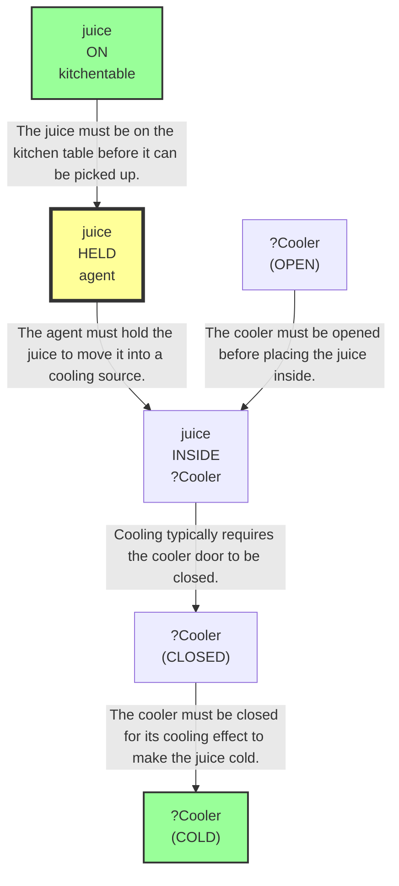

# 🚀 VirtualHome Agent Episode Log


### [GoalReasoner (Module A - Intent)] Output
```json
{
  "is_instruction_obviously_vague": true,
  "clarification_question": "Which drink should I bring from the kitchen table?",
  "target_object": "drink",
  "location_hint": "kitchen table",
  "reasoning_chain": [
    {
      "question": "Why does the user want this object?",
      "answer": "To have a drink brought from the kitchen table."
    },
    {
      "question": "Why is that important?",
      "answer": "To obtain a beverage they can consume."
    },
    {
      "question": "What fundamental need does this fulfill?",
      "answer": "It fulfills the need for hydration or beverage consumption."
    },
    {
      "question": "Are there any deeper psychological or physical motivations?",
      "answer": "The user may be thirsty or want refreshment."
    }
  ],
  "deep_intent": "The user wants to obtain a beverage for hydration or refreshment.",
  "acceptable_alternatives_properties": [
    {
      "priority": 1,
      "description": "Other ready-to-drink beverages in the same temperature state, such as water, juice, milk, or soda."
    },
    {
      "priority": 2,
      "description": "Similar beverages of the same general type, such as another cold drink or another warm drink."
    },
    {
      "priority": 3,
      "description": "Any potable drink that can satisfy thirst, including tea, coffee, or flavored water."
    },
    {
      "priority": 4,
      "description": "A hydrating food or beverage alternative, such as soup or an ice pop, if no drink is available."
    }
  ]
}
```

### [RoboStateMultiTaskController] Output
```json
{
  "action": "[ask] Which drink should I bring from the kitchen table?",
  "active_task_id": "task_1",
  "task_context": {
    "active_task_id": "task_1",
    "pending_task_ids": [],
    "satisfied_task_ids": []
  },
  "source": "goal_reasoner_clarification"
}
```
## Step 0
- **Action**: `[ask] Which drink should I bring from the kitchen table?`
- **Action Success**: `True`
- **Action Message**: The juice.
- **Active Task**: `task_1`
- **Decision Source**: `goal_reasoner_clarification`
- **Task Progress**: T5_G2_14_B2=pending
- **SDG Status**:
No SDG active.
- **Observed Items (159)**: wall(12), wall(13), wall(14), wall(15), wall(16), wall(17), wall(18), wall(19), wall(20), wall(21), floor(22), floor(23), floor(24), floor(25), floor(26)...


### [GoalReasoner (Module A - Intent)] Output
```json
{
  "is_instruction_obviously_vague": true,
  "clarification_question": "What temperature should the juice be?",
  "target_object": "juice",
  "location_hint": "kitchen table",
  "reasoning_chain": [
    {
      "question": "Why does the user want this object?",
      "answer": "To drink the juice."
    },
    {
      "question": "Why is that important?",
      "answer": "To satisfy a beverage preference or refreshment need."
    },
    {
      "question": "What fundamental need does this fulfill?",
      "answer": "Relieving thirst and providing refreshment."
    },
    {
      "question": "Are there any deeper psychological or physical motivations?",
      "answer": "The user may want a drink that is comfortable to consume and matches their preferred temperature."
    }
  ],
  "deep_intent": "The user wants to obtain a drinkable beverage at a specific temperature to relieve thirst and provide refreshment.",
  "acceptable_alternatives_properties": [
    {
      "priority": 1,
      "description": "Other drinkable beverages that can be provided at the same desired temperature, such as water, juice, or milk."
    },
    {
      "priority": 2,
      "description": "Similar ready-to-drink cold or warm beverages, such as tea, coffee, or flavored drinks."
    },
    {
      "priority": 3,
      "description": "Any household beverage that can be served at the requested temperature and consumed immediately."
    },
    {
      "priority": 4,
      "description": "A beverage alternative that still relieves thirst, even if it is a different drink type."
    }
  ]
}
```

### [RoboStateMultiTaskController] Output
```json
{
  "action": "[ask] What temperature should the juice be?",
  "active_task_id": "task_1",
  "task_context": {
    "active_task_id": "task_1",
    "pending_task_ids": [],
    "satisfied_task_ids": []
  },
  "source": "goal_reasoner_clarification"
}
```
## Step 1
- **Action**: `[ask] What temperature should the juice be?`
- **Action Success**: `True`
- **Action Message**: Cold.
- **Active Task**: `task_1`
- **Decision Source**: `goal_reasoner_clarification`
- **Task Progress**: T5_G2_14_B2=pending
- **SDG Status**:
No SDG active.
- **Observed Items (159)**: wall(12), wall(13), wall(14), wall(15), wall(16), wall(17), wall(18), wall(19), wall(20), wall(21), floor(22), floor(23), floor(24), floor(25), floor(26)...


### [GoalReasoner (Module A - Intent)] Output
```json
{
  "is_instruction_obviously_vague": false,
  "clarification_question": null,
  "target_object": "juice",
  "location_hint": "kitchen table",
  "reasoning_chain": [
    {
      "question": "Why does the user want this object?",
      "answer": "To receive the juice that is currently on the kitchen table."
    },
    {
      "question": "Why is that important?",
      "answer": "The user likely wants to drink it or use it right away while keeping it cold."
    },
    {
      "question": "What fundamental need does this fulfill?",
      "answer": "It fulfills the need for a cold beverage."
    },
    {
      "question": "Are there any deeper psychological or physical motivations?",
      "answer": "The user may be seeking refreshment, hydration, or comfort from a chilled drink."
    }
  ],
  "deep_intent": "The user wants to obtain a cold beverage for refreshment or hydration.",
  "acceptable_alternatives_properties": [
    {
      "priority": 1,
      "description": "Other cold ready-to-drink beverages, such as chilled water, iced tea, soda, or milk"
    },
    {
      "priority": 2,
      "description": "Any chilled fruit drink or refrigerated beverage in a similar container"
    },
    {
      "priority": 3,
      "description": "Cold nonalcoholic drinks that can provide hydration and refreshment"
    },
    {
      "priority": 4,
      "description": "Room-temperature drinks that can still satisfy thirst if no cold beverage is available"
    }
  ]
}
```

### [PerceptionFilter] Output
```json
{
  "reasoning": "Need the target drink (juice), the specified location where it is currently placed (kitchentable), and the possible cooling appliances that can serve as the required ?Cooler in the SDG. Since alternatives/backups must be retained, include all visible cooler-capable options relevant to chilling the juice: fridge and dishwasher if treated as a cooling/storage appliance in the environment, plus microwave/stove are not cooling so excluded. Also keep a ready-to-drink alternative beverage (milk, waterglass) only if needed by the goal’s acceptable alternatives, but the minimum strictly necessary set is juice, kitchentable, and fridge.",
  "selected_classes": [
    "character",
    "waterglass",
    "juice",
    "dishwasher",
    "fridge",
    "door",
    "kitchentable",
    "milk"
  ],
  "raw_class_count": 50
}
```

### [LLMExecutor] Output
```json
{
  "reasoning": "The target juice is already present and cold on the kitchen table, satisfying the key goal state from the SDG (juice on table and cold). The remaining action needed to align with the graph is to hold the juice before any further placement/cooling steps, so I will grab the cold juice object that is currently close to the agent and on the kitchen table.",
  "satisfied_nodes": [
    "N1",
    "N6"
  ],
  "current_node_focus": "N2",
  "mapped_variables": {},
  "action": "[grab] <juice> (173)"
}
```

### [RoboStateMultiTaskController] Output
```json
{
  "action": "[grab] <juice> (173)",
  "active_task_id": "task_1",
  "task_context": {
    "active_task_id": "task_1",
    "pending_task_ids": [],
    "satisfied_task_ids": []
  },
  "source": "llm_executor"
}
```
## Step 2
- **Action**: `[grab] <juice> (173)`
- **Action Success**: `True`
- **Action Message**: {'0': {'message': 'Success'}}
- **Active Task**: `task_1`
- **Decision Source**: `llm_executor`
- **Task Progress**: T5_G2_14_B2=done
- **SDG Status**:

- **Observed Items (23)**: door(47) [OPEN], waterglass(64), waterglass(71), waterglass(72), waterglass(79), waterglass(80), waterglass(87), waterglass(88), waterglass(100), kitchentable(131), kitchentable(135), fridge(162) [CLOSED], dishwasher(165) [CLOSED,OFF], juice(173) [COLD], juice(174)...

