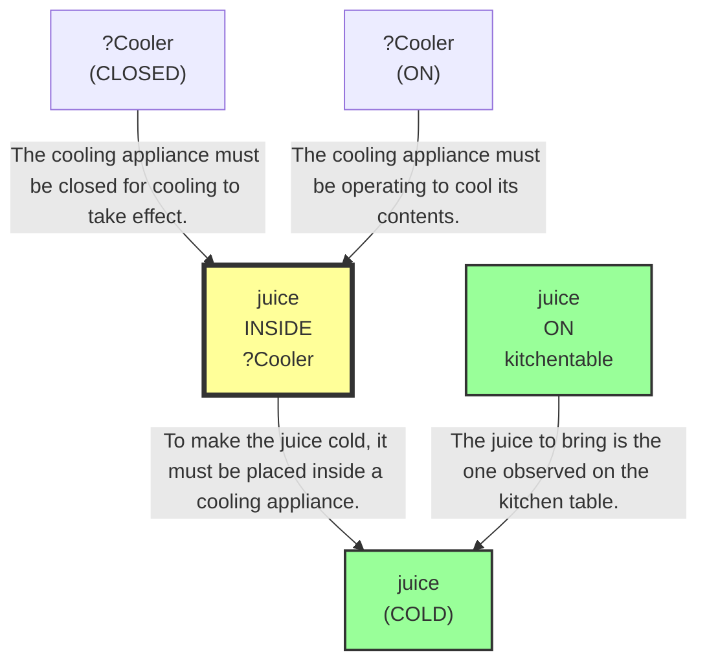
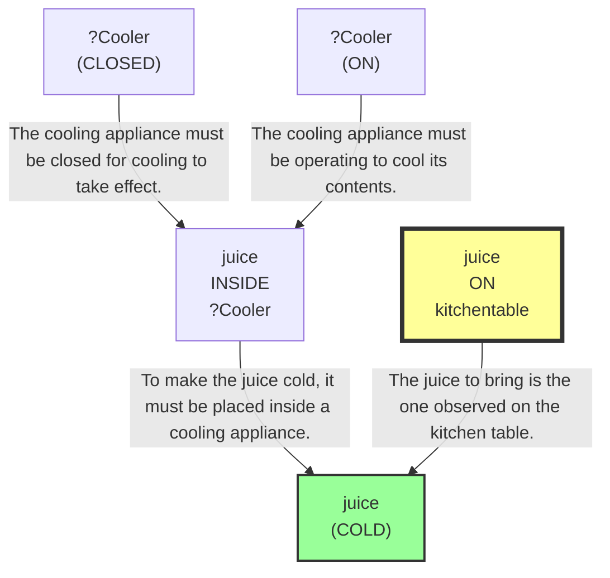

# 🚀 VirtualHome Agent Episode Log


### [GoalReasoner (Module A - Intent)] Output
```json
{
  "is_instruction_obviously_vague": true,
  "clarification_question": "Which drink should I bring?",
  "target_object": null,
  "location_hint": "kitchen table",
  "reasoning_chain": [
    {
      "question": "Why does the user want this object?",
      "answer": "To have a drink available."
    },
    {
      "question": "Why is that important?",
      "answer": "To satisfy a likely thirst or beverage need."
    },
    {
      "question": "What fundamental need does this fulfill?",
      "answer": "Hydration and refreshment."
    },
    {
      "question": "Are there any deeper psychological or physical motivations?",
      "answer": "The user likely wants the most suitable drink among several options, with a specific temperature preference."
    }
  ],
  "deep_intent": "The user wants to hydrate or refresh themselves with a suitable beverage.",
  "acceptable_alternatives_properties": [
    {
      "priority": 1,
      "description": "Other drink options that match the intended beverage type and temperature as closely as possible."
    },
    {
      "priority": 2,
      "description": "Similar beverages in the same general category, such as another cold or warm drink."
    },
    {
      "priority": 3,
      "description": "Any ready-to-drink beverage that can satisfy hydration or refreshment needs."
    },
    {
      "priority": 4,
      "description": "Plain water or another simple beverage if the preferred drink is unavailable."
    }
  ]
}
```

### [RoboStateMultiTaskController] Output
```json
{
  "action": "[ask] Which drink should I bring?",
  "active_task_id": "task_1",
  "task_context": {
    "active_task_id": "task_1",
    "pending_task_ids": [],
    "satisfied_task_ids": []
  },
  "source": "goal_reasoner_clarification"
}
```
## Step 0
- **Action**: `[ask] Which drink should I bring?`
- **Action Success**: `True`
- **Action Message**: The juice.
- **Active Task**: `task_1`
- **Decision Source**: `goal_reasoner_clarification`
- **Task Progress**: T5_G2_14_B3=pending
- **SDG Status**:
No SDG active.
- **Observed Items (159)**: wall(12), wall(13), wall(14), wall(15), wall(16), wall(17), wall(18), wall(19), wall(20), wall(21), floor(22), floor(23), floor(24), floor(25), floor(26)...


### [GoalReasoner (Module A - Intent)] Output
```json
{
  "is_instruction_obviously_vague": true,
  "clarification_question": "What temperature should the juice be?",
  "target_object": "juice",
  "location_hint": "kitchen table",
  "reasoning_chain": [
    {
      "question": "Why does the user want this object?",
      "answer": "To have a drink available."
    },
    {
      "question": "Why is that important?",
      "answer": "To consume a beverage in the desired state."
    },
    {
      "question": "What fundamental need does this fulfill?",
      "answer": "To relieve thirst."
    },
    {
      "question": "Are there any deeper psychological or physical motivations?",
      "answer": "Primarily a physical need for hydration, with the requested temperature affecting comfort and preference."
    }
  ],
  "deep_intent": "The user wants to relieve thirst with a beverage at a specific temperature.",
  "acceptable_alternatives_properties": [
    {
      "priority": 1,
      "description": "Other drinks that can be served at the requested temperature, such as water, tea, or soda."
    },
    {
      "priority": 2,
      "description": "Other juice varieties or similar ready-to-drink beverages at the same temperature."
    },
    {
      "priority": 3,
      "description": "Cold or warm household beverages that provide hydration and are acceptable at that temperature."
    },
    {
      "priority": 4,
      "description": "Any drinkable liquid suitable for relieving thirst if the exact beverage is unavailable."
    }
  ]
}
```

### [RoboStateMultiTaskController] Output
```json
{
  "action": "[ask] What temperature should the juice be?",
  "active_task_id": "task_1",
  "task_context": {
    "active_task_id": "task_1",
    "pending_task_ids": [],
    "satisfied_task_ids": []
  },
  "source": "goal_reasoner_clarification"
}
```
## Step 1
- **Action**: `[ask] What temperature should the juice be?`
- **Action Success**: `True`
- **Action Message**: Cold.
- **Active Task**: `task_1`
- **Decision Source**: `goal_reasoner_clarification`
- **Task Progress**: T5_G2_14_B3=pending
- **SDG Status**:
No SDG active.
- **Observed Items (159)**: wall(12), wall(13), wall(14), wall(15), wall(16), wall(17), wall(18), wall(19), wall(20), wall(21), floor(22), floor(23), floor(24), floor(25), floor(26)...


### [GoalReasoner (Module A - Intent)] Output
```json
{
  "is_instruction_obviously_vague": false,
  "clarification_question": null,
  "target_object": "juice",
  "location_hint": "kitchen table",
  "reasoning_chain": [
    {
      "question": "Why does the user want this object?",
      "answer": "They want a drink."
    },
    {
      "question": "Why is that important?",
      "answer": "They likely want to quench thirst or refresh themselves."
    },
    {
      "question": "What fundamental need does this fulfill?",
      "answer": "Relieving thirst and providing hydration."
    },
    {
      "question": "Are there any deeper psychological or physical motivations?",
      "answer": "They may also want comfort or enjoyment from having a cold beverage."
    }
  ],
  "deep_intent": "The user wants to relieve thirst and feel refreshed with a cold beverage.",
  "acceptable_alternatives_properties": [
    {
      "priority": 1,
      "description": "Other cold ready-to-drink beverages such as water, soda, or iced tea"
    },
    {
      "priority": 2,
      "description": "Other chilled juice varieties or flavored drinks"
    },
    {
      "priority": 3,
      "description": "Any cold beverage stored in the kitchen or refrigerator"
    },
    {
      "priority": 4,
      "description": "A room-temperature drink if no cold option is available, to still help with hydration"
    }
  ]
}
```

### [PerceptionFilter] Output
```json
{
  "reasoning": "The goal is to obtain the juice on the kitchen table and ensure it is cold. So we must keep the target juice, the location furniture the juice is on (kitchentable), and all plausible cooling appliances that can satisfy ?Cooler, including the fridge and microwave as alternative cooling-related appliances in the scene. A waterglass is also retained as a fallback ready-to-drink container for hydration if needed.",
  "selected_classes": [
    "microwave",
    "character",
    "waterglass",
    "juice",
    "fridge",
    "kitchentable"
  ],
  "raw_class_count": 50
}
```

### [LLMExecutor] Output
```json
{
  "reasoning": "The target juice is already located and matched in the current graph as juice(173) with the required COLD state, and it is on the kitchen table, satisfying the final SDG nodes N1 and N2. No further physical action is needed for the shown state. However, since the task likely expects the drink to be brought/handled next and the graph does not show it held, the next progression should be to approach the juice before any grab can happen. The object is currently close to the character, so walking to it is the correct next atomic step toward eventual retrieval.",
  "satisfied_nodes": [
    "N1",
    "N2"
  ],
  "current_node_focus": "N3",
  "mapped_variables": {
    "?Cooler": "fridge(162)"
  },
  "action": "[walk] <juice> (173)"
}
```

### [RoboStateMultiTaskController] Output
```json
{
  "action": "[walk] <juice> (173)",
  "active_task_id": "task_1",
  "task_context": {
    "active_task_id": "task_1",
    "pending_task_ids": [],
    "satisfied_task_ids": []
  },
  "source": "llm_executor"
}
```
## Step 2
- **Action**: `[walk] <juice> (173)`
- **Action Success**: `True`
- **Action Message**: {'0': {'message': 'Success'}}
- **Active Task**: `task_1`
- **Decision Source**: `llm_executor`
- **Task Progress**: T5_G2_14_B3=pending
- **SDG Status**:

- **Observed Items (20)**: waterglass(64), waterglass(71), waterglass(72), waterglass(79), waterglass(80), waterglass(87), waterglass(88), waterglass(100), kitchentable(131), kitchentable(135), fridge(162) [CLOSED], microwave(171) [CLOSED,OFF], juice(173) [COLD], juice(174), character(1)...


### [PerceptionFilter] Output
```json
{
  "reasoning": "Reused cached class selection.",
  "selected_classes": [
    "microwave",
    "character",
    "waterglass",
    "juice",
    "fridge",
    "kitchentable"
  ],
  "raw_class_count": 50
}
```

### [LLMExecutor] Output
```json
{
  "reasoning": "The target juice has already been located and is currently CLOSE to the character, with state COLD already satisfied in the graph. The remaining explicit SDG requirement for the observed juice is to place it ON the kitchen table. Since I am already near the juice, the next step is to grab it before I can later place it on the table.",
  "satisfied_nodes": [
    "N2"
  ],
  "current_node_focus": "N1",
  "mapped_variables": {},
  "action": "[grab] <juice> (173)"
}
```

### [RoboStateMultiTaskController] Output
```json
{
  "action": "[grab] <juice> (173)",
  "active_task_id": "task_1",
  "task_context": {
    "active_task_id": "task_1",
    "pending_task_ids": [],
    "satisfied_task_ids": []
  },
  "source": "llm_executor"
}
```
## Step 3
- **Action**: `[grab] <juice> (173)`
- **Action Success**: `True`
- **Action Message**: {'0': {'message': 'Success'}}
- **Active Task**: `task_1`
- **Decision Source**: `llm_executor`
- **Task Progress**: T5_G2_14_B3=done
- **SDG Status**:

- **Observed Items (20)**: waterglass(64), waterglass(71), waterglass(72), waterglass(79), waterglass(80), waterglass(87), waterglass(88), waterglass(100), kitchentable(131), kitchentable(135), fridge(162) [CLOSED], microwave(171) [CLOSED,OFF], juice(173) [COLD], juice(174), character(1)...

